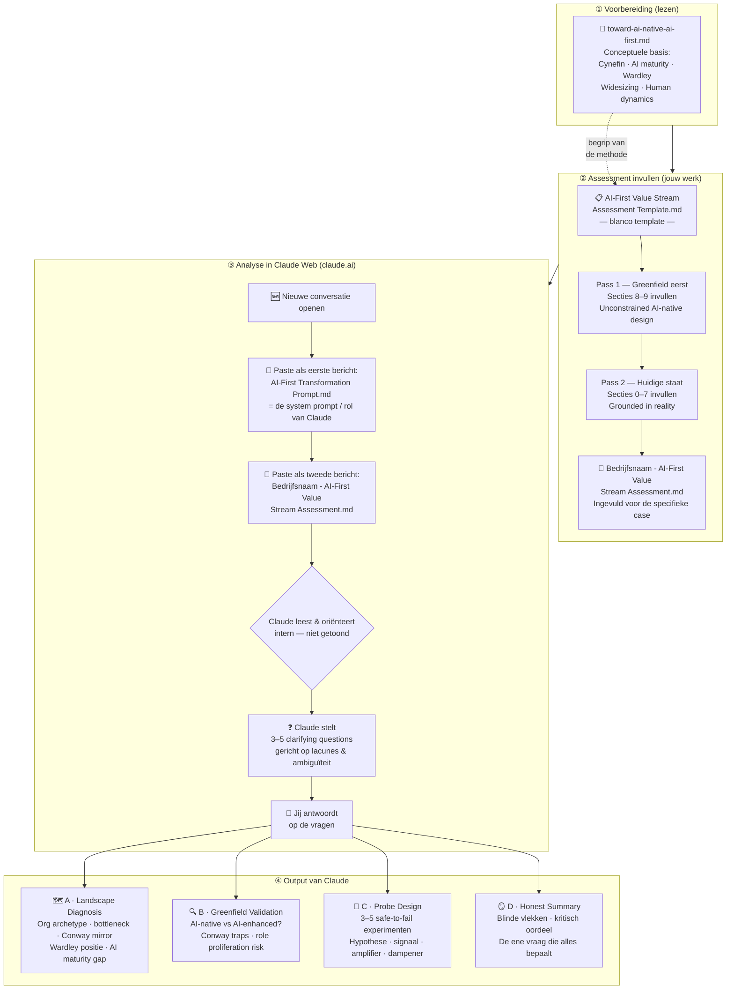
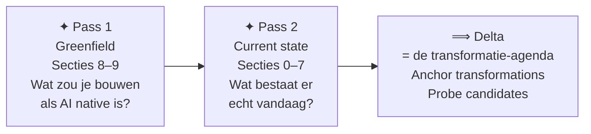
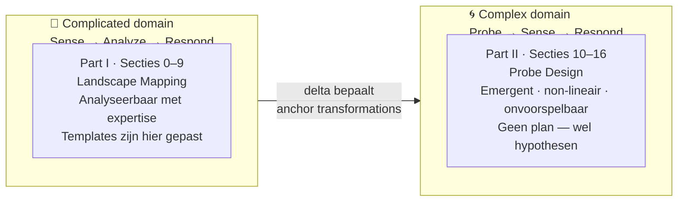
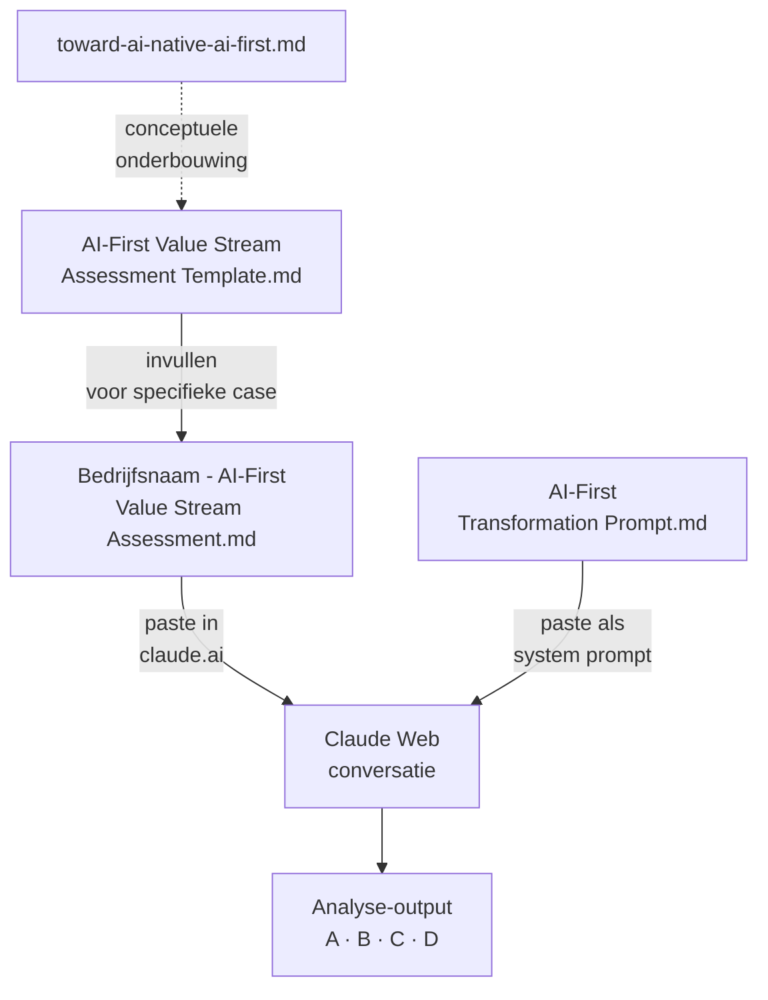

# AI-First Transformation — Workflow Overview

Dit document illustreert hoe de drie bestanden samenwerken om van een blanco template naar een volledige AI-first analyse te gaan.

---

## De drie bouwstenen

| Bestand | Rol |
|---|---|
| `toward-ai-native-ai-first.md` | Conceptuele basis — de *waarom* en *hoe* van de methodologie |
| `AI-First Value Stream Assessment Template.md` | Blanco template — wordt ingevuld voor een specifieke organisatie |
| `AI-First Transformation Prompt.md` | System prompt — activeert Claude als AI-first consultant |

---

## Workflow

---

## De twee passes — waarom die volgorde?

> Pass 1 eerst (Greenfield) voorkomt dat de huidige staat je denken verankert.
> Je ontwerpt vanuit klantwaarde — niet vanuit interne inertie.

---

## Cynefin — twee domeinen in één assessment

---

## Betrokken bestanden per stap

---

*Zie ook: [[toward-ai-native-ai-first]] · [[AI-First Value Stream Assessment Template]] · [[AI-First Transformation Prompt]]*
