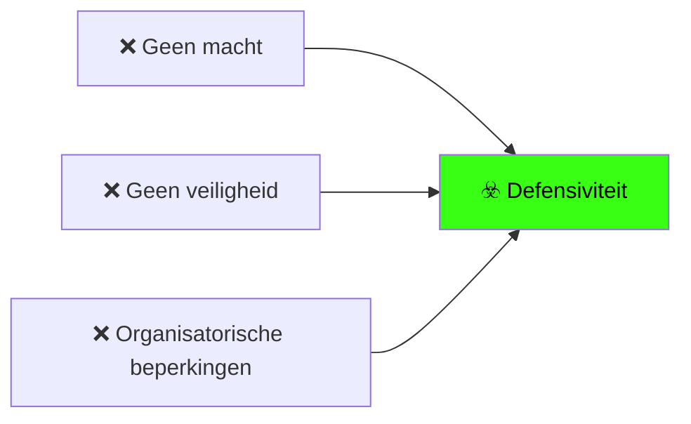
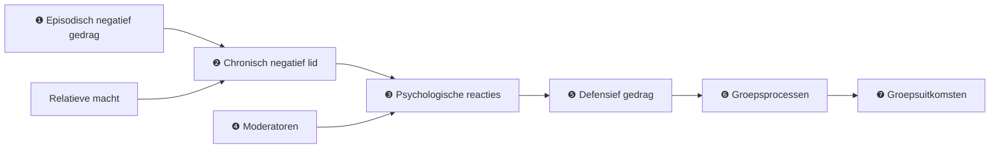

> [!note]- Bronnen
> - [PDF — lokale kopie](felps-mitchell-byington-how-when-why-bad-apples-2006/felps-2006-bad-apples-spoil-the-barrel.pdf)
> - [Research in Organizational Behavior, Volume 27, pp. 175–222 (2006) — ScienceDirect](https://www.sciencedirect.com/science/article/abs/pii/S0191308506270059)
> - [Semantic Scholar — open access versie](https://www.semanticscholar.org/paper/How,-When,-and-Why-Bad-Apples-Spoil-the-Barrel:-and-Felps-Mitchell/6b3a863c267088743fc18232ab35cc47feb8522c)
> - DOI: 10.1016/S0191-3085(06)27005-9

## Core idea

Eén negatief teamlid kan het functioneren van een heel team ernstig beschadigen — asymmetrisch en systematisch. Het paper presenteert een integratief model van hoe dit proces verloopt, wanneer het ernstig wordt, en via welke mechanismen het zich verspreidt. Negatief gedrag is besmettelijk: het lokt defensieve reacties uit bij anderen, en die defensiviteit ondermijnt samenwerking, creativiteit en prestatie.

## Key concepts

[[free-rider]], [[social-loafing]], [[defensiveness]], [[team-dysfunction]], [[psychological-safety]], [[accountability]], [[candor]]

## What I took from it

### General

Dit is een **review- en theoriepaper**, geen laboratoriumexperiment. Felps et al. integreren bestaand onderzoek en bouwen een causaal model. **Belangrijk voor de KB**: het 30–40% prestatieverlies dat Reed Hastings in *[No Rules Rules](../books/hastings-no-rules-rules-netflix-and-the-culture-of-reinvention.md)* aan Felps toeschrijft, komt in werkelijkheid uit eerder onderzoek dat Felps reviewt — met name Barrick, Stewart, Neubert & Mount (1998), die in 51 productie-teams aantoonden dat de laagste teamscores op consciëntieusheid, inschikkelijkheid en emotionele stabiliteit sterke voorspellers zijn van groepsprestatie. Felps' bijdrage is het causale mechanisme dat verklaart *waarom* en *hoe* dit effect optreedt.

### Connection to our work

**De free-rider is type 1 van drie.** Felps definieert drie types negatief teamlid. De free-rider ("withholder of effort") is er één van — en het paper toont dat alle drie hetzelfde besmettingsmechanisme activeren. Dat betekent dat de free-rider-discussie in onze KB eigenlijk breder is: ook de chronisch pessimistische collega en de interpersoonlijke overtreder ondermijnen teamfunctioneren via hetzelfde pad.

**Het mechanisme verklaart waarom zwijgen het probleem verergert.** Wanneer teamleden niet kunnen ingrijpen, wordt defensiviteit de enige uitweg — en defensiviteit is zelf een vorm van slacking off, terugtrekken en verborgen wraak. Het vat spoilt niet door de bad apple alleen, maar door wat het team doet als het niet kan reageren. Dit is de wetenschappelijke onderbouwing van wat [Bennis](../books/bennis-transparency-how-leaders-create-a-culture-of-candor.md) noemt: withholding als rationele reactie op een onveilig systeem.

**Team-interdependentie als moderator.** Hoe meer teamleden van elkaar afhankelijk zijn, hoe groter de impact van een negatief lid. Dit verklaart waarom kleine, hecht samenhangende teams ([Buurtzorg](../beyond-the-review/cases/buurtzorg.md), [W.L. Gore](../beyond-the-review/cases/wl-gore.md)) tegelijk het meest kwetsbaar zijn voor één bad apple én de sterkste sociale controle hebben om eraan te ontsnappen.

**De drie reacties als model voor candor-gesprekken.** Felps beschrijft drie teamresponsen: motivationele interventie (het gesprek aangaan), rejection (uitsluiten/verwijderen) en defensiviteit (zichzelf beschermen). Alleen de eerste twee lossen het probleem op. Defensiviteit is wat er gebeurt als de eerste twee niet mogelijk zijn — en dat is precies de situatie die een candor-cultuur wil voorkomen.

Related: [No Rules Rules](../books/hastings-no-rules-rules-netflix-and-the-culture-of-reinvention.md), [Powerful](../books/mccord-powerful-building-a-culture-of-freedom-and-responsibility.md), [Transparency: How Leaders Create a Culture of Candor](../books/bennis-transparency-how-leaders-create-a-culture-of-candor.md), [Project Aristotle](google-project-aristotle-what-makes-a-team-effective.md), [The Five Dysfunctions of a Team](../books/lencioni-the-five-dysfunctions-of-a-team.md), [How Netflix Reinvented HR](performance-and-evaluation/mccord-how-netflix-reinvented-hr-hbr-2014.md), [Netflix — case](../beyond-the-review/cases/netflix.md), [Buurtzorg — case](../beyond-the-review/cases/buurtzorg.md), [W.L. Gore — case](../beyond-the-review/cases/wl-gore.md)

---

## Samenvatting

### Definitie van het negatieve teamlid

> *"Individuals who chronically display behavior which asymmetrically impairs group functioning."*

Drie kenmerken van de definitie:
- **Chronisch**: episodisch negatief gedrag is een hobbel; chronisch negatief gedrag is het probleem
- **Asymmetrisch**: het negatieve effect is groter dan het positieve effect van een equivalent positief lid — de slechte kant weegt zwaarder
- **Gedrag, niet persoonlijkheid**: het gaat om observeerbare handelingen, niet om onderliggende traits

---

### Drie types negatief teamlid

**1. [Withholder of effort](../concepts/free-rider.md)** (= free rider / social loafer / shirker)
Ontwijkt verantwoordelijkheid, voltooit taken niet, neemt geen risico's, hoopt dat anderen compenseren. In de literatuur ook wel *shirking* (economen), *free riding* (sociologen) of *social loafing* (psychologen) genoemd — Felps beschouwt dit als beschrijvingen van hetzelfde fenomeen in verschillende contexten.

**2. [Affectively negative](../concepts/affectively-negative.md)**
Persistent pessimistisch, angstig, geïrriteerd. Verspreidt negatieve emoties door het team — ook als er objectief geen reden voor is. Bijzonder moeilijk aan te pakken via motivationele interventie, omdat teammates weinig geloof hebben dat ze iemands stemming kunnen veranderen.

**3. [Interpersonal deviant](../concepts/interpersonal-deviant.md)**
Overtreedt normen van respect: pesten, kwetsende opmerkingen, publiek vernederen, gemene grappen. Zeven gedragingen die consistent als deviant worden beoordeeld (Robinson & Bennett, 1995): iemand belachelijk maken, iets kwetsends zeggen, etnische/religieuze opmerkingen, vloeken, gemene grappen, grof gedrag, iemand publiek in verlegenheid brengen.

---

### Het causale model (Fig. 1)

**Stap 1 — Episodisch negatief gedrag:**
- Incidenteel negatief gedrag van één teamlid — een hobbel, nog geen structureel probleem
- Pas wanneer dit gedrag chronisch wordt, treedt het model in werking

**Stap 2 — Chronisch negatief lid:**
- Wanneer episodisch gedrag een patroon wordt, is er sprake van een chronisch negatief teamlid
- De **relatieve macht** van die persoon (senioriteit, formele rol, bescherming door organisatiestructuur) bepaalt mee hoe moeilijk het is voor teammates om in te grijpen

**Stap 3 — Psychologische reacties bij teammates:**
- Perceptie van ongelijkheid (inequity)
- Negatieve emoties
- Beschadigd vertrouwen

**Stap 4 — Moderatoren:**
- Intensiteit van het negatieve gedrag
- Team-interdependentie
- Recente uitkomsten (successen maken veerkrachtiger; mislukkingen maken kwetsbaarder)
- Persoonlijke copingvaardigheden van teammates

**Stap 5 — Defensief gedrag:**
- Explosies / uitbarstingen
- Verborgen wraak (covert revenge)
- Mood maintenance (stemming bewaken, niet meer investeren)
- Ontkenning
- Slacking off
- Terugtrekken (withdrawal)

**Stap 6 — Aangetaste groepsprocessen:**
- Motivatie
- Samenwerking
- Conflict
- Creativiteit
- Leren

**Stap 7 — Groepsuitkomsten:**
- Lage prestatie
- Laag welzijn
- Lage levensvatbaarheid

**Mechanismen van verspreiding**: aggregatie (individuele reacties stapelen zich op), spillover (negatieve stemming verspreidt zich), sensemaking (het team geeft betekenis aan het gedrag en past zijn normen aan).

---

### Moderatoren

| Moderator | Effect |
|---|---|
| **Intensiteit van het negatieve gedrag** | Hoe extremer, hoe sneller defensiviteit optreedt |
| **Team-interdependentie** | Hoe meer leden van elkaar afhangen, hoe groter de impact |
| **Recente uitkomsten** | Na successen is het team veerkrachtiger; na mislukkingen kwetsbaarder |
| **Persoonlijke copingvaardigheden** | Individuen met sterke regulatie absorberen meer voordat defensiviteit optreedt |

**Kritische implicatie van team-interdependentie**: kleine, hecht samenhangende teams zijn het meest kwetsbaar voor één bad apple — maar hebben ook de sterkste sociale controle (zichtbaarheid van bijdrage, directe feedback, geen anonimiteit).

---

### Drie reacties van teammates

**1. Motivationele interventie**
Het aanspreken van de negatieve persoon met de bedoeling het gedrag te veranderen. Werkt het best wanneer het gedrag als controleerbaar wordt gezien. Klassiek voorbeeld: in de Hawthorne Studies "bingden" collega's een luie medewerker op de bovenarm als informele norm-handhaving — effectiever dan managersupervisie of bonussen.

**2. Rejection**
Uitsluiten, verwijderen, psychologisch distantiëren, taakoverdracht reduceren. Treedt op wanneer motivationele interventie faalt of het gedrag als oncontroleerbaar wordt gezien (met name bij affectief negatieven).

**3. Defensiviteit**
Wanneer noch motivationele interventie noch rejection mogelijk is — door organisatorische beperkingen, senioriteit, formele rolstructuren, of machtsverschillen — beschermen teammates zichzelf. Dit is de toestand waarin het vat écht spoilt: defensief gedrag ondermijnt de groepsprocessen die prestatie dragen.

> **Kernpunt**: de bad apple bederft het vat niet direct — het is de defensiviteit die hij uitlokt bij teammates die niet kunnen ingrijpen, die de echte schade aanricht.

---

### Wat dit zegt over organisatieontwerp

Het paper maakt impliciet één ontwerpconclusie onontkoombaar: **de schade van een negatief teamlid is grotendeels een functie van of het team kan ingrijpen**. Organisaties die motivationele interventie en rejection onmogelijk maken — door machtsstructuren, angstcultuur, gebrek aan psychologische veiligheid, of procedurebescherming van underperformers — garanderen defensiviteit als uitkomst.

Met andere woorden: de vraag "hoe gaan we om met free-riders?" is in de eerste plaats een vraag over **of mensen veilig kunnen spreken** en **of ze de macht hebben om te handelen**. Dat is geen HR-vraag. Het is een organisatieontwerp-vraag.
