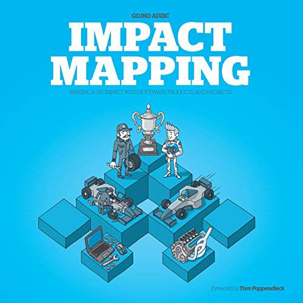

## Core idea

Impact maps align delivery with strategic goals: WHY (goal) → WHO (actors) → HOW (impacts) → WHAT (deliverables). Prevents building things that don't matter. \
Start from the impact we want to achieve in *behavior*, *whose behavior*, and what *goals* to achieve with. 
Then think of the first most important branch (the one on top, like in a backlog) what deliverables we need to make in order to get that *impact*.

If it appears that deliverable did NOT achieve that impact, according to the measurables (setup upfront), throw that branch away, and start with the first one below.

## Key concepts

[[impact-mapping]], [[why-who-how-what]], [[goal-alignment]], [[deliverable-vs-outcome]], [[assumption-testing]]

## What I took from it

Impact mapping should not be complete.  Only the most important branches are important to investigate for potential impact.

### General

*(To be filled in)*

### Connection to our work

The target attractor (Section 10) can be structured as an impact map. Probes map to HOW — the impacts we're trying to create. Related to outside-in thinking.
