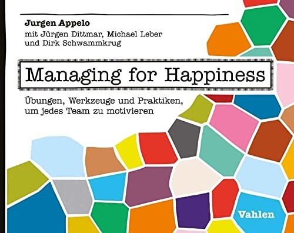

> [!note]- Bronnen
> - [Management 3.0. *Managing for Happiness — book page*](https://management30.com/books/managing-for-happiness/)
> - [O'Reilly. *Chapter 1: Kudo Box and Kudo Cards*](https://www.oreilly.com/library/view/managing-for-happiness/9781119268680/c01.xhtml)
> - [Management 3.0. *Merit Money practice*](https://management30.com/practice/merit-money/)
> - Zie ook [Happy Melly case](../trust-by-design/beyond-the-review/cases/happy-melly.md) in Beyond the Review.

## Core idea

Practical games and tools for Management 3.0: Kudo cards, Moving Motivators, Delegation Poker, Merit Money. Makes management practices concrete and playful.

## Key concepts

[[kudo-cards]], [[moving-motivators]], [[delegation-poker]], [[merit-money]], [[management-games]]

## What I took from it

### General

Appelo maakt Management 3.0 (het theoretische kader uit zijn vorige boek) concreet: geen abstracte principes maar spelletjes, kaarten en rituals die je morgen kunt invoeren. Het boek is opgebouwd rond twaalf practices, elk met een duidelijk probleem, een mechanisme en praktische varianten. De toon is licht, maar de inhoud is serieus — elk instrument is geworteld in motivatiepsychologie (Deci & Ryan, Kohn, Maslow).

Het centrale idee: *"management is too important to leave to managers."* Motivatie, erkenning, feedback en beslissingsbevoegdheid zijn geen HR-taken — het zijn teamtaken.

### Connection to our work

De tools in dit boek zijn de praktische uitwerking van wat de [[beyond-the-review/cases/happy-melly|Happy Melly-case]] in Beyond the Review beschrijft. Merit Money en Kudo Cards zijn direct toepasbaar als alternatief voor klassieke prestatiebeoordelingen. Moving Motivators maakt expliciet wat mensen drijft — essentieel voor eerlijke evaluatiegesprekken. Related: [[books/kohn-punished-by-rewards|Kohn]], [[books/appelo-management-30-leading-agile-developers-developing-agile-lead|Management 3.0]]

---

## Samenvatting

### Centrale stelling

Traditionele bonussystemen werken niet — dat is al decennia aangetoond. Toch blijven organisaties ze implementeren. Appelo biedt twaalf concrete alternatieven die wél werken, omdat ze intrinsieke motivatie versterken in plaats van ondermijnen.

---

### De twaalf practices — de meest relevante voor evaluatie & beloning

#### 1. Kudo Cards & Kudo Box

**Probleem**: erkenning komt te weinig voor, en als het komt, is het top-down en traag.

**Mechanisme**: iedereen in het team heeft toegang tot Kudo Cards — kleine kaarten waarop je iemand bedankt of erkent voor een bijdrage. De kaarten gaan in een Kudo Box; wekelijks of tweewekelijks worden ze voorgelezen of uitgedeeld.

**Waarom het werkt**: erkenning van peers is psychologisch krachtiger dan erkenning van een manager. Het is onverwacht, specifiek en ontkoppeld van geld. Appelo baseert dit op zes regels voor effectieve beloningen: niet verwacht, niet geld, specifiek, onmiddellijk, persoonlijk en publiek.

---

#### 2. Merit Money

**Probleem**: bonussen worden bepaald door managers op basis van subjectieve beoordelingen — niet door de mensen die het werk het dichtst van nabij kennen.

**Mechanisme**: elk teamlid ontvangt een gelijk aantal punten ("hugs") per periode om te verdelen onder collega's wier bijdrage ze waardevol vinden. Niemand mag punten aan zichzelf geven. De verzamelde punten worden omgezet in een variabele beloning.

**Waarom het werkt**: peers zien elkaars bijdrage beter dan managers. Het systeem maakt peer feedback de primaire maatstaf voor beloning. Wanneer een bonus structureel wordt (iedereen verwacht hem), converteert hij naar basisloon — en de Merit Money-cyclus begint opnieuw.

---

#### 3. Moving Motivators

**Probleem**: managers nemen aan te weten wat medewerkers motiveert — vaak fout.

**Mechanisme**: een kaartspel gebaseerd op tien intrinsieke motivatoren (het CHAMPFROGS-model: Curiosity, Honor, Acceptance, Mastery, Power, Freedom, Relatedness, Order, Goal, Status). Spelers rangschikken de kaarten naar persoonlijk belang en bespreken hoe een verandering (nieuwe rol, reorganisatie, nieuw project) elke motivator beïnvloedt.

**Waarom het werkt**: het maakt motivatie bespreekbaar zonder te oordelen. Ideaal als vertrekpunt voor een evaluatiegesprek dat over groei gaat in plaats van beoordeling.

---

#### 4. Delegation Poker

**Probleem**: onduidelijkheid over wie welke beslissingen neemt leidt tot frustratie, micromanagement of juist stuurloosheid.

**Mechanisme**: zeven niveaus van beslissingsbevoegdheid (van "Tell" — manager beslist en informeert — tot "Delegate" — team beslist volledig). Teams spelen het als kaartspel per beslissingstype: wie heeft welk niveau nu, en wat is wenselijk?

**Waarom het werkt**: het maakt impliciete aannames expliciet. Niet elke beslissing hoeft op hetzelfde niveau te liggen — de poker-discussie zelf is waardevol.

---

#### 5. Feedback Wraps

**Probleem**: feedback wordt gegeven op een manier die de ontvanger in de verdediging drijft.

**Mechanisme**: een gestructureerd format in vijf stappen — beschrijf de context, geef je observatie, deel je emotie, leg de waarde uit, geef een suggestie. Geen oordeel, geen label.

**Waarom het werkt**: het verschuift feedback van evaluatie naar informatie. De ontvanger voelt geen aanval, maar een aanbod.

---

#### 6. Celebration Grid

**Probleem**: teams vieren alleen successen en verbergen mislukkingen — terwijl mislukte experimenten even leerzaam zijn.

**Mechanisme**: een raster met twee assen (succes/mislukking × goede praktijk/experiment/fout). Teams markeren waar hun initiatieven vielen. Experimenten die mislukten worden gevierd — ze waren gepland, dus de mislukking is informatie. Fouten (onzorgvuldigheid, gebrek aan planning) worden besproken.

**Waarom het werkt**: het ontkoppelt leren van beoordelen. Een team dat durft te experimenteren en te mislukken, leert sneller dan een team dat alleen doet wat veilig is.
