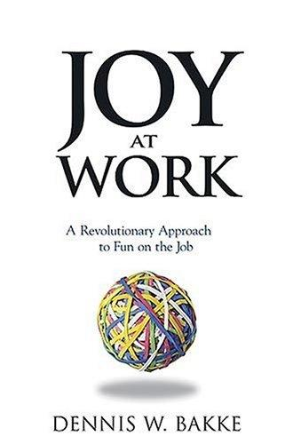

> [!note]- Bronnen
> - [Bakke, D. (2005). *Joy at Work*. PVG. — Officiële samenvatting op dennisbakke.com](https://dennisbakke.com/summary/)
> - [Reinventing Organizations Wiki. *AES (Applied Energy Services)*](https://reinventingorganizationswiki.com/en/cases/aes-applied-energy-services/) — Contextuele beschrijving van de AES-praktijken uit het boek.
> - [ethix.org (2004). *Dennis Bakke: Creating Real Fun at Work*](https://ethix.org/2004/06/01/creating-real-fun-at-work) — Interview met Bakke voor publicatie van het boek.
> - [getAbstract. *Joy at Work — summary*](https://www.getabstract.com/en/summary/joy-at-work/4716)

## Core idea

Werk hoort leuk te zijn — niet als bijproduct van succes, maar als doel op zich. Bakke, co-oprichter en voormalig CEO van AES, beschrijft hoe hij een energiebedrijf van 40.000 medewerkers bouwde op één centraal principe: mensen zijn creatieve, betrouwbare volwassenen die in staat zijn tot grote beslissingen. Alles wat dat vertrouwen ondermijnt — procedures, goedkeuringen, centrale stafdiensten — is verspilling.

## Key concepts

[[adviesproces]], [[zelfmanagement]], [[decentralisatie]], [[taakverrijking]], [[intrinsieke-motivatie]]

## What I took from it

### General

Dit is het interne verslag van het AES-experiment — geschreven door de architect ervan, na zijn vertrek. Dat maakt het bijzonder eerlijk: Bakke beschrijft niet alleen wat werkte, maar ook hoe het eindigde. Het board schafte alles af zodra de aandelenkoers instortte. Zijn conclusie is niet cynisch maar nuchter: een zelfmanagementmodel overleeft alleen als de mensen aan de top het ook écht geloven — niet als instrument voor aandeelhouderswaarde.

### Connection to our work

Dit boek is de primaire bron voor de [[beyond-the-review/cases/aes|AES-case]] in Beyond the Review. Het maakt de redenering achter het adviesproces expliciet: maximaliseer het aantal mensen dat in hun werkzame leven écht grote beslissingen kan nemen. Dat is een definitie van goed werk die radicaal verschilt van klassiek prestatiemanagement. Related: [[books/laloux-reinventing-organizations-geillustreerde-versie-dutch-editio|Laloux]], [[books/kohn-punished-by-rewards|Kohn]]

---

## Samenvatting

### Centrale stelling

Bakke's argument is eenvoudig en radicaal: de meeste organisaties verspillen het grootste deel van hun menselijk potentieel. Ze doen dat niet uit kwaadwil, maar omdat ze gebouwd zijn op een verkeerde aanname — dat medewerkers gestuurd, gecontroleerd en beloond moeten worden om goed werk te leveren.

Het alternatief: behandel mensen als wat ze zijn. Creatieve, verantwoordelijke volwassenen die betekenisvol willen bijdragen. Geef hen echte beslissingsmacht. Dan volgt vreugde in het werk vanzelf — en prestaties ook.

---

### De vier waarden van AES

Bij de oprichting van AES in 1982 formuleerden Bakke en Sant vier kernwaarden die niet als wanddecoratie bedoeld waren, maar als operationeel fundament:

1. **Integriteit** — doe wat je zegt, zeg wat je doet
2. **Sociale verantwoordelijkheid** — de omgeving en gemeenschap tellen mee
3. **Eerlijkheid** — gelijke behandeling, ongeacht rang of functie
4. **Plezier** — niet casual Friday, maar *"a joy-filled, rewarding, creative work environment where talents are fully utilized"*

Die vierde waarde is de meest controversiële. Bakke bedoelt er niet mee dat werk altijd aangenaam moet zijn, maar dat het zinvol moet zijn — dat mensen het gevoel hebben dat hun bijdrage telt en dat ze groeien.

---

### Het adviesproces

Het centrale mechanisme bij AES: **iedereen kan elke beslissing nemen, mits hij advies heeft ingewonnen bij iedereen met relevante kennis of impact**. Advies vragen is verplicht; het opvolgen niet. De beslisser draagt volledige verantwoordelijkheid.

Bakke beschrijft het zo: het doel is "het maximaliseren van het aantal mensen dat in hun werkzame leven écht grote beslissingen kan nemen." Dat is een definitie van goed werk.

Concreet voorbeeld: een financieel analist op junior niveau onderzocht zelfstandig de elektriciteitsmarkt in Pakistan, overtuigde partners, structureerde financiering — en creëerde uiteindelijk een energiecentrale van 700 miljoen dollar. Zonder CEO-goedkeuring, wel met adviesronde.

---

### De 80/20-regel en vrijwillige task forces

AES had geen HR-afdeling, geen centrale aankoopdienst, geen interne auditdienst. Die functies bestonden, maar waren verdeeld over **vrijwillige, interdisciplinaire task forces**.

Elke medewerker — van poetspersoneel tot ingenieur — besteedde gemiddeld 80% van zijn tijd aan zijn primaire functie en 20% aan één of meer task forces. Die task forces namen beslissingen over aanwerving, ontslag, veiligheid, onderhoud, kapitaaluitgaven, budgetten én compensatie.

Bijzonder: **interne audits werden uitgevoerd door collega's van andere fabrieken**. Geen externe revisoren, geen centrale auditdienst — maar vakgenoten die elkaars installaties kritisch doorlichtten. Dit is het meest directe equivalent van Pixar's braintrust: dezelfde logica van eerlijke peer-review, toegepast op industriële veiligheid en financiële controle.

---

### Beloning: iedereen een AES business person

Bakke streed drie jaar intern voor één maatregel: **alle medewerkers — ook fabrieksarbeiders op uurloon — moesten kunnen kiezen voor een vast maandsalaris met toegang tot bonussen en aandelenopties**.

Het principe: als iedereen dezelfde beslissingsmacht heeft, verdient iedereen ook dezelfde kans op financieel meeprofiteren van het succes. De tweedeling "managers met opties, arbeiders met uurloon" is inconsistent met een organisatie die zegt haar mensen te vertrouwen.

---

### Het einde — en de les

Na 11 september 2001, de Enron-crisis en de dotcom-crash daalde de AES-aandelenkoers van 70 naar 5 dollar. Het board — dat het model jarenlang had gesteund *omdat* het de aandelenprijs omhoog dreef — keerde terug naar klassiek management. Externe juristen, een co-CEO, centrale controle. Negen maanden later vertrok Bakke.

Zijn reflectie is ontnuchterend: de meeste board members geloofden nooit écht in het model. Ze geloofden in de koers. Zodra die koers verdween, verdween het geduld voor het experiment.

De les voor elke organisatie die richting Teal beweegt: **het model overleeft alleen als de mensen aan de top het geloven als principe — niet als instrument**. Externe druk (aandeelhouders, raad van bestuur, crisis) test dat geloof. AES slaagde niet voor die test.
