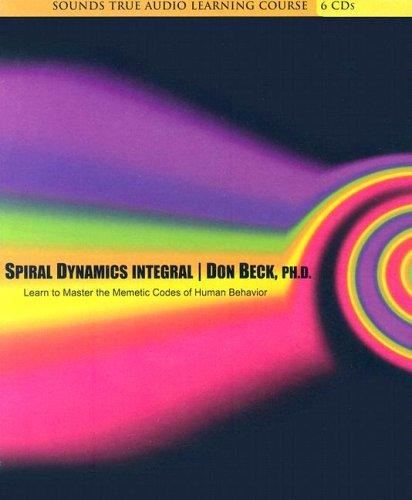

## Core idea

Human consciousness evolves through value systems (vMemes): Beige → Purple → Red → Blue → Orange → Green → Yellow → Turquoise. Different organizational problems require solutions matched to the right vMeme level.

## Key concepts

[[spiral-dynamics]], [[vmemes]], [[developmental-stages]], [[second-tier-thinking]], [[orange-vs-green]], [[integral]]

## What I took from it

### General

*(To be filled in)*

### Connection to our work

AI-first transformation fails if implemented at Orange level (efficiency metrics) when the org is at Green (human values). Understanding the org's vMeme center of gravity determines which narrative works. Related: [Reinventing organizations: geillustreerde versie (Dutch Edition)](laloux-reinventing-organizations-geillustreerde-versie-dutch-editio.md), [The Fifth Discipline: The Art & Practice of The Learning Organization](senge-the-fifth-discipline-the-art-practice-of-the-learning-organi.md)
