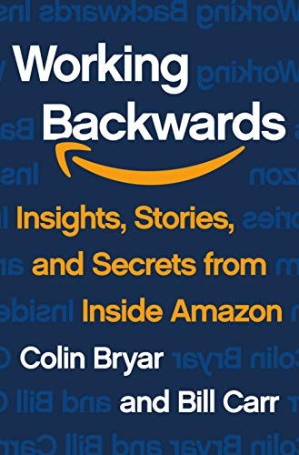

## Core idea

*(To be filled in)*

## Key concepts

Working backwards from the customer, press release method, design from end state

## What I took from it

### General

*(Not directly read — used as reference framework)*

### Connection to our work

Foundation of the two-pass approach: design the AI-native end state first (Pass 1), then map current state (Pass 2). The greenfield sections in the template directly apply this.
