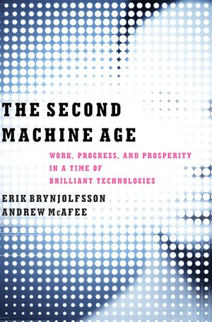

## Core idea

*(To be filled in)*

## Key concepts

Human-AI role split, labor economics of automation, combinatorial innovation, bounty and spread

## What I took from it

### General

*(Not directly read — used as reference framework)*

### Connection to our work

Basis for the narrative layer in toward-ai-native-ai-first: what AI should absorb vs. what humans retain. Also informs the Expected Emergence section.
