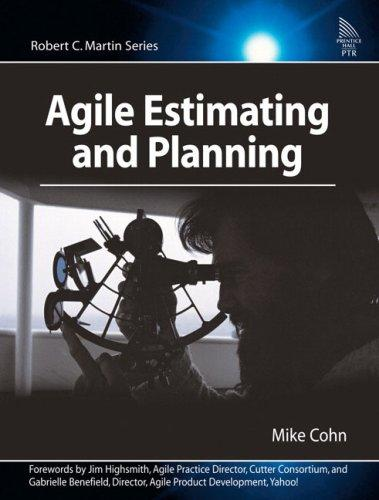

## Core idea

Story points, velocity, release planning, and iterative planning. Estimation is about relative effort and uncertainty, not precise prediction.

## Key concepts

[[story-points]], [[velocity]], [[iterative-planning]], [[uncertainty-in-planning]], [[cone-of-uncertainty]]

## What I took from it

### General

*(To be filled in)*

### Connection to our work

Uncertainty-based planning applies to probe design. Probes should be estimated in uncertainty ranges, not precise timelines.
