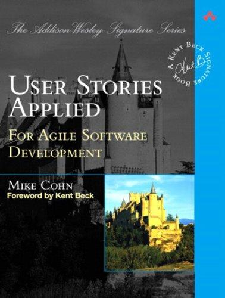

## Core idea

User stories as a requirements technique: "As a [role], I want [goal], so that [reason]." Acceptance criteria, story splitting, backlog management.

## Key concepts

[[user-stories]], [[acceptance-criteria]], [[story-splitting]], [[backlog]], [[role-goal-reason]]

## What I took from it

### General

*(To be filled in)*

### Connection to our work

Probe hypotheses can be written in user story format to clarify who benefits and how we will know it works.
