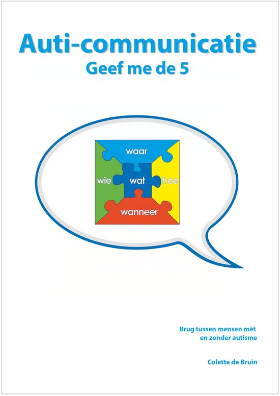

> [!note]- Bronnen
> - [Goodreads — Auti-communicatie: Brug tussen mensen met en zonder autisme](https://www.goodreads.com/book/show/30797292-auti-communicatie)
> - [Hebban — Auti-communicatie, boekgegevens en editiegeschiedenis](https://www.hebban.nl/boek/auti-communicatie-colette-de-bruin)
> - [Managementboek.nl — Auti-communicatie, Colette de Bruin](https://www.managementboek.nl/boek/9789492985149/auti-communicatie-colette-de-bruin)
> - [Officieel inkijkexemplaar (Geef me de 5 / Graviant Educatieve Uitgaven) — voorwoord, inhoudsopgave en volledig hoofdstuk 1](https://cdn.i-pulse.nl/geefmede5/userfiles/inkijkexemplaar/auticom-inkijk.pdf)
> - [geefmede5.nl — Tips voor communicatie bij autisme](https://www.geefmede5.nl/tips-communicatie-bij-autisme)
> - [geefmede5.nl — 10 tips voor omgaan met autisme](https://www.geefmede5.nl/10-tips-voor-omgaan-met-autisme)
> - [Psychologenpraktijk Groene Hart — samenvatting "Vind je eigen weg met autisme" (Achterberg) & Geef me de 5-methode (De Bruin)](https://psychologenpraktijkgroenehart.nl/wp-content/uploads/2025/08/Vind-je-eigen-weg-met-autisme-en-Geef-me-de-Vijf-samenvatting.pdf)

## Core idea

*Auti-communicatie* is het vervolg op [Geef me de 5](de-bruin-geef-me-5.md) en werkt de communicatielaag van die methodiek uit tot een volwaardige, op zichzelf staande taal. Waar *Geef me de 5* structuur biedt via de vijf vragen (wat/hoe/waar/wanneer/wie), gaat dit boek over **hoe je praat, formuleert en reageert** zodat iemand met een autismespectrumstoornis (in het boek consequent "CASS" genoemd — een neutrale, leeftijds- en geslachtsloze aanduiding) zich begrepen voelt. De basisregel: reageer niet op het gedrag of de verbale agressie zelf, maar zoek de oorzaak erachter en pak die aan. Neemt de oorzaak weg, dan verdwijnt het probleemgedrag vaak vanzelf ([inkijkexemplaar, voorwoord](https://cdn.i-pulse.nl/geefmede5/userfiles/inkijkexemplaar/auticom-inkijk.pdf)).

## What I took from it

Wat opvalt aan het voorwoord is de eerlijkheid over de herkomst van de methode: geen laboratoriumonderzoek, maar meer dan een decennium co-creatie met vijftig collega's — leerkrachten, ambulant begeleiders, zorgmedewerkers en ouders — die de aanpak in de praktijk toetsten, bijstelden en verfijnden. De Bruin is daar expliciet over: het is *practice-based*, niet *evidence-based* in de klassieke zin.

Sterk is de "streepjescode"-metafoor uit hoofdstuk 1: in plaats van CASS te reduceren tot een DSM-label, wordt per functiegebied (zintuigen, sociaal-emotioneel, denken, taalbegrip, taalgebruik, plannen/uitvoeren) een individueel patroon van dikke en dunne strepen getekend. Twee mensen met exact dezelfde diagnose kunnen volledig verschillende streepjescodes hebben — wat meteen verklaart waarom generieke aanpakken zo vaak mislukken. Het boek dwingt de lezer om het label los te laten en naar het individuele patroon te kijken.

---

## Samenvatting

### Structuur van het boek

Het boek is opgebouwd als een opklimmende reeks — van *begrijpen* naar *communiceren* naar *bijsturen*:

1. **Informatieverwerkingsstoornis** (h.1) — de oorzaak van ASS uitgelegd via drie verklarende theorieën
2. **Sterke punten van CASS** (h.2) — een bewust tegenwicht tegen de deficit-georiënteerde toon van h.1
3. **Communicatie van CASS** (h.3) — hoe CASS zelf contact maakt en spreekt
4. **Basishouding** (h.4) — de innerlijke instelling die auti-communicatie vereist
5. **Afstemmen: Waarnemen — Aansluiten — Toevoegen** (h.5) — het kernmodel
6. **Terug naar de oorzaak bij probleemgedrag** (h.6)
7. **Afstemmen met Basis Auti-communicatie** (h.7) — veertien concrete taaltechnieken
8. **Samenhang communiceren met Auti-communicatie** (h.8) — de vijf verduidelijken, ondertitelen, generaliseren
9. **Samenhang communiceren door waarom uit te leggen** (h.9)
10. **Tot slot** (h.10)

([Volledige inhoudsopgave, inkijkexemplaar](https://cdn.i-pulse.nl/geefmede5/userfiles/inkijkexemplaar/auticom-inkijk.pdf))

### De informatieverwerkingsstoornis (hoofdstuk 1)

De Bruin herhaalt het uitgangspunt van *Geef me de 5* en werkt het verder uit: ASS is geen gedragsstoornis maar een **informatieverwerkingsstoornis**. Drie verklarende theorieën komen aan bod: moeite met **Centrale Coherentie** (het geheel uit details opbouwen), met **Theory of Mind** (je inleven in wat een ander weet of bedoelt) en met **Executieve Functies** (plannen, organiseren, flexibel schakelen).

**De streepjescode.** Om te laten zien dat elke CASS uniek is, gebruikt het boek de metafoor van een streepjescode over zes gebieden: zintuigen, sociaal-emotioneel functioneren, denken, taalbegrip, taalgebruik, en plannen/uitvoeren van gedrag. Een dikke streep betekent zichtbare, sterke gevolgen op dat gebied; een dunne streep of geen streep betekent weinig tot geen last. Twee mensen met dezelfde diagnose (bijvoorbeeld beiden PDD-NOS) kunnen volledig verschillende streepjescodes hebben — vandaar dat De Bruin liever over "iemands streep" spreekt dan over "zijn stoornis": minder beladen, en het erkent de individuele variatie ([inkijkexemplaar, p.14-15](https://cdn.i-pulse.nl/geefmede5/userfiles/inkijkexemplaar/auticom-inkijk.pdf)).

**Puzzelstukjes en puzzeltijd.** De kernmetafoor voor hoe CASS waarneemt: informatie komt niet als samenhangend geheel binnen, maar als losse puzzelstukjes die actief — en met moeite — tot een betekenisvol beeld samengevoegd moeten worden. De tijd die dat kost, noemt De Bruin **puzzeltijd**: hoe voller het hoofd (hoe meer stukjes er tegelijk liggen), hoe meer puzzeltijd nodig is. Puzzeltijd hangt af van de mate van ASS, opgedane ervaring, intelligentie, de hoeveelheid stukjes die al in het hoofd zitten, en de mate waarin de omgeving zich op CASS afstemt ([inkijkexemplaar, p.17-18, 23](https://cdn.i-pulse.nl/geefmede5/userfiles/inkijkexemplaar/auticom-inkijk.pdf)).

**Zintuiggevoeligheid.** CASS kan op elk zintuig over- of ondergevoelig zijn — soms beide tegelijk, op verschillende momenten. Onderliggend probleem: het filter tussen onbewuste en bewuste waarneming werkt bij CASS minder goed. Bij de meeste mensen houdt dit filter onbelangrijke prikkels (tikkende klok, zoemende koelkast) buiten het bewustzijn; bij CASS dringen die prikkels vaker door, wat concentratie tot een voortdurende bewuste inspanning maakt. Bij te veel prikkels kan het filter zich juist volledig sluiten — CASS "zit dan in zijn eigen wereldje" en neemt zelfs belangrijke prikkels niet meer waar ([inkijkexemplaar, p.24](https://cdn.i-pulse.nl/geefmede5/userfiles/inkijkexemplaar/auticom-inkijk.pdf)).

### De term "CASS"

De Bruin voert doorheen het hele boek de term **CASS** in als aanduiding voor een persoon met een **A**utisme **S**pectrum **S**toornis. De **C** ervoor is geen letterlijk acroniem maar een bewuste, esthetische toevoeging: De Bruin vindt "CASS" een mooie naam, die toevallig ook als jongensnaam voorkomt en als verkorting van de meisjesnaam Cassandra ([inkijkexemplaar, p.11](https://cdn.i-pulse.nl/geefmede5/userfiles/inkijkexemplaar/auticom-inkijk.pdf)). Het doel van de term is sekseneutraal en leeftijdloos kunnen schrijven — "kind", "puber", "hij/zij" wordt overal vervangen door één woord. Expliciete keuze: de beschreven kenmerken zijn niet bedoeld om te stigmatiseren maar om helder te kunnen beschrijven waar de problematiek uit bestaat, vergelijkbaar met hoe een arts een klacht benoemt zonder daarmee de rest van het functioneren te diskwalificeren.

### Sterke punten van CASS (hoofdstuk 2)

Een bewust tegenwicht tegen de deficit-toon van hoofdstuk 1: oog voor detail, goed geheugen, sterk in taal(grapjes), logica, analyseren en filosoferen, objectieve en realistische kijk, doorzettingsvermogen, thuis in de digitale wereld, sterk in gestructureerd werk en regels naleven, eerlijk en betrouwbaar, goed kunnen focussen en afsluiten, kunnen genieten van kleine dingen, plichtsgetrouw en zelfstandig, en vaak fantasierijk en kunstzinnig.

### Basishouding (hoofdstuk 4)

Voor auti-communicatie effectief werkt, moet de begeleider/opvoeder een innerlijke basishouding aannemen: fungeren als **tolk** tussen de wereld van CASS en de omgeving, je aanpassen aan zijn (on)mogelijkheden, uitgaan van **positieve intentie en onvoorwaardelijk geloof** in CASS, actief aan zelfreflectie doen, je "rits dicht" houden (niet persoonlijk reageren op gedrag), en betrouwbaar zijn.

### Afstemmen: Waarnemen — Aansluiten — Toevoegen (hoofdstuk 5)

Het centrale procesmodel van het boek, kortweg **WAT**: eerst **Waarnemen** wat er bij CASS speelt, dan **Aansluiten** bij zijn beleving en niveau, en pas daarna iets **Toevoegen** — nieuwe informatie, een correctie, een volgende stap. Bij zowel Aansluiten als Toevoegen bespreekt het boek expliciet de uitzonderingen en valkuilen: te snel toevoegen zonder eerst aan te sluiten is een van de meest gemaakte fouten in de omgang met CASS.

### Terug naar de oorzaak bij probleemgedrag (hoofdstuk 6)

Herneemt de basisregel uit het voorwoord in concrete vorm: bij probleemgedrag niet het gedrag zelf bestrijden, maar terug redeneren naar de onderliggende oorzaak in de informatieverwerking — en die aanpakken.

### Veertien technieken van Basis Auti-communicatie (hoofdstuk 7)

Het meest praktische hoofdstuk van het boek: veertien concrete, direct toepasbare taaltechnieken. De titels van de veertien secties komen uit de inhoudsopgave van het boek zelf; de toelichting en voorbeelden hieronder zijn aangevuld vanuit de officiële methodiekpagina's van Geef me de 5 ([geefmede5.nl — Tips voor communicatie bij autisme](https://www.geefmede5.nl/tips-communicatie-bij-autisme), [geefmede5.nl — 10 tips voor omgaan met autisme](https://www.geefmede5.nl/10-tips-voor-omgaan-met-autisme)) en een onafhankelijke praktijksamenvatting die dezelfde technieken met concrete voorbeelden bespreekt ([Psychologenpraktijk Groene Hart — samenvatting Vind je eigen weg met autisme & Geef me de 5](https://psychologenpraktijkgroenehart.nl/wp-content/uploads/2025/08/Vind-je-eigen-weg-met-autisme-en-Geef-me-de-Vijf-samenvatting.pdf)), die de Geef me de 5-methode expliciet als bron noemt.

**7.1 — Geef puzzeltijd tijdens een gesprek.** Na een vraag of instructie heeft CASS **puzzeltijd** nodig — de tijd om binnenkomende informatie tot een samenhangend geheel te verwerken (zie hoofdstuk 1). De regel: blijf stil, wacht net zo lang als de puzzeltijd duurt, en voeg vooral **geen nieuwe informatie** toe terwijl iemand nog aan het verwerken is — dat vergroot de hoeveelheid te puzzelen stukjes en verlengt het proces alleen maar.

**7.2 — Geef puzzeltijd bij overgangen.** Dezelfde logica toegepast op overgangsmomenten tussen taken of activiteiten: een overgang vraagt evenveel verwerkingstijd als een vraag. Vooraf aankondigen dat een overgang eraan komt (in plaats van hem abrupt te laten plaatsvinden) geeft CASS de puzzeltijd die anders ontbreekt.

**7.3 — Zeg wat WEL.** Formuleer wat je wél van iemand verwacht, in plaats van wat niet mag. "Loop rustig" in plaats van "Ren niet" — want een verbod beschrijft niet wat er in de plaats moet gebeuren, en CASS moet dat gewenste alternatief zelf nog bedenken.

**7.4 — Spreek positief.** Gebruik positieve woorden, zodat informatie door CASS direct positief gelabeld wordt — bijvoorbeeld "handig" of "slim plan" in plaats van neutrale of negatieve formuleringen ([Psychologenpraktijk Groene Hart-samenvatting](https://psychologenpraktijkgroenehart.nl/wp-content/uploads/2025/08/Vind-je-eigen-weg-met-autisme-en-Geef-me-de-Vijf-samenvatting.pdf)).

**7.5 — Zet negatief om naar (meer) positief.** Waar 7.3 en 7.4 gaan over hoe je van meet af aan formuleert, gaat deze techniek over het actief herschrijven van een reeds negatieve boodschap: neem een zin die van nature negatief is en herformuleer die naar een (meer) positieve versie, zonder de inhoud te veranderen.

**7.6 — Spreek kernachtig.** Korte zinnen, zonder bijzinnen, één boodschap tegelijk. Hoe meer een zin vertakt, hoe meer wegen CASS in zijn hoofd moet afleggen om de kern te vinden.

**7.7 — Spreek zwart-wit.** Spreek in uitersten — zoals CASS zelf ook denkt — in plaats van in nuances of een grijs midden. Een grijze tussenpositie vraagt juist het soort samenhang-denken (centrale coherentie) waar CASS moeite mee heeft.

**7.8 — Spreek met !!! in plaats van met ???.** Stel iets in de vorm van een mededeling in plaats van een vraag. "Je hangt je jas op" kost minder verwerking dan "Zou je je jas willen ophangen?", omdat een vraag CASS dwingt om eerst te bepalen of er eigenlijk wel een echte keuze is.

**7.9 — Spreek met !? Als hij ! niet accepteert, maar wel nodig heeft.** Een tussenvorm voor de situatie waarin een kale mededeling (!) door CASS niet geaccepteerd wordt terwijl de duidelijkheid ervan wel nodig is, bijvoorbeeld door een verschil in wens naar autonomie en nood aan!. Een voorbeeld hiervan is ! gevolgd door "Ok?" of "Goed?". Hierdoor heeft CASS het gevoel mee beslist te hebben.

**7.10 — Zeg sorry.** Als volwassene of begeleider je eigen aandeel in een misverstand of fout expliciet en concreet benoemen — vergelijkbaar met het "Tafel afruimen"-voorbeeld uit de inleiding, waar de vader leert de fout bij zichzelf te zoeken in plaats van bij het kind. Sorry is een opportuniteit op herstel van vertrouwen. Valkuil: "Sorry, maar..."   

**7.11 — Spreek concreet.** Gebruik woorden die je letterlijk zou kunnen tekenen; vermijd vage, abstracte uitdrukkingen. Zeg niet "straks" maar "om 2 uur" ([Psychologenpraktijk Groene Hart-samenvatting](https://psychologenpraktijkgroenehart.nl/wp-content/uploads/2025/08/Vind-je-eigen-weg-met-autisme-en-Geef-me-de-Vijf-samenvatting.pdf)).

**7.12 — Maak abstract concreet.** Waar 7.11 gaat over woordkeuze tijdens het spreken, gaat dit over onderwerpen die inherent abstract zijn (gevoelens, tijd, sociale regels): visualiseer ze — een tekening, tijdlijn of pictogram dwingt tot concreetheid en maakt het onderwerp verwerkbaar.

**7.13 — Spreek met feiten.** Gebruik algemene, vaststaande informatie in plaats van meningen of sociaal-emotioneel gekleurde framing. Feiten worden door CASS beter verwerkt dan sociale informatie, juist omdat ze zonder sociale en emotionele lagen worden aangeboden.

**7.14 — Stem af op zijn 'Ik'.** CASS heeft vaak een beperkt en fragmentarisch zelfbeeld, mede doordat opmerkingen van anderen door de emotionele lading ervan niet altijd landen in het eigen zelfbeeld. Auti-communicatie ondersteunt dit actief door zelfkennis als concrete, feitelijke informatie aan te reiken — bijvoorbeeld: "Het hoort bij jou dat je soms wat langer moet nadenken, dat komt door je autisme" of "Jij bent een echte detailwaarnemer, daar ben jij goed in." Dat soort ondertitelde zelfkennis komt terecht in wat CASS al over zichzelf weet, in plaats van verloren te gaan in de emotionele lading van de opmerking.

### Samenhang communiceren met Auti-communicatie (hoofdstuk 8)

Waar hoofdstuk 7 op zinsniveau werkt, gaat hoofdstuk 8 een niveau hoger: niet de losse zin, maar de samenhang over een hele taak, dag of relatie. De sectietitels komen uit de inhoudsopgave van het boek; toelichting en voorbeelden hieronder zijn aangevuld vanuit de officiële methodiekpagina van Geef me de 5 ([geefmede5.nl — Wie, wat, waar, wanneer en hoe. Waarom de WAAROM niet?](https://www.geefmede5.nl/actueel/48/wie--wat--waar--wanneer-en-hoe--waarom-de-waarom-niet)) en de eerder genoemde praktijksamenvatting ([Psychologenpraktijk Groene Hart](https://psychologenpraktijkgroenehart.nl/wp-content/uploads/2025/08/Vind-je-eigen-weg-met-autisme-en-Geef-me-de-Vijf-samenvatting.pdf)).

**De 5 verduidelijken (8.1-8.5).** Deze cluster brengt de wat/hoe/waar/wanneer/wie uit *Geef me de 5* terug in de dagelijkse taal.
- **8.1 De 5 verduidelijken** — bij elke taakuitleg de vijf elementen expliciet herhalen, niet veronderstellen dat ze vanzelfsprekend zijn.
- **8.2 In de taak zetten** — wanneer CASS niets te doen heeft voelt dat ongemakkelijk. Hierdoor kan CASS onverwacht reageren, bijv door herhalende handelingen. Wat CASS hier nodig heeft, is concreet iets voor handen hebben om te doen. Om iets niet telkens te moeten herhalen, kan het handig zijn een visuele voorstelling te hebben van dat 'doen'. Bijv: "CASS ga doen wat op je picto-bord staat!" 
- **8.3 Parkeren in de tijd** — als iets nu niet aan de orde kan komen, benoem dat expliciet én zeg wanneer je erop terugkomt ("wanneer wel") — en houd je vervolgens aan die afspraak. Zonder dat expliciete "wanneer wel" blijft een onderwerp onopgelost in het hoofd rondspoken ([Psychologenpraktijk Groene Hart-samenvatting](https://psychologenpraktijkgroenehart.nl/wp-content/uploads/2025/08/Vind-je-eigen-weg-met-autisme-en-Geef-me-de-Vijf-samenvatting.pdf)).
- **8.4 Opgesplitst parkeren in de tijd** — wanneer we complexere zaken willen parkeren, dienen we dat opgesplitst te doen. Elk deeltje geven we een plaats in de tijd en parkeren we. De valkuil: Complexere zaken gaan vaak over zaken waar iedereen zo vol van is, dat er veel over gesproken wordt.  Terwijl we nu net parkeren om het een plaats te geven en het tijdelijk af te sluiten!   
- **8.5 De HOE verduidelijken** — van de vijf is het *hoe* vaak het lastigst, omdat een taak doorgaans uit meerdere deeltaken bestaat. De oplossing: het hoe verduidelijken door een concreet **stappenplan** te maken ([geefmede5.nl](https://www.geefmede5.nl/actueel/48/wie--wat--waar--wanneer-en-hoe--waarom-de-waarom-niet)).

**Ondertitelen (8.6-8.11).** "Ondertitelen" is de kernmetafoor van dit blok: net als een ondertitel bij een film, geef je in taal aan wat voor de kijker/toehoorder anders impliciet en dus onzichtbaar zou blijven. Het brengt samenhang aan en geeft taal aan wat nog geen betekenis heeft.
- **8.6 Omgeving ondertitelen** — benoem wat er in de omgeving gebeurt, bijvoorbeeld: "Dat is de postbode die een pakketje brengt."
- **8.7 'Ik' of 'ander' ondertitelen** — benoem wat er in jezelf of in de ander omgaat, inclusief zichtbare fysieke signalen: "Jij hebt een rode kleur op je wangen, jij hebt hard gefietst!" Dit sluit direct aan bij techniek 7.14 (afstemmen op zijn 'Ik'): door zelfkennis als feit te ondertitelen ("Dat komt door je autisme", "Jij bent een echte detailwaarnemer"), landt die kennis in het zelfbeeld van CASS in plaats van verloren te gaan in de emotionele lading van het moment ([Psychologenpraktijk Groene Hart-samenvatting](https://psychologenpraktijkgroenehart.nl/wp-content/uploads/2025/08/Vind-je-eigen-weg-met-autisme-en-Geef-me-de-Vijf-samenvatting.pdf)).
- **8.8 Zijn taken ondertitelen** — benoem expliciet wat een taak allemaal inhoudt en wat erbij hoort — bijvoorbeeld dat "de tafel afruimen" ook het tafelkleed omvat, niet alleen de borden.
- **8.9 Toekomst ondertitelen** — vertel vooraf, stap voor stap, wat er te verwachten valt aan communicatie, taak en gedrag — zodat CASS niet zonder referentiekader een nieuwe situatie ingaat.
- **8.10 Verleden ondertitelen** — breng achteraf samenhang aan in wat er gebeurd is: benoem wat er is voorgevallen en waarom, zodat het niet als een los, onverklaard feit in het geheugen blijft hangen.
- **8.11 Categorieën ondertitelen** — benoem tot welke categorie iets behoort; dit is de directe voorbereiding op generaliseren (8.12), omdat je pas kunt generaliseren tussen situaties als je weet dat ze tot dezelfde categorie behoren.

**Generaliseren (8.12-8.15).** CASS ondervindt van nature moeite met **centrale coherentie** (zie hoofdstuk 1) en beschouwt een situatie daardoor snel als volledig nieuw zodra er één detail verandert.
- **8.12 Generaliseren** — expliciet aanleren dat voor soortgelijke situaties dezelfde regel of hetzelfde kader geldt, juist omdat dat voor CASS niet vanzelfsprekend overspringt van de ene situatie naar de andere ([Psychologenpraktijk Groene Hart-samenvatting](https://psychologenpraktijkgroenehart.nl/wp-content/uploads/2025/08/Vind-je-eigen-weg-met-autisme-en-Geef-me-de-Vijf-samenvatting.pdf)).
- **8.13 Vaste afspraken en regels maken** — bouw op die generalisatie voort met heldere, herbruikbare regels in plaats van telkens opnieuw uit te leggen.
- **8.14 Uitzonderingen benoemen** — elke regel kent uitzonderingen; als die niet expliciet benoemd worden, past CASS de regel star toe, zelfs wanneer dat niet passend is.
- **8.15 Relativeren** — generaliseren is tegelijk de basis van relativeren: wie eenmaal kan generaliseren, leert vervolgens ook nuanceren tussen situaties in plaats van alles even zwart-wit te behandelen.

### Samenhang communiceren door waarom uit te leggen (hoofdstuk 9)

Dit hoofdstuk lijkt op het eerste gezicht te botsen met het advies elders in de methodiek om "waarom" te vermijden — De Bruins eigen methodiekpagina stelt: *"Als je duidelijk bent 'op de 5', is de waarom overbodig. Sterker nog: de waarom ook uitleggen, maakt het juist ingewikkelder"* ([geefmede5.nl](https://www.geefmede5.nl/actueel/48/wie--wat--waar--wanneer-en-hoe--waarom-de-waarom-niet)). Hoofdstuk 9 lost die schijnbare tegenspraak op: waarom is geen verboden woord, maar een instrument dat pas ingezet wordt wanneer het echt nodig is — en dan op een specifieke, feitelijke manier, niet als sociale of abstracte redenering.

- **9.1 Waarom uitleggen met feiten** — een waarom-verklaring wordt gegeven met algemene, vaststaande feiten en met verbindingswoorden als *want* en *omdat*, die de causale samenhang expliciet zichtbaar maken.
- **9.2 Waarom-vraag beantwoorden met een dooddoener** — de valkuil om te vermijden: reageer nooit op een waarom-vraag met een non-antwoord als "daarom" of "omdat ik het zeg" — zo'n dooddoener biedt geen echte causale informatie en laat CASS zonder de samenhang die hij nodig heeft.
- **9.3 Gevolgen verduidelijken** — maak gevolgen expliciet en concreet, typisch via een "Als je … dan …"-formulering, zonder nuancering ([Psychologenpraktijk Groene Hart-samenvatting](https://psychologenpraktijkgroenehart.nl/wp-content/uploads/2025/08/Vind-je-eigen-weg-met-autisme-en-Geef-me-de-Vijf-samenvatting.pdf)).
- **9.4 Interne motivatie zoeken** — zoek eerst naar CASS's eigen intrinsieke motivatie (IM). Die kan tekortschieten wanneer het doel te abstract of te ver weg is (het klassieke voorbeeld: "voor later" leren is voor een puber met ASS een abstract begrip zonder trekkracht). Schiet interne motivatie tekort, dan kan een concrete, aan het gewenste gedrag gekoppelde externe prikkel worden ingezet.
- **9.5 Win-winnen** — in het hoofd van CASS is een win-win vertaald als een balans. Sterker nog, de motivatie moet sterker doorwegen dan de geleverde prestatie. Hiervoor kan je als - dan constructies maken. Als ... (geleverde prestatie voor hem, gewenst gedrag voor ons/hem) - dan ... (voordeel voor CASS = IM). \
Voorwaarden: 
  - Gewenst gedrag: 100% duidelijk voor CASS
  - IM moet even zwaar, of zwaarder wegen dan het gewenst gedrag
  - De win-win moet de snelste en makkelijkste weg zijn naar IM. Je kan nooit een win-win maken als er een snellere of makkelijker oplossing is dan het inzetten van het gewenste gedrag.   
- **9.6 Zwart-wit keuze geven** — bouwt voort op techniek 7.7: geef bij een gevolg of beslissing een ondubbelzinnige, binaire keuze ("Als je … dan …"), zonder middenweg.
- **9.7 Geef vertrouwen en maak verantwoordelijk** — het sluitstuk van het hoofdstuk en van de methodiek als geheel: geef CASS echt vertrouwen en echte verantwoordelijkheid over de uitkomst, in plaats van elke stap te blijven controleren. Dit is de communicatieve vertaling van de basishouding uit hoofdstuk 4 ("positieve intentie en onvoorwaardelijk geloof") en van de ontwikkelingslijn uit *Geef me de 5* — van persoonsafhankelijk via structuurafhankelijk naar zelfstandig (zie [Geef me de 5](de-bruin-geef-me-5.md)).

### Kanttekening

Net als bij *Geef me de 5* is de onderbouwing hier expliciet **practice-based**: ontwikkeld en getoetst door De Bruin samen met vijftig collega's uit onderwijs, zorg en gezinnen over meer dan een decennium, niet via gecontroleerde effectstudies ([inkijkexemplaar, voorwoord](https://cdn.i-pulse.nl/geefmede5/userfiles/inkijkexemplaar/auticom-inkijk.pdf)). De brede praktijktoetsing is een reële kwaliteitswaarborg, maar iets anders dan wetenschappelijke validatie.
