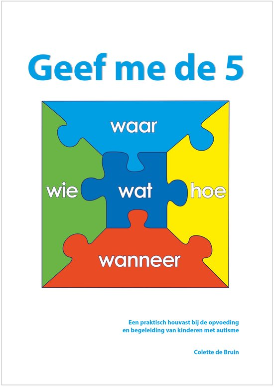

> [!note]- Bronnen
> - [Goodreads — Geef me de 5](https://www.goodreads.com/book/show/11497685-geef-me-de-5)
> - [Hebban — Geef me de 5, boekgegevens en editiegeschiedenis](https://www.hebban.nl/boek/geef-me-de-5-colette-de-bruin)
> - [mijn.bsl.nl — Geef me de 5, uitgeversgegevens eerste druk](https://mijn.bsl.nl/geef-me-de-5/433372)
> - [Kennisplein Gehandicaptensector — Methode Geef me de 5](https://www.kennispleingehandicaptensector.nl/tips-tools/tools/methode-geef-me-5)
> - [Autismeportaal — Geef me de Vijf: waarom deze methode werkt voor jouw autistische brein](https://www.autismeportaal.nl/post/geef-me-de-vijf-methodiek-bij-autisme)
> - [Mijn Gezondheidsgids — Geef me de 5-methodiek bij autisme](https://www.mijngezondheidsgids.nl/neurologie/autisme/geef-me-de-5-methodiek-bij-autisme/)
> - [Interim24-7 — Geef me de 5 (methode-achtergrond, ontwikkelingslijn)](https://www.interim24-7.nl/zorg-abc/32-lvg-licht-verstandelijk-gehandicapt.html)

## Core idea

Een kind met autisme heeft, om een situatie te begrijpen, telkens antwoord nodig op vijf vaste vragen: **Wat** is mijn taak, **Hoe** voer ik ze uit, **Waar** vindt het plaats, **Wanneer** moet ik beginnen en klaar zijn, en **Wie** is erbij betrokken. Colette de Bruin — orthopedagogisch gedragsdeskundige, moeder van vijf pleegkinderen met autisme en zelf opgevoed door een vader met het syndroom van Asperger — ontwikkelde deze methodiek vanuit de kern dat autisme een **informatieverwerkingsstoornis** is, geen gedragsprobleem. Duidelijkheid en voorspelbaarheid zijn dan geen pedagogische vriendelijkheid, maar een functionele noodzaak: zonder de vijf antwoorden blijft de wereld voor het kind onvoorspelbaar, en onvoorspelbaarheid kost het autistische brein onevenredig veel energie.

## What I took from it

Wat dit boek onderscheidt van algemene opvoedadviesliteratuur is de volgorde van redeneren: niet "dit gedrag is problematisch, hoe corrigeren we het", maar "dit gedrag is de uitkomst van hoe dit brein informatie verwerkt, dus wat moet de omgeving veranderen". De methodiek plaatst de aanpassingslast bewust bij de begeleider/opvoeder, niet bij het kind — een omkering die in de gehandicaptenzorg en het onderwijs allesbehalve vanzelfsprekend is.

De kracht van de vijf-vragen-structuur zit in de eenvoud: het is geen theoretisch model dat eerst geïnternaliseerd moet worden, maar een directe checklist die iedereen — ouder, leerkracht, begeleider — in elke situatie kan toepassen. Tegelijk is de onderbouwing expliciet **practice-based** en niet via gerandomiseerde trials getoetst ([Kennisplein Gehandicaptensector](https://www.kennispleingehandicaptensector.nl/tips-tools/tools/methode-geef-me-5)) — de methode steunt op decennia praktijkervaring van De Bruin en gebruikers, niet op experimentele effectstudies. Dat maakt het een sterk toepasbaar, maar wetenschappelijk minder hard onderbouwd instrument dan de klinische toon van "auti-bril" en "informatieverwerkingsstoornis" soms suggereert.

---

## Samenvatting

### Uitgangspunt: autisme als informatieverwerkingsstoornis

De Bruin vertrekt niet vanuit gedragskenmerken, maar vanuit drie theoretische kaders over hoe het autistische brein informatie verwerkt: **centrale coherentie**, **executief functioneren** en **theory of mind** ([mijn.bsl.nl](https://mijn.bsl.nl/geef-me-de-5/433372)). Kort samengevat:

- **Zwakkere centrale coherentie** — niet-autistische hersenen zien automatisch eerst het geheel en zoomen dan in op details; autistische hersenen werken andersom en moeten de samenhang actief construeren uit losse details ([Autismeportaal](https://www.autismeportaal.nl/post/geef-me-de-vijf-methodiek-bij-autisme)).
- **Bredere, diepere prikkelverwerking** — er worden meer hersennetwerken tegelijk geactiveerd, wat opmerkzaamheid en detailgerichtheid vergroot, maar ook meer tijd en energie kost om overzicht te krijgen ([Mijn Gezondheidsgids](https://www.mijngezondheidsgids.nl/neurologie/autisme/geef-me-de-5-methodiek-bij-autisme/)).
- **Moeizame generalisatie** — een vaardigheid die in de ene context is aangeleerd, wordt niet automatisch toegepast in een andere; expliciete instructie per context is nodig, transfer wordt niet verondersteld.

Gedrag dat van buitenaf "vreemd" of "ongepast" oogt, is in deze lezing een logisch gevolg van hoe informatie binnenkomt en verwerkt wordt — niet van onwil of opvoedingsfouten.

### De auti-bril

Centraal staat het opzetten van de **"auti-bril"**: de wereld leren zien vanuit het perspectief van iemand met ASS, zodat je begrijpt *waarom* een kind reageert zoals het reageert, in plaats van alleen het gedrag te beoordelen. De Bruin herhaalt dit als methodische discipline: eerst de onderliggende informatieverwerking begrijpen, dan pas een interventie kiezen.

### De vijf vragen

Het operationele hart van de methode — vijf vaste vragen die een kind nodig heeft om een taak of situatie te kunnen uitvoeren zonder stress:

| Vraag | Betekenis |
|---|---|
| **Wat** | Wat is precies mijn taak? (concreet, niet abstract geformuleerd) |
| **Hoe** | Welke stappen doorloop ik om de taak uit te voeren? |
| **Waar** | Op welke plek vindt dit plaats? |
| **Wanneer** | Wanneer begin ik, en — minstens zo belangrijk — wanneer ben ik klaar? |
| **Wie** | Wie is erbij betrokken, en wie kan ik erop aanspreken? |

Zolang één van deze vijf onbeantwoord blijft, kost de situatie het kind onevenredig veel energie om te doorgronden — met stressgedrag als gevolg. De Bruin: *"Maak je het vervolgens voorspelbaar en duidelijk wat het kind van 's ochtends vroeg tot 's avonds laat moet doen, dan is de stress weg."* ([Mijn Gezondheidsgids](https://www.mijngezondheidsgids.nl/neurologie/autisme/geef-me-de-5-methodiek-bij-autisme/))

### Praktijkvoorbeeld: Cindy

Het boek illustreert de methode onder meer aan de hand van de casus Cindy: door structureel meer helderheid te bieden op de vijf elementen — en haar letterlijk iets tastbaars in handen te geven bij overgangsmomenten — werden lastige transities aanzienlijk soepeler en zonder verzet ([Kennisplein Gehandicaptensector](https://www.kennispleingehandicaptensector.nl/tips-tools/tools/methode-geef-me-5)).

### Auti-communicatie

De vijf vragen werken alleen als de communicatie zelf is aangepast aan hoe het autistische brein taal verwerkt — De Bruin noemt dit **auti-communicatie**:

- **Concreet in plaats van abstract** — letterlijke, ondubbelzinnige taal vermindert misverstanden; figuurlijke uitdrukkingen en impliciete aannames worden vermeden.
- **Visueel ondersteund** — het boek werkt met pictogrammen en (in de eerste druk) een bijgevoegde dvd met downloadbare pictogrammen en videofragmenten uit de praktijk ([mijn.bsl.nl](https://mijn.bsl.nl/geef-me-de-5/433372)).
- **Zowel verbaal als visueel**, afgestemd op de verwerkingsstijl van het individuele kind.

### Vijf werkingsprincipes

Naast de vijf-vragen-structuur beschrijft de methodiek vijf onderliggende principes die verklaren *waarom* de aanpak werkt ([Autismeportaal](https://www.autismeportaal.nl/post/geef-me-de-vijf-methodiek-bij-autisme)):

1. **Concrete communicatie** vermindert misverstanden door abstracte taal te vermijden
2. **Structuur** verlaagt energieverbruik doordat de situatie voorspelbaar wordt
3. **Sensorische aandacht** houdt de prikkelbelasting beheersbaar
4. **Geleidelijke verandering** geeft het brein de tijd om te schakelen tussen taken
5. **Positieve bekrachtiging** versterkt motivatie zonder kritiek of correctie als vertrekpunt

De rode draad: de interventie zit in het **aanpassen van de omgeving**, niet in het proberen te veranderen van het kind zelf.

### Ontwikkelingslijn: van persoonsafhankelijk naar zelfstandig

De methode beschrijft een groeilijn in drie fasen: van **persoonsafhankelijk** (er moet steeds één vaste, vertrouwde persoon sturing geven), via **structuurafhankelijk** (het kind functioneert zelfstandig zolang de opgebouwde structuur — de vijf antwoorden — aanwezig blijft), naar uiteindelijk grotere **zelfstandigheid** ([Interim24-7](https://www.interim24-7.nl/zorg-abc/32-lvg-licht-verstandelijk-gehandicapt.html)). De Bruin formuleert het doel scherp: niet levenslange afhankelijkheid van begeleiding, maar de beweging van **"overleven"** naar **"leven"**, naar **"regie over het eigen leven"** ([Mijn Gezondheidsgids](https://www.mijngezondheidsgids.nl/neurologie/autisme/geef-me-de-5-methodiek-bij-autisme/)).

### Doelgroep en bereik

Het boek richt zich op ouders, leerkrachten, en begeleiders in zorg, onderwijs en psychiatrie van kinderen met autisme — inclusief kinderen met bijkomende (ernstige) verstandelijke beperkingen. Sinds de eerste druk in 2004 bij Graviant Educatieve Uitgave (Doetinchem, ISBN 90-75129-64-5, 192 pagina's, [mijn.bsl.nl](https://mijn.bsl.nl/geef-me-de-5/433372)) zijn er meerdere herdrukken en een uitgebreide boekenreeks verschenen; van dit specifieke boek zijn intussen meer dan 125.000 exemplaren verkocht ([Hebban](https://www.hebban.nl/boek/geef-me-de-5-colette-de-bruin)). De methodiek zelf is gepatenteerd en wordt inmiddels ook via cursussen en trainingen aangeboden voor opvoeders, onderwijs en zorgprofessionals.

### Kanttekening

De methodiek is nadrukkelijk **practice-based**: gebouwd op praktijkervaring van De Bruin, pleegouders en professionals, niet gevalideerd via gecontroleerde effectstudies ([Kennisplein Gehandicaptensector](https://www.kennispleingehandicaptensector.nl/tips-tools/tools/methode-geef-me-5)). Dat doet niets af aan de praktische bruikbaarheid van de vijf-vragen-structuur, maar betekent wel dat claims over werkzaamheid vooral op ervaring en gebruikersaantallen steunen, niet op wetenschappelijk bewijs van effect.
