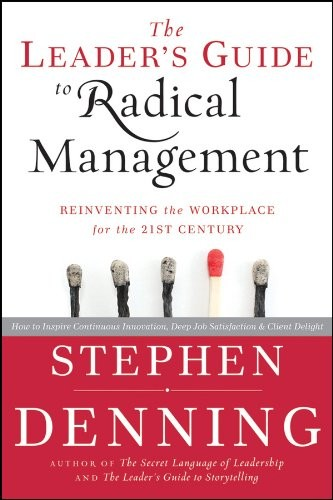

## Core idea

Traditional management (plan-and-control) fails in a world of rapid change. Radical management: iterative work focused on customer delight, self-organizing teams, radical transparency, continuous improvement.

## Key concepts

[[radical-management]], [[customer-delight]], [[self-organizing-teams]], [[iterative-work]], [[continuous-improvement]], [[storytelling-in-management]]

## What I took from it

### General

*(To be filled in)*

### Connection to our work

Radical management principles map directly to AI-first org design. Customer delight (outside-in) and self-organizing teams (post-AI) are the same destination from different starting points. Related: [Reinventing organizations: geillustreerde versie (Dutch Edition)](laloux-reinventing-organizations-geillustreerde-versie-dutch-editio.md), [Management 3.0: Leading Agile Developers, Developing Agile Leaders](appelo-management-30-leading-agile-developers-developing-agile-lead.md)
