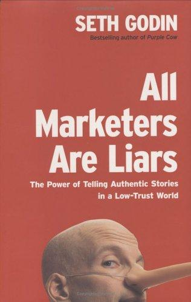

## Core idea

Marketing works through authentic stories that match the audience's worldview. The best stories are true. Authenticity matters because people sense inauthenticity.

## Key concepts

[[authentic-storytelling]], [[worldview-matching]], [[framing]], [[remarkable]], [[permission-marketing]]

## What I took from it

### General

*(To be filled in)*

### Connection to our work

The narrative layer in toward-ai-native is a storytelling challenge. The AI-first story must be authentic (true) and match the organization's worldview. A story that doesn't match worldview is ignored or rejected. Related: [Start with Why: How Great Leaders Inspire Everyone to Take Action](sinek-start-with-why-how-great-leaders-inspire-everyone-to-take-ac.md)
