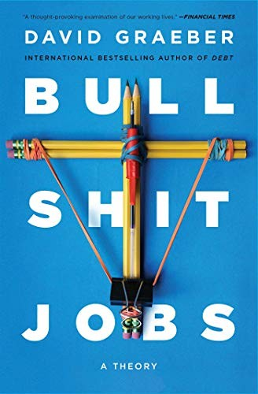

## Centrale these

In 2013 schreef Graeber een essay in *Strike! Magazine* met de stelling dat een groot deel van de moderne banen zinloos is — en dat de mensen die ze uitvoeren dat zelf het best weten. Hij werd overladen met reacties van mensen die hun eigen werk herkenden. Het boek is de uitwerking van die these.

De kern: **een significant deel van de moderne jobs zijn "bullshit jobs" — werk waarvan de uitvoerder zelf gelooft dat het geen bestaansrecht heeft.** Dit is geen individueel falen. Het is structureel, en het contradicteert de basislogica van het kapitalisme: als markten efficiënt zijn, zouden zinloze jobs verdwijnen. Ze prolifereren.

---

## De vijf types

### 1. Flunkies
Jobs die bestaan om iemand anders belangrijker te laten lijken. Niet om werk te doen, maar om aanwezig te zijn als statussymbool.

*Voorbeelden: receptionist die niets te doen heeft, persoonlijk assistent die niet nodig is, portier die er alleen staat om indruk te maken.*

### 2. Goons
Jobs die alleen bestaan omdat andere organisaties vergelijkbare mensen in dienst hebben. Offensief of defensief, maar wederzijds onnodige rollen die elkaar in stand houden.

*Voorbeelden: bedrijfsjuristen (omdat concurrenten ook juristen hebben), lobbyisten, PR-specialisten, telemarketeers, militaire contractors.*

Graeber's test: als iedereen er tegelijk mee zou stoppen, zou de wereld er niet slechter op worden.

### 3. Duct tapers
Mensen aangesteld om problemen op te lossen die niet zouden mogen bestaan — of om structurele fouten ad hoc te blijven patchen in plaats van ze te fixen.

*Voorbeelden: de programmeur die elke week dezelfde bug herstelt omdat niemand hem structureel oplost; de medewerker die data manueel overzet tussen twee systemen die met elkaar zouden moeten praten; de consultant die managementproblemen oplost die het management zelf veroorzaakt.*

### 4. Box tickers
Mensen wiens job bestaat om een organisatie te laten *zeggen* dat ze iets doet zonder het echt te doen. De taak is de schijn van activiteit, niet de activiteit zelf.

*Voorbeelden: compliance-medewerkers die formulieren invullen die niemand leest; welzijnscoördinatoren aangesteld om een vinkje te zetten; rapportages die automatisch worden gearchiveerd.*

### 5. Taskmasters
In twee varianten:
- **Onnodige managers**: leidinggevenden die teams aansturen waarvan het team zelf erkent dat ze beter af zouden zijn zonder hen
- **Bullshit-generatoren**: mensen wier job bestaat uit het aanmaken van zinloos werk voor anderen — vergaderingen plannen, taken delegeren die niemand vroeg

---

## Bullshit jobs vs. shit jobs

Een cruciale onderscheid die Graeber maakt: **bullshit jobs** zijn niet hetzelfde als **shit jobs**.

| | Bullshit jobs | Shit jobs |
|---|---|---|
| **Inhoud** | Zinloos, maar de uitvoerder weet het | Vermoeiend, gevaarlijk of onaangenaam, maar maatschappelijk nuttig |
| **Verloning** | Vaak goed betaald | Vaak slecht betaald |
| **Voorbeelden** | Corporate lawyer, PR-manager, compliance officer | Verpleegkundige, vuilnisophaler, schoonmaker |

De paradox: **hoe duidelijker nuttig je job is voor de samenleving, hoe minder je er doorgaans voor betaald wordt.** En omgekeerd.

---

## Waarom prolifereren bullshit jobs?

Graeber wijst op een structurele logica die hij **"manageriaal feodalisme"** noemt:

- De macht en status van een manager worden vaak gemeten aan de grootte van zijn team → incentive om mensen in dienst te nemen ook als dat niet nodig is
- Organisaties verkiezen mensen te betalen om te doen alsof ze werken boven toegeven dat het werk niet bestaat
- In onze samenleving is betaald werk gekoppeld aan morele waarde — een job hebben is goed, geen job hebben is verdacht, zelfs als de job zinloos is
- Grote organisaties ontwikkelen eigen interne logica waarbij administratief overhead zichzelf in stand houdt

---

## Psychologische schade

Graeber besteedt veel aandacht aan het leed dat bullshit jobs veroorzaken. Mensen in zinloze jobs rapporteren consistent:
- Depressie, angst, verlies van zelfwaardering
- Het gevoel iets te stelen ("ik word betaald voor niets")
- Cynisme dat oversloeg naar de rest van hun leven

De ironie: mensen in slecht betaalde maar zinvolle jobs (verpleging, onderwijs) rapporteren hogere werktevredenheid dan mensen in goed betaalde bullshit jobs.

**Mensen hebben de behoefte te voelen dat hun werk ertoe doet.** Dat is geen luxe — het is een fundamentele psychologische behoefte.

---

## Graeber's politiek punt

Het boek is ook een politiek-economische aanklacht. Keynes voorspelde in 1930 dat we tegen 2000 nog maar 15 uur per week zouden werken dankzij productiviteitswinsten. Dat is niet gebeurd.

De productiviteitswinsten zijn niet omgezet in vrije tijd — ze zijn geabsorbeerd in bullshit jobs. Graeber stelt dat dit geen toeval is: een beschikbare arbeidersklasse die bezig gehouden wordt (ook met zinloos werk) is politiek handiger dan mensen die vrije tijd hebben om na te denken.

> *"It's as if someone were out there making up pointless jobs just to keep us all working."*

---

## Conclusies

1. **Bullshit jobs zijn reëel en wijdverspreid** — niet als individuele perceptie maar als collectief, herkenbaar fenomeen
2. **Ze zijn structureel, niet accidenteel** — ze worden in stand gehouden door organisatorische logica, statusdynamieken en politieke economie
3. **Ze veroorzaken psychologische schade** — zelfs (of juist) als ze goed betaald zijn
4. **Marktwaarde en sociale waarde zijn omgekeerd evenredig** — de meest nuttige jobs zijn het slechtst betaald
5. **De oplossing vereist een ander denken over werk en inkomen** — Graeber was sympathiek aan Universal Basic Income als manier om de koppeling tussen werk en morele waarde te doorbreken

---

## Verwant in de kennisbank

- [Moral Mazes](jackall-moral-mazes-the-world-of-corporate-managers.md) — hoe bureaucratische logica managers drijft tot gedrag dat niemand wil
- [Organize for Complexity](pflaeging-organize-for-complexity-how-to-get-life-back-into-work-to-bu.md) — alternatief organisatiemodel dat zinvol werk centraal stelt
- [The Performance Illusion](../articles/performance-and-evaluation/the-performance-illusion.md) — hoe beoordelingssystemen bullshit-activiteit in stand houden (box tickers, taskmasters)
- [Beyond the Bonus](../articles/remuneration/beyond-the-bonus.md) — verloning losgekoppeld van zingeving als structureel probleem
