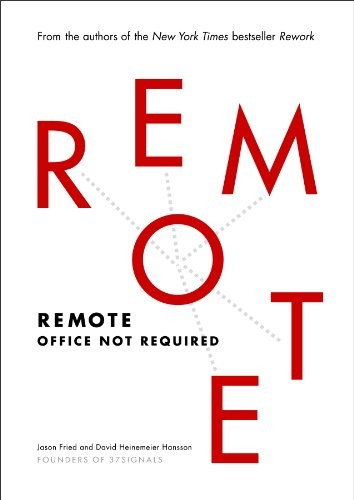

## Core idea

Remote work is not a compromise — it can produce better work than office environments. Async communication, trust, and results over presence.

## Key concepts

[[remote-work]], [[async-communication]], [[trust-over-presence]], [[results-focused-culture]]

## What I took from it

### General

*(To be filled in)*

### Connection to our work

AI-first orgs are often distributed. Remote work practices shape how AI tools are integrated into daily work.
