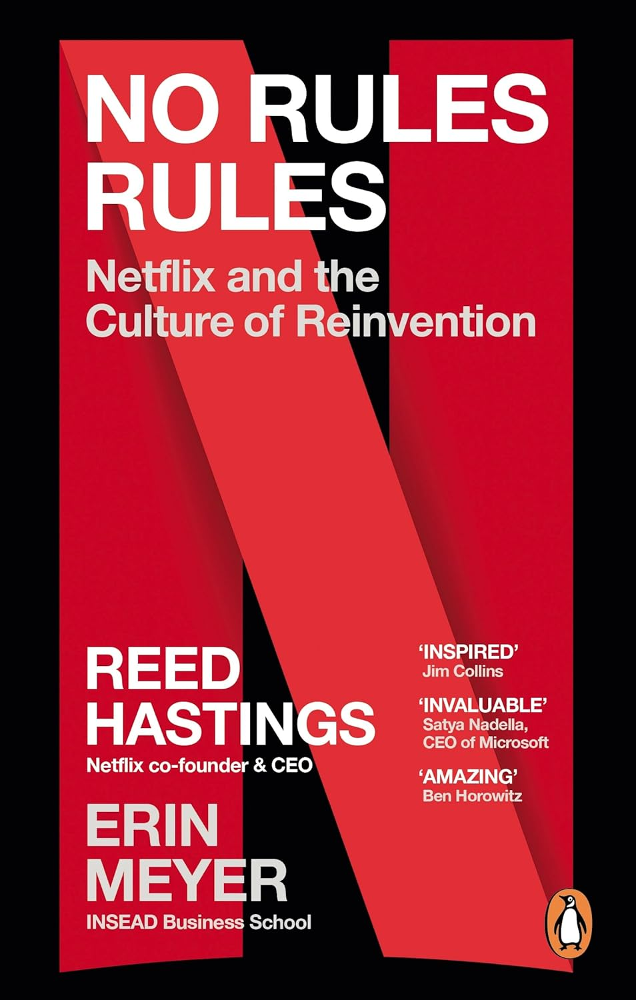
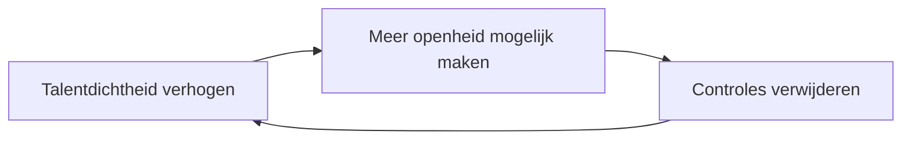

> [!note]- Bronnen
> - [No Rules Rules — Penguin Press (Amazon)](https://www.amazon.com/No-Rules-Netflix-Culture-Reinvention/dp/1984877860)
> - [No Rules Rules — Goodreads](https://www.goodreads.com/book/show/49099937-no-rules-rules)

## Core idea

Netflix's cultuur werkt via een versterkende cyclus: hoge talentdichtheid maakt meer openheid mogelijk, meer openheid maakt het veilig om controles te verwijderen, minder controle geeft mensen meer ruimte om uitstekend werk te leveren — wat de talentdichtheid verder versterkt. Geen van de drie elementen werkt zonder de andere twee.

## Key concepts

[[talent-density]], [[candor]], [[radical-honesty]], [[feedback-kwaliteit]], [[adults-in-the-room]], [[netflix-culture]], [[keeper-test]], [[context-design]], [[free-rider]]

## What I took from it

### General

Waar [Powerful](mccord-powerful-building-a-culture-of-freedom-and-responsibility.md) (McCord, 2018) het *waarom* van de Netflix-cultuur beschrijft vanuit HR-perspectief, beschrijft dit boek het *hoe* vanuit de CEO zelf — aangevuld door Erin Meyer (auteur van *The Culture Map*) die de context en de buitenwereld-blik levert. De afwisseling tussen Hastings en Meyer is het sterkste element van het boek: Hastings beschrijft wat Netflix doet, Meyer plaatst het in vergelijkend perspectief en benoemt waar het wringt.

### Connection to our work

**Het antwoord op de free-rider vraag.** Netflix lost het free-rider probleem op niet via collectieve druk maar via talentdichtheid: wie niet bijdraagt, past niet in een team van uitblinkende mensen die elkaar uitdagen. De Keeper Test maakt dit operationeel — het is geen maatstaf voor goed of slecht, maar voor "past deze persoon nog in de richting die we opgaan?" Dat is een fundamenteel andere vraag dan een performance review.

**De 4A's als praktisch kader.** Dit is de concrete tool die ontbrak in onze KB-discussie over candor. De 4A's (Aim to assist, Actionable, Appreciate, Accept or discard) zijn geen gedragscode maar een ontwerpregel: ze maken eerlijke feedback minder bedreigend voor de gever én de ontvanger. Door de ontvanger het laatste woord te geven (accept or discard), wordt feedback informatie — geen oordeel.

**Frequentie van 360°-feedback: het definitieve antwoord.** Geschreven 360s: jaarlijks, minimum 10 collega's, niet-anoniem (senior medewerkers: 30–40). Live 360-diners: geen vaste cadans beschreven — het boek benadrukt continue, informele feedback als norm, niet een geplande cyclus. De live sessies zijn een aanvulling op de dagelijkse praktijk, niet de vervanging ervan.

**Meyer's bijdrage: cultuur is niet universeel.** Netflix paste zijn candor-cultuur aan voor verschillende landen. In indirecte culturen (Azië, maar ook deels Europa) werkt directe feedback anders — niet slechter, maar anders. Meyer voegt een pragmatisch principe toe: pas de *vorm* aan, niet de *inhoud*. Eerlijkheid blijft het doel; de verpakking mag cultureel sensitief zijn.

Related: [Powerful: Building a Culture of Freedom and Responsibility](mccord-powerful-building-a-culture-of-freedom-and-responsibility.md), [How Netflix Reinvented HR](../trust-by-design/the-kindness-trap/mccord-how-netflix-reinvented-hr-hbr-2014.md), [Netflix-case](../trust-by-design/beyond-the-review/cases/netflix.md), [The Advantage](lencioni-the-advantage-why-organizational-health-trumps-everything-el.md)

---

## Samenvatting

### De kern: een versterkende cyclus

Het boek is gestructureerd als drie fases die elkaar versterken:

Elke fase wordt twee keer behandeld: eerst de basis, dan de gevorderde versie.

---

### Fase 1 — Talentdichtheid

**Het startpunt: de onverwachte ontdekking (2001)**

Na de dot-com crash moest Netflix een derde van het personeel ontslaan. Het resterende team — kleiner, maar uitsluitend sterke performers — werkte sneller, produceerde beter, en had hogere moraal. De conclusie: één sterke performer levert meer op dan twee middelmatige. En middelmatige performers verlagen de productiviteit van de rest.

Professor Will Felps onderzocht het omgekeerde mechanisme: één chronisch onderpresterend teamlid tast de teamprestatie systematisch aan, en dat negatieve effect is groter dan het positieve effect van een even sterk presterend lid ([Felps, Mitchell & Byington, 2006](../trust-by-design/the-kindness-trap/felps-mitchell-byington-how-when-why-bad-apples-2006.md)). Prestatie is dus niet symmetrisch besmettelijk — slecht gedrag weegt zwaarder door dan goed gedrag.

**Talentdichtheid in de praktijk**

- **Top-of-market salaris per individu**: niet op basis van interne schalen maar op basis van wat de markt betaalt voor die specifieke persoon. Medewerkers worden actief aangemoedigd om recruitercalls te nemen om hun marktwaarde te kennen.
- **Geen bonussen**: variabele beloning werkt voor routinetaken, niet voor creatief werk. Netflix betaalt het marktloon in het basisloon — niet als bonus aan het einde van het jaar.
- **Geen stack ranking of bell curves**: die structuren maken concurrenten van collega's en ondermijnen samenwerking.

**De Keeper Test**

Managers stellen zichzelf voortdurend de vraag: *"Als deze persoon morgen zou vertrekken, zou ik alles doen om hem of haar te houden?"* Als het antwoord nee is: royaal vertrekpakket (4–9 maanden), eerlijk gesprek, en zoeken naar iemand die beter past.

Medewerkers mogen de test ook omgekeerd toepassen op hun manager.

Het frame: niet "heeft deze persoon gefaald?" maar "past deze persoon nog bij waar we naartoe gaan?" Dat ontkoppelt de beslissing van moreel oordeel.

---

### Fase 2 — Candor

**Waarom candor het tweede element is, niet het eerste**

Candor werkt alleen in een omgeving van talentdichtheid. In een gemiddeld team is eerlijke feedback bedreigend: de ontvanger verdedigt zich, de gever wordt als vijand gezien. In een team van uitblinkers is eerlijke feedback informatie — iedereen wil beter worden, en feedback helpt daarbij.

**De 4A's: het praktische kader**

Netflix gebruikte vier principes om feedback te normeren:

| A | Principe | Wat het betekent |
|---|---|---|
| **Aim to assist** | Geef feedback met de intentie te helpen | Niet om frustraties te uiten of macht te tonen |
| **Actionable** | Feedback moet uitvoerbaar zijn | Niet "je bent soms vaag" maar "in de presentatie van dinsdag miste ik concrete cijfers" |
| **Appreciate** | Ontvang feedback met dankbaarheid | Defensiviteit sluit het gesprek — ook als je het niet eens bent |
| **Accept or discard** | De ontvanger beslist wat hij doet met de feedback | Feedback is informatie, geen opdracht |

Het laatste punt is cruciaal: **de ontvanger heeft altijd het laatste woord**. Dat maakt candor veilig voor de gever — je bent niet verantwoordelijk voor wat de ander doet met jouw feedback.

**Live 360-diners: het format**

Netflix organiseerde live 360-sessies — in kleine groepen, face-to-face, vaak rond een etentje.

- **Format**: start/stop/continue
- **Verhouding**: ±25% positief, ±75% ontwikkelingsgericht
- **Regel**: geen vaagheid — alle feedback moet concreet en uitvoerbaar zijn
- **Anonimiteit**: geen — iedereen staat achter zijn eigen feedback

**Geschreven 360s: het enige formele moment**

- **Frequentie**: jaarlijks
- **Aantal reviewers**: minimum 10 collega's; voor senior medewerkers 30–40
- **Anonimiteit**: geen — signed feedback

Buiten de jaarlijkse geschreven 360 en de live diners: continue, informele feedback als dagelijkse norm. Geen vaste cadans voor de live sessies.

**Hoe de candor-cultuur werd opgebouwd**

1. **Leiders gaan eerst**: senior medewerkers vragen publiekelijk om kritische feedback en reageren er zichtbaar op — zonder zich te verdedigen. Dat geeft het signaal dat eerlijkheid veilig is.
2. **Interne transparantie**: medewerkers krijgen toegang tot vertrouwelijke financiële data. Informatie verbergen is een vorm van controle — openheid is een vorm van vertrouwen.
3. **Fouten publiek maken**: mislukte initiatieven worden openlijk gedeeld, inclusief wat er mis ging. "Sunshine" heten ze dat. Wie fouten verbergt, verliest geloofwaardigheid; wie ze deelt, wint vertrouwen.
4. **Disloyaliteit redefinieren**: bij Netflix is het *niet* spreken als je het ergens niet mee eens bent een daad van disloyaliteit — niet het omgekeerde.

---

### Fase 3 — Controles verwijderen

**Context over controle**

Wanneer je de juiste mensen hebt en ze eerlijk met elkaar communiceren, worden de meeste controles overbodig. Netflix verwijderde ze systematisch:

- **Vakantiebeleid**: geen. Leidinggevenden modelleren zichtbaar dat ze vakantie nemen.
- **Onkostenbeleid**: vijf woorden — *"Act in Netflix's best interests."*
- **Goedkeuringsprocessen**: medewerkers beslissen zelf, zonder voorafgaande toestemming.

Het principe: *"Lead with context, not control."* De taak van de leider is niet beslissingen nemen, maar de informatie geven die mensen in staat stelt zelf de juiste beslissingen te nemen.

**De informatiekapitein**

Beslissingen worden genomen door de persoon die het meeste relevante informatie heeft — niet door de persoon met de hoogste rang. Die persoon heet de "informed captain": hij of zij raadpleegt anderen, luistert, en neemt dan zelf de beslissing. Geen consensus nodig, geen goedkeuring van boven.

**Innovatiecyclus**

1. *Farm for dissent*: actief tegenargumenten verzamelen voor een beslissing
2. Piloteer
3. Informatiekapitein beslist
4. Resultaat: vier bij winst, publiek leren bij verlies

---

### Meyer's perspectief: cultuur is niet universeel

Erin Meyer voegt een cruciaal element toe dat Powerful en de HBR-artikelen missen: de Netflix-cultuur botst in sommige landen.

In directe culturen (Nederland, Denemarken, Israël) sluit de candor-aanpak goed aan. In indirecte culturen (Japan, India, maar ook Frankrijk en Spanje in andere dimensies) werkt dezelfde directheid anders — niet slechts oncomfortabel, maar soms contraproductief.

Haar aanbeveling: pas de *vorm* aan, niet de *inhoud*. Meer context geven voor kritische feedback, meer private kanalen benutten, meer impliciet signaleren. De onderliggende norm — eerlijkheid als culturele verwachting — blijft staan.

---

### Anti-patronen

| Patroon | Waarom het faalt |
|---|---|
| Performance Improvement Plans (PIPs) | Fundamenteel oneerlijk: kondigen impliciet ontslag aan zonder het te zeggen |
| Bonussystemen | Werken voor routinetaken, ondermijnen creatief werk |
| Anonieme 360-feedback | Maakt feedback politiek in plaats van informatief |
| Stack ranking / bell curves | Maakt collega's tot concurrenten |
| Controle als antwoord op vertrouwensbreuk | Lost het symptoom op, niet de oorzaak (verkeerde persoon aangenomen) |

---

### Kernspanning van het boek

> Netflix's cultuur werkt als systeem — je kunt er geen onderdelen uitpikken. Talentdichtheid zonder candor leidt tot politiek. Candor zonder talentdichtheid leidt tot destructieve eerlijkheid. Vrijheid zonder beide leidt tot chaos.

Het boek is eerlijk over de prijs: hoge talentdichtheid betekent dat mensen vertrekken als hun skills niet meer passen. Candor betekent dat moeilijke gesprekken gevoerd worden — regelmatig, niet jaarlijks. Vrijheid betekent dat managers verantwoording dragen voor hun beslissingen, zonder de buffer van beleid.

De vraag is niet of dit model goed is. De vraag is of een organisatie bereid is de prijs te betalen.
