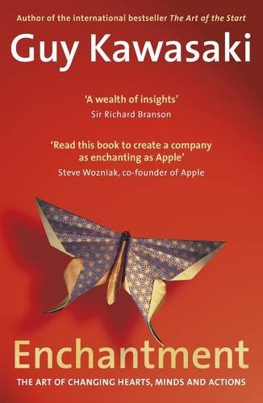

## Core idea

Enchantment = changing people's hearts, minds, and actions through likability, trustworthiness, and great cause. Not manipulation — genuine transformation.

## Key concepts

[[enchantment]], [[likability]], [[trustworthiness]], [[cause]], [[influence]]

## What I took from it

### General

*(To be filled in)*

### Connection to our work

AI-first transformation requires enchantment, not selling. The cause must be genuine (freeing people from non-human work). Related to the narrative layer.
