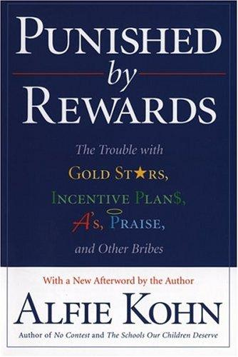

## Core idea

Externe beloningen — bonussen, cijfers, lof, privileges — ondermijnen intrinsieke motivatie. Hoe groter en zichtbaarder de beloning, hoe meer mensen ophouden te doen wat ze deden omdat ze het wilden, en beginnen te doen wat nodig is om de beloning te krijgen. Het systeem dat gedrag wil sturen, vernietigt precies de motivatie die het probeert te benutten.

## Key concepts

[[intrinsieke-motivatie]], [[extrinsieke-motivatie]], [[prestatiebeloning]], [[bonussystemen]], [[overjustification-effect]], [[zelfdeterminatietheorie]]

## What I took from it

### General

Kohn bouwt op tientallen jaren motivatieonderzoek (Deci, Ryan, Lepper, e.a.) en komt tot een conclusie die managers niet willen horen: "Do this and you'll get that" werkt niet. Niet omdat mensen lui zijn of verkeerd geconfigureerd — maar omdat de logica van beloning fundamenteel haaks staat op de logica van betrokkenheid. Beloningen sturen aandacht naar de beloning, weg van de taak. Ze signaleren dat de taak zelf niet de moeite waard is. Ze vervangen vertrouwen door controle.

De kracht van het boek: het is geen intuïtie, het is een systematische doorlichting van de onderzoeksliteratuur. Kohn is polemisch, maar zijn bronnen zijn solide.

### Connection to our work

Dit is de empirische onderbouwing achter de kritiek op oranje bonussystemen in [Beyond the Review — Inleiding](../trust-by-design/beyond-the-review/deel-1.md). Organisaties die willen bewegen naar Groen of Teal (zie [Laloux](laloux-reinventing-organizations-geillustreerde-versie-dutch-editio.md)) stoten op precies dit probleem: de beloningsmechanismen die ze geërfd hebben van Oranje ondermijnen de waarden die ze willen uitdragen. Kohn geeft de theoretische grond voor wat de cases in Beyond the Review in de praktijk doen.

**Bevestigen Kohn's kritiek op prestatiebeloning** — ze schaften het af of gingen er nooit mee van start:
- [FAVI](../trust-by-design/beyond-the-review/cases/favi.md): bonus was 20% van maandloon, bepaald door stemming van de chef → precies wat Kohn beschrijft als willekeurig en demotiverend. Zobrist schafte het af en integreerde het in het basissalaris.
- [Handelsbanken](../trust-by-design/beyond-the-review/cases/handelsbanken.md): geen individuele bonussen in een sector waar ze norm zijn. Collectieve Oktogonen-uitkering bij pensioen vervangt de prikkel volledig.
- [AES](../trust-by-design/beyond-the-review/cases/aes.md): geen manager-bepaalde bonussen; iedereen — ook fabrieksarbeiders — kreeg toegang tot stock options.
- [Buurtzorg](../trust-by-design/beyond-the-review/cases/buurtzorg.md), [Morning Star](../trust-by-design/beyond-the-review/cases/morning-star.md), [Semco](../trust-by-design/beyond-the-review/cases/semco.md): beloning losgekoppeld van individuele beoordeling.

**Passen Kohn's alternatieven toe** — collaboratie, autonomie, onverwachte erkenning:
- [Happy Melly](../trust-by-design/beyond-the-review/cases/happy-melly.md): Merit Money = peer-verdeeld, onverwacht, criteria wisselen maandelijks → voldoet aan Kohn's zes regels voor effectieve beloningen.
- [W.L. Gore](../trust-by-design/beyond-the-review/cases/wl-gore.md): peer-ranking vervangt managerbeoordeling → verwijdert de subjectiviteit en machtsdynamiek die Kohn bekritiseert.
- [Mondragon](../trust-by-design/beyond-the-review/cases/mondragon.md): democratisch loonbeleid, winst- én verliesverdeling → collectief boven individueel.
- [Buffer](../trust-by-design/beyond-the-review/cases/buffer.md): transparante formule zonder onderhandeling → geen strategisch gedrag, geen politiek.

Related: [Laloux](laloux-reinventing-organizations-geillustreerde-versie-dutch-editio.md), [[books/appelo-managing-for-happiness-games-tools-practices-to-motivate-any|Managing for Happiness]], [[books/bakke-joy-at-work|Joy at Work]]

---

## Samenvatting

### Centrale stelling

Kohn's kernargument is verrassend eenvoudig: **beloningen werken niet**. Niet op de manier waarop we bedoelen dat iets "werkt". Ze kunnen tijdelijk gedrag aanpassen, maar ze slagen er structureel niet in om blijvende betrokkenheid, creativiteit of kwaliteit te produceren. En in veel gevallen maken ze dingen erger.

Dit gaat in tegen de diepst gewortelde managementaanname: dat mensen gedrag vertonen als er een voldoende grote wortel aan hangt. Kohn laat zien dat dit behaviorisme — van Skinner's duiven naar kantoormedewerkers — een onjuiste overdracht is.

---

### Het overjustification-effect

Het centrale mechanisme dat Kohn beschrijft heet het **overjustification effect** (Lepper & Greene, 1973). Als mensen iets doen dat ze leuk vinden, en je begint ze daarvoor te belonen, dalen hun interesse en kwaliteit — ook als je de beloning later wegneemt.

**Het klassieke experiment**: kinderen die tekenden voor plezier werden verdeeld in drie groepen. Groep 1: beloond met een certificaat (verwacht). Groep 2: verrast met een certificaat achteraf. Groep 3: geen beloning. Na de beloningsperiode: groep 1 tekende minder, met minder kwaliteit. Groepen 2 en 3: geen verschil.

Conclusie: de belofte van een beloning ondermijnt intrinsieke motivatie. Een onverwachte beloning achteraf doet dit niet — omdat er geen verwachting was om naartoe te werken.

---

### Vijf redenen waarom beloningen mislukken

Kohn destilleert de literatuur in vijf mechanismen:

**1. Beloningen bestraffen**
Een beloning die je niet krijgt, is een straf. Systemen die belonen voor X straffen automatisch iedereen die X niet haalt. De spanning van "word ik beoordeeld als goed genoeg?" is een constante stressor.

**2. Beloningen verstoren relaties**
Zodra manager en medewerker in een beloningsrelatie zitten, verandert de dynamiek. Medewerkers leren wat de manager wil zien — niet wat de situatie vraagt. Vertrouwen wordt vervangen door strategisch gedrag.

**3. Beloningen negeren oorzaken**
Wanneer iemand slecht presteert, is de oorzaak zelden gebrek aan motivatie. Het is vaker: onduidelijkheid, verkeerde middelen, een slechte fit, persoonlijke omstandigheden. Een bonus lost geen van deze oorzaken op.

**4. Beloningen ontmoedigen risico's**
Mensen in een beloningssysteem kiezen de veilige weg. Ze stellen geen vragen die hun beoordeling in gevaar brengen. Ze nemen geen initiatieven die kunnen mislukken. Creativiteit — die per definitie risico inhoudt — droogt op.

**5. Beloningen verminderen interesse**
Dit is het overjustification-effect in de breedste zin: externe beloningen signaleren dat de taak zelf niet de moeite waard is. "Als jij me moet betalen om dit te doen, moet het wel iets zijn wat ik niet uit mezelf zou willen doen."

---

### Prestatieloon specifiek

Een groot deel van het boek gaat over prestatieloon (merit pay, performance bonuses). Kohn's conclusie: het werkt niet, en de reden is structureel.

- **Subjectiviteit**: beoordelaars schatten bijdragen systematisch verkeerd in, beïnvloed door halo-effecten, recency bias en persoonlijke sympathie.
- **Relatieve beoordeling**: in de meeste systemen wint de een ten koste van de ander. Dit vernietigt samenwerking.
- **Kortetermijndenken**: medewerkers optimaliseren voor wat gemeten wordt, niet voor wat belangrijk is. Microsoft's stack ranking (afgeschaft in 2013) is het meest geciteerde voorbeeld.
- **Demotivatie van de meerderheid**: als 70% "voldoende" scoort en 20% "goed", is het systeem structureel demotiverend voor die 70%.

> *"Pay people well and fairly, then do everything you can to get money off their minds."*
> — Alfie Kohn, samenvattend uit het onderzoek van Deci e.a.

---

### Wat werkt dan wel?

Kohn is niet alleen kritisch — hij stelt een alternatief voor, gebaseerd op dezelfde onderzoeksbasis. Drie voorwaarden voor intrinsieke motivatie (voorloper van Deci & Ryan's zelfdeterminatietheorie):

**1. Collaboratie boven competitie**
Mensen werken beter samen wanneer ze niet met elkaar hoeven te concurreren voor schaarse beloningen. Teams presteren beter dan individuen-in-competitie, in bijna elk type taak.

**2. Inhoud boven controle**
Mensen willen weten waarom iets telt, niet alleen wat ze moeten doen. Betekenis, autonomie en groei zijn krachtigere motivatoren dan een bonus.

**3. Keuze boven volgzaamheid**
Autonomie — het gevoel dat je keuzes hebt, dat je werk je eigen keuze is — is een van de sterkste predictoren van kwaliteit en betrokkenheid.

---

### Relevantie voor evaluatie & beloning in organisaties

Kohn schrijft over scholen en bedrijven, maar de implicaties zijn het scherpst voor organisaties die willen bewegen voorbij klassieke prestatiemanagement:

- **Geen prestatiegebonden loon**: beloning los van beoordeling — [Buurtzorg](../trust-by-design/beyond-the-review/cases/buurtzorg.md), [Morning Star](../trust-by-design/beyond-the-review/cases/morning-star.md), [FAVI](../trust-by-design/beyond-the-review/cases/favi.md), [Handelsbanken](../trust-by-design/beyond-the-review/cases/handelsbanken.md)
- **Geen rankings of ratings**: het systeem dat beoordeelt vernielt wat het probeert te meten — zie ook Microsoft's stack ranking (afgeschaft 2013) in [deel-1](../trust-by-design/beyond-the-review/deel-1.md)
- **Peer-evaluatie als alternatief voor managerbeoordeling**: verwijdert de machtsdynamiek zonder de subjectiviteit te vergroten — [W.L. Gore](../trust-by-design/beyond-the-review/cases/wl-gore.md), [Happy Melly](../trust-by-design/beyond-the-review/cases/happy-melly.md)
- **Collectieve beloning boven individuele bonus**: succes is zelden individueel — [Mondragon](../trust-by-design/beyond-the-review/cases/mondragon.md), [Handelsbanken](../trust-by-design/beyond-the-review/cases/handelsbanken.md), [FAVI](../trust-by-design/beyond-the-review/cases/favi.md)
- **Transparante formule zonder onderhandeling**: verwijdert politiek en strategisch gedrag — [Buffer](../trust-by-design/beyond-the-review/cases/buffer.md), [Semco](../trust-by-design/beyond-the-review/cases/semco.md)
- **Vertrouwen als standaard**: de vraag is niet "hoe stimuleer ik mensen?" maar "waarom zouden mensen hier niet willen bijdragen?" — [AES](../trust-by-design/beyond-the-review/cases/aes.md), [Buurtzorg](../trust-by-design/beyond-the-review/cases/buurtzorg.md)

De EU Pay Transparency Directive dwingt Belgische bedrijven tot transparantie over loon — maar Kohn's argument gaat verder: transparantie over een gebrekkig systeem maakt het systeem niet beter. Zie [deel-3](../trust-by-design/beyond-the-review/deel-3.md) en [conclusie](../trust-by-design/beyond-the-review/conclusie.md).
