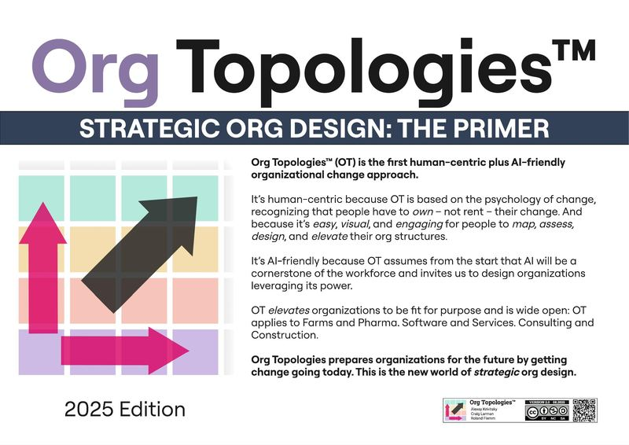
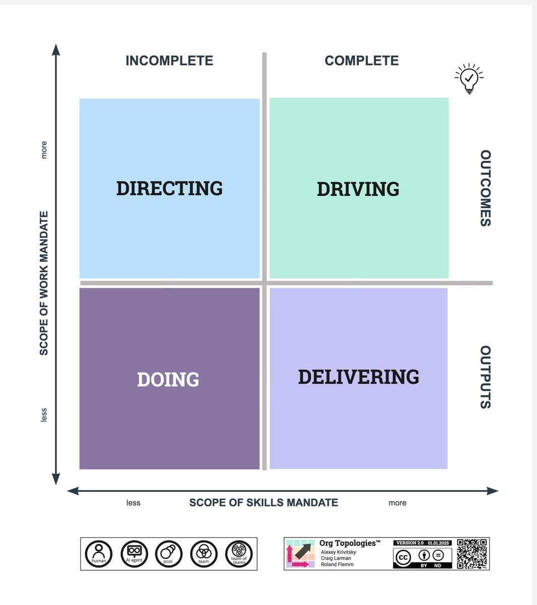
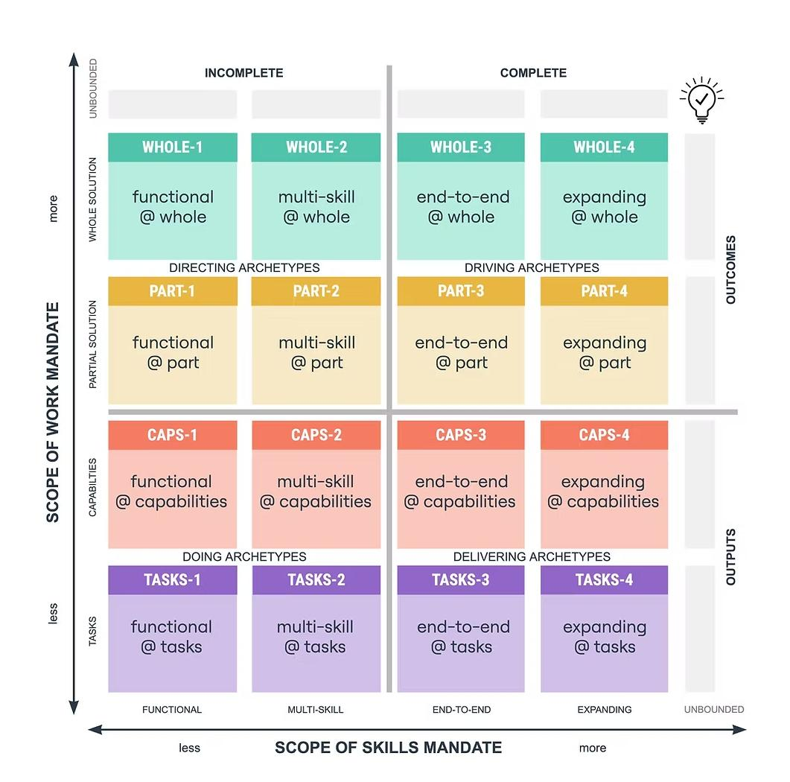

## Core idea

Org Topologies™ (OT) is the first **human-centric + AI-friendly** organizational change approach. It provides a visual mapping language to assess, design, and elevate organizational structures — making it easy for people to *own* their change rather than have it pushed onto them.

OT prepares organizations for the future by getting change going today. It applies universally: Farms and Pharma, Software and Services, Consulting and Construction.

## Key concepts

### The OT Map: Two Dimensions

The map places every organizational unit on two axes:

**Horizontal axis — Scope of Skills Mandate** (transaction costs)
How broad the skills given to a unit are. More to the right = more autonomous, fewer handoffs, faster value flow.

| Level | Description | Example |
|---|---|---|
| Functional | Specialists in one domain | Movie Costume Dept |
| Multi-Skill | Cross-functional but incomplete | Surgical Team (needs Post-Op) |
| End-to-End | Delivers complete value independently | Software Feature Team |
| Expanding | E2E + mandate to acquire new skills | Special Forces Military Team |
| Unbounded | Can learn anything for unbounded exploration | AI-enabled future teams |

**Vertical axis — Scope of Work Mandate** (switching costs)
How broad the business scope a unit is responsible for. Higher = closer to real problems, more context.

| Level | Description | Example |
|---|---|---|
| Tasks | Narrowest scope, fine-grained work | Sous-Chef chopping onions |
| Capabilities | A feature/function/service element | Insurance Claims Processing Group |
| Partial Solution | A business vertical/domain | Uber Ride vs Uber Eats |
| Whole Solution | Holistic customer value | Two-person Instagram-like startup |
| Unbounded | Discovering new undiscovered needs | Pivoting startup (→ Slack) |

### The 16 Archetypes

Each cell on the map is an archetype with a short code:
- **WHOLE** (C0–C4): Top row — whole solution focus
- **PART** (B0–B4): Partial solution focus  
- **CAPS** (A0–A4): Capabilities focus
- **TASKS** (Y0–Y4): Tasks focus

The number (1–4) indicates skills mandate from functional to expanding.

### Four Organizational Characteristics

**1. Incomplete vs. Complete Archetypes**
- *Incomplete*: Require other archetypes to deliver customer value. Rely on "thinkers and planners" elsewhere.
- *Complete*: Can independently deliver customer value. Focus on "value", "outcome", and "flow."

**2. Output vs. Outcome Archetypes**
- *Output*: Counts deliverables (surgeries, features, documents). More output ≠ more outcomes. Often increases cost.
- *Outcome*: Works in higher-level business context. Focuses on healthy people, profit, real impact.

### Four Archetype Groups

| Group | Quadrant | What they do |
|---|---|---|
| **Directing** | Top-left (incomplete, outcomes) | Plan, coordinate, speculate. Write specs for others. Example: Project Manager |
| **Doing** | Bottom-left (incomplete, outputs) | Execute tasks but can't see the whole. Rely on Directing + other specialists |
| **Delivering** | Bottom-right (complete, outputs) | Deliver value end-to-end but in narrow scope. Risk: siloed, wrong value |
| **Driving** | Top-right (complete, outcomes) | Understand + create + deliver customer value holistically. The goal state |

### Three Org Topologies

**1. Resource Topology** (Directing + Doing)
- Goal: 100% resource utilization
- Value creation in Doing archetypes, coordinated by Directing
- High dependencies, traditional project management, heavy upfront specs
- Fit for: organizations that *rent* resources for defined skills (e.g. movie production)

**2. Delivery Topology** (Directing + Delivering)
- Goal: Fast flow via cross-functional teams with minimal change
- "Feature Factory" — near-endless stream of features
- Discovery remains separated; outputs may miss real outcomes ("feature bloat")
- Fit for: domains where the challenge is *predictable* delivery, not discovery

**3. Adaptive Topology** (Driving)
- Goal: Adaptiveness, customer-centricity, continuous learning
- Merges directing + doing + delivering into Driving archetypes
- Humans, AI agents, and robots collaborate on complex problems
- "Synchronicity of work" — all parties work in unison
- Fit for: growth, learning, market disruption, startups

| Aspect | Resource | Delivery | Adaptive |
|---|---|---|---|
| Common Use Case | PMO resource mgmt | Fast delivery of proven worth | Seek, change, discover, adapt |
| Goal | Maximize utilization | Maximize output/predictability | Maximize outcome/innovation |
| Dependencies | High (functional silos) | Moderate | Low (autonomous units) |
| AI Application | Automate tasks, optimize utilization | Real-time insights, feedback loops | Drive innovation, predict needs, ML |

### The MADE Method

The change process in four steps:

1. **Map** — Visualize the current ecosystem "as is" on the OT map
2. **Assess** — Evaluate the "as is" against business objectives. Test for strategic alignment.
3. **Design** — Select the org goal (adaptiveness, flow, utilization…) and org design that supports it
4. **Elevate** — Move the org from "as is" toward "to be" using *Elevating Katas™*

Key insight: *Org design is internal and predictable. Business objectives are external and probabilistic.* Design what you can control.

**Elevating Katas™**: A disciplined, repeating set of practices and principles (from Judo/Toyota kata concept) to incrementally move the org toward the target topology. Periodic re-mapping creates a learning loop.

### Strategic AI Adoption with OT

OT is explicitly AI-friendly. Key insight: *Specialization and expertise are vanishing as limited resources, due to intelligence as a service.* AI makes elevation much easier.

Three questions to guide Strategic AI with OT:
1. **What parts of the org are the focus of development?** → Focus AI where you're elevating, where competitive advantage comes from early adoption
2. **What archetypes are part of your target, and what are the bottlenecks?** → Find early points where AI can make outsized impact
3. **Do the AIs need monitoring by humans?** → Monitoring will become a key human responsibility

**AI per Archetype Group:**

| Group | Strategic AI Application | Key Benefit |
|---|---|---|
| Directing | Predictive analytics, resource optimization, workflow automation | Data-driven decisions, less manual planning |
| Doing | Task-specific agents, virtual assistants, automation | Reduce cognitive load, consistent execution |
| Delivering | Real-time integration, recommendation engines, feedback loops | Reduce silos, align outputs with goals |
| Driving | Adaptive ML, customer journey analytics, AI as subject-matter expert | Amplify autonomy, predict customer needs |

### OT vs. Framework Thinking

Framework thinking (SAFe, Spotify, etc.) assumes an industry-standard framework solves your problems. OT's alternative:
- Strategy chosen to influence business objectives
- Org goals and capabilities chosen to be fit for purpose
- Leaders understand and design their own internal org

OT can *map* other frameworks: SAFe maps mostly to Tasks/Capabilities level with interdependent incomplete teams. RDHY (Haier) maps to micro-enterprises directly interacting with users.

### Language of Org Design

OT introduces a shared vocabulary to describe any organizational unit:
> *"Most of our teams are CAPS-2 — multi-skilled yet incomplete, lacking certain capabilities. There are also functional TASKS-1 parties supporting our CAPS-2 teams. This creates dependencies and challenges that are managed by CAPS-1 and PART-1 groups…"*

An **OT ecosystem** = the structure/configuration of archetypes + components + their relationships.

## What I took from it

### General

The primer is dense and immediately actionable. OT gives a neutral, visual language that avoids the cargo-cult traps of named frameworks. The 2×2 map with 16 archetypes is the core tool — everything else (topologies, MADE, Katas) flows from it.

The human-centric principle — people must *own* not *rent* their change — directly addresses why most transformations fail.

### Connection to our work

Extremely relevant as a strategic positioning tool for AI Adoption Architect work:
- The Adaptive Topology is the target state for AI-first organizations
- Strategic AI Adoption section directly maps onto consultancy propositions
- OT provides the diagnostic language missing from most AI transformation conversations
- The MADE method complements LeSS, Cynefin, and Team Topologies work
- Craig Larman co-authored this — strong connection to [Large-Scale Scrum: More with LeSS (Addison-Wesley Signature Series (Cohn))](larman-large-scale-scrum-more-with-less-addison-wesley-signature-se.md) and [Scaling Lean & Agile Development: Thinking and Organizational Tools for Large-Scale Scrum](larman-scaling-lean-agile-development-thinking-and-organizational-t.md)

Related: [Cynefin Framework](snowden-cynefin.md), [Accelerate: Building and Scaling High Performing Technology Organizations](forsgren-accelerate-building-and-scaling-high-performing-technology-o.md), [Holacracy: The New Management System for a Rapidly Changing World](robertson-holacracy-the-new-management-system-for-a-rapidly-changing-w.md)
