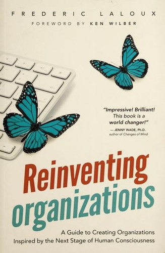
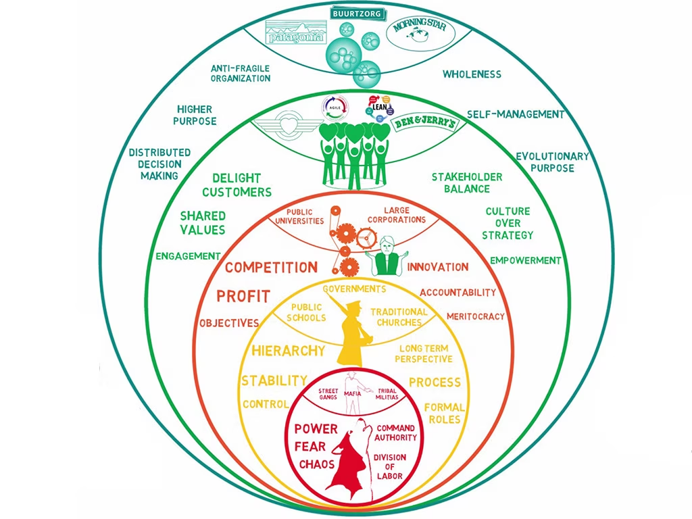

## Core idea

Organizations evolve through developmental stages (Red → Amber → Orange → Green → Teal). Teal organizations are self-managing, wholeness-oriented, and evolutionary-purpose-driven. Each stage is appropriate for its context.

## Key concepts

[Teal Organizations](../concepts/teal-organizations.md), [Self-Management](../concepts/self-management.md), [[evolutionary-purpose]], [[wholeness]], [[organizational-stages]], [[amber-orange-green-teal]], [[advice-process]]

## What I took from it

### General

Dit is het enige managementboek dat organisaties beschrijft die fundamenteel anders zijn dan de meeste — niet op een schaal-van-volwassenheid maar in paradigma. Het sleutelinzicht: elke menselijke samenlevingsvorm heeft zijn eigen organisatievorm voortgebracht. De huidige "Oranje" organisatievorm is niet de eindtoestand — het is een fase. Wat daarna komt is al zichtbaar in een kleine groep organisaties wereldwijd.

### Connection to our work

Begrijpen waar een organisatie *nu* zit bepaalt wat er realistisch mogelijk is — voor elke verandering, inclusief AI-adoptie. AI versterkt het bestaande paradigma: een Oranje organisatie die AI inzet wordt méér Oranje (optimaliseren op schaal), een Amber-organisatie wordt méér Amber (controle geautomatiseerd). AI leidt niet vanzelf naar Teal — Teal vereist een bewustzijnsontwikkeling die los staat van technologie. Related: [Organize for Complexity: How to Get Life Back Into Work to Build the High-Performance Organization (Betacodex Publishing)](pflaeging-organize-for-complexity-how-to-get-life-back-into-work-to-bu.md), [Holacracy: The New Management System for a Rapidly Changing World](robertson-holacracy-the-new-management-system-for-a-rapidly-changing-w.md), [Spiral Dynamics Integral: Learn to Master the Memetic Codes of Human Behavior](beck-spiral-dynamics-integral-learn-to-master-the-memetic-codes-o.md)

---

## Samenvatting

### Centrale stelling

Organisaties zijn niet op zoek naar de beste managementmethode — ze zijn een weerspiegeling van het worldview van de mensen die ze bouwen en leiden. Naarmate menselijk bewustzijn evolueert, evolueren de organisatievormen die mensen kunnen creëren en laten functioneren.

---

### Dit is geen wedstrijd

Voordat je verder leest: Laloux beschrijft *paradigma's*, geen rangorde. Elke fase was en is een adequate respons op een specifieke context. Rood werkt in omgevingen waar directe macht de enige taal is. Amber werkt waar stabiliteit en reproduceerbaarheid de prioriteit zijn. Oranje werkt waar innovatie en groei het doel zijn.

De vraag is niet "hoe kom ik zo snel mogelijk bij Teal?" maar "in welk paradigma opereert deze organisatie, en wat betekent dat voor wat hier werkt en wat niet?" Een interventie die perfect past in Teal kan volledig mislukken in Amber — niet omdat de mensen dom zijn, maar omdat het paradigma de interventie afstoot.

Laloux's model is primair een **diagnostisch instrument**, niet een aspiratieladder.

---

### De paradigma's in detail

#### 🔴 Rood — Impulsief

**Worldview**: de wereld is gevaarlijk en onvoorspelbaar. Macht is de enige zekerheid. Wie sterk is, overleeft.

**Hoe beslissingen worden genomen**: de sterkste beslist. Altijd. Gezag komt van angst en directe controle, niet van positie of regels.

**Hoe mensen worden gezien**: als uitvoerders of als bedreiging. Loyaliteit wordt gekocht of afgedwongen.

**Wat de metafoor vangt**: een wolvenroedel — de alfa bepaalt alles, de rest volgt of vecht. Geen structuur buiten de persoon van de leider.

**Doorbraak ten opzichte van wat ervoor was**: arbeidsverdeling — de sterkste hoeft niet alles zelf te doen, anderen nemen taken over onder zijn gezag.

**Waar het werkt**: crisissituaties, omgevingen zonder rechtsstaat, organisaties die leven van snelheid en intimidatie (straatbendes, bepaalde maffia-structuren, sommige militaire contexten in conflict).

**Schaduwkant**: volledig afhankelijk van de persoon aan de top. Verdwijnt de leider, valt de organisatie uiteen.

---

#### 🟠 Amber — Conformistisch

**Worldview**: de wereld heeft een vaste orde. Er is een juiste manier van doen. Regels en rollen beschermen iedereen.

**Hoe beslissingen worden genomen**: via de hiërarchie en de regels. Wie jouw meerdere is, beslist. Wie de regels kent, heeft macht.

**Hoe mensen worden gezien**: als rollen, niet als individuen. Je bent wat je functie is. Emoties en persoonlijke omstandigheden horen buiten de deur.

**Wat de metafoor vangt**: het leger of de kerk — duidelijke rangen, onveranderlijke procedures, loyaliteit aan de instelling boven loyaliteit aan personen.

**Doorbraak ten opzichte van Rood**: stabiliteit en schaalbaarheid. Processen en rollen maken de organisatie onafhankelijk van één persoon. De katholieke kerk functioneert na 2.000 jaar nog steeds, ongeacht wie de paus is.

**Waar het werkt**: overheidsinstanties, traditionele scholen, grote religieuze organisaties, militaire organisaties in vredestijd — overal waar reproduceerbaarheid en gelijkheid van behandeling de kernwaarde zijn.

**Schaduwkant**: rigiditeit. Verandering is een bedreiging voor de orde. Wie afwijkt van de regels, wordt gecorrigeerd — niet uitgenodigd.

---

#### 🟡 Oranje — Prestatiegericht

**Worldview**: de wereld is een machine die begrepen en geoptimaliseerd kan worden. Wie slimmer en sneller is, wint.

**Hoe beslissingen worden genomen**: op basis van data, analyse en resultaten. Meritocratisch — de beste ideeën winnen, ongeacht rang. In de praktijk: degene die de beste business case bouwt.

**Hoe mensen worden gezien**: als middelen én als talent. Mensen worden ontwikkeld zolang ze bijdragen aan de resultaten. Performancemanagement, bonussen, carrièrepaden.

**Wat de metafoor vangt**: een machine — efficiënt, doelgericht, optimaliseerbaar. Elke tandwiel heeft een functie; het geheel is groter dan de delen.

**Doorbraak ten opzichte van Amber**: innovatie en meritocratisch denken. Je hoeft niet meer geboren te zijn in de juiste klasse of familie om te stijgen — prestatie telt.

**Waar het werkt**: de meeste beursgenoteerde bedrijven, consultancybedrijven, techbedrijven in groeifase — overal waar groei, innovatie en concurrentie de bestaansreden zijn.

**Schaduwkant**: behandelt mensen als middelen zodra de resultaten tegenvallen. Kortetermijndenken door kwartaalcijfers. Externaliseert kosten (milieu, gemeenschap, medewerkerswelzijn) die niet in de cijfers zitten.

---

#### 🟢 Groen — Pluralistisch

**Worldview**: mensen zijn meer dan hun prestaties. Relaties, cultuur en waarden zijn minstens zo belangrijk als resultaten. Alle stemmen tellen.

**Hoe beslissingen worden genomen**: via consensus of uitgebreide consultatie. Iedereen wordt gehoord. De keerzijde: trage besluitvorming en het risico dat moeilijke beslissingen worden uitgesteld om niemand te kwetsen.

**Hoe mensen worden gezien**: als volledige mensen met behoeften, waarden en perspectieven. Empowerment, psychologische veiligheid, diversiteit zijn kernwaarden — niet als HR-strategie maar als oprecht geloof.

**Wat de metafoor vangt**: een familie — warm, inclusief, iedereen hoort erbij. Maar ook: families vermijden soms moeilijke waarheden om de harmonie te bewaren.

**Doorbraak ten opzichte van Oranje**: stakeholderperspectief. De organisatie heeft een verantwoordelijkheid voorbij aandeelhouders — medewerkers, gemeenschap, milieu tellen mee.

**Waar het werkt**: organisaties met een sterke cultuurmissie, nonprofits, coöperaties, bedrijven zoals Southwest Airlines of de vroege Zappos — overal waar cultuur en mensen de onderscheidende factor zijn.

**Schaduwkant**: kan verlammend worden door consensusdrang. Moeilijke beslissingen worden omzeild. En de nadruk op harmonie kan leiden tot oppervlakkige inclusie zonder echte machtsverschuiving.

---

#### 🩵 Teal — Evolutionair

**Worldview**: het leven is een proces van worden. Er is geen eindtoestand, geen perfecte structuur. Vertrouwen in mensen en in het emergente is de basis.

**Hoe beslissingen worden genomen**: via het **adviesproces** — iedereen kan elke beslissing nemen, mits ze advies vragen aan mensen met kennis of mensen die geraakt worden. Het advies is verplicht; de opvolging niet. Geen hiërarchie, geen consensus — maar volledige accountability bij de beslisser.

**Hoe mensen worden gezien**: als hele mensen die zichzelf meebrengen. Geen professionele maskers. Emoties, intuïtie en persoonlijke groei horen bij het werk.

**Wat de metafoor vangt**: een levend organisme — het past zich aan, het heeft geen centrale aansturing nodig, het reageert op zijn omgeving vanuit interne intelligentie.

**Drie doorbraken**:
1. *Zelfmanagement* — geen managers in traditionele zin; rollen in plaats van functies
2. *Heelheid* — de hele persoon is welkom, niet alleen de professionele persona
3. *Evolutionair doel* — het doel van de organisatie is niet vastgesteld door leiderschap maar emergent; leiders luisteren naar waar de organisatie naartoe wil

**Waar het werkt**: Buurtzorg (10.000+ verpleegkundigen zonder managers), Patagonia, FAVI (Franse gietijzerfabriek) — organisaties waar vertrouwen, complexiteit en mensgericht werk samenkomen.

**Schaduwkant**: niet overdraagbaar zonder bewustzijnsontwikkeling. Teal forceren in een organisatie die nog in Oranje of Amber opereert produceert chaos of cynisme — geen Teal. De structuur vereist mensen die vanuit intrinsieke motivatie en zelfsturing kunnen opereren.

---

### Buurtzorg als casestudy

Buurtzorg (Nederlandse thuiszorgorganisatie): 10.000+ verpleegkundigen, geen managers in traditionele zin. Teams van 10–12 verpleegkundigen beheren eigen patiëntenportefeuille, eigen werkplanning, eigen aanwervingen.

Resultaat: hoogste klanttevredenheid in de sector, laagste kosten per patiënt, hoogste medewerkersbetrokkenheid. Niet ondanks het weggooien van management — maar daardoor.

---

### Geen wedstrijd, wel een diagnose

Het meest waardevolle gebruik van Laloux's model is niet "wij willen Teal worden" maar "in welk paradigma opereren wij vandaag, en wat betekent dat?"

Een organisatie die zichzelf Oranje is kan uitstekend functioneren — als de context dat vraagt. Een Groen-aspirerende organisatie die haar Oranje-fundament niet erkent, bouwt luchtkastelen. En een consultant die Teal-interventies voorstelt aan een Amber-organisatie verspilt ieders tijd.

De vraag is altijd: *wat past hier?* Niet: *hoe ver zijn we al?*

---

### Relevantie voor AI-tijdperk

AI versterkt het bestaande paradigma — het verandert het paradigma niet.

- Een **Amber**-organisatie die AI inzet, krijgt meer Amber: geautomatiseerde controle, surveillance, proceshandhaving op schaal.
- Een **Oranje**-organisatie die AI inzet, krijgt meer Oranje: snellere optimalisatie, meer data, hogere outputdruk.
- Een **Groene** organisatie die AI inzet, krijgt meer Groen: meer inclusiechecks, meer feedbackloops, soms verlammender consensusprocessen.
- Een **Teal**-organisatie die AI inzet, gebruikt het als instrument voor het evolutionaire doel — niet als doel op zich.

AI leidt niet vanzelf naar Teal. Teal vereist een bewustzijnsontwikkeling die los staat van technologie. Het gevaar: organisaties die Teal-structuren bouwen als AI-strategie (zelfmanagement als efficiency-maatregel, evolutionair doel als marketingverhaal) produceren een mismatch die sneller breekt dan de Amber-structuur die ze vervingen.
