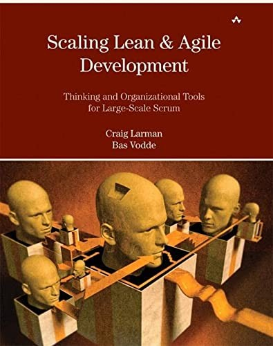

## Core idea

Foundational thinking and organizational tools for large-scale Scrum. Systems thinking, queueing theory, and lean product development applied to organizational design.

## Key concepts

[[less-thinking]], [[queueing-theory]], [[lean-product-development]], [[organizational-design-agile]], [[systems-thinking-agile]]

## What I took from it

### General

*(To be filled in)*

### Connection to our work

Queueing theory explains why % Wait Time in the value stream table matters so much. Related: [Large-Scale Scrum: More with LeSS (Addison-Wesley Signature Series (Cohn))](larman-large-scale-scrum-more-with-less-addison-wesley-signature-se.md), [Lean Thinking: Banish Waste and Create Wealth in Your Corporation](womack-jones-lean-thinking.md)
