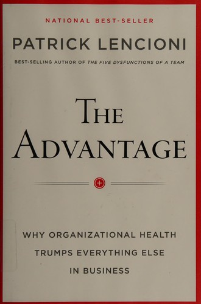

## Core idea

Organizational health is the single greatest competitive advantage. Health = minimal politics, minimal confusion, high morale, low turnover. Built through cohesive leadership, clarity, over-communication, and reinforcement of culture.

## Key concepts

[Organizational Health](../concepts/organizational-health.md), [[leadership-cohesion]], [[clarity]], [[overcommunication]], [[culture]], [[smart-vs-healthy]]

## What I took from it

### General

Het centrale argument van dit boek is even eenvoudig als ongemakkelijk: de meeste organisaties falen niet door gebrek aan intelligentie of strategie — maar door gebrek aan gezondheid. En gezondheid is niet vaag of zacht: het is meetbaar, opbouwbaar, en het enige wat concurrenten niet kunnen kopiëren.

Het meest bruikbare concept: de **zes vragen**. Als een leiderschapsteam die zes vragen niet met één stem kan beantwoorden, is alle andere inspanning symptoombestrijding. Verwarring over richting sijpelt door de hele organisatie — elk niveau interpreteert de lacune zelf in.

### Connection to our work

AI-first transitions most often fail due to organizational health problems, not technical ones. Expected Emergence (Section 14) should include health indicators. Related: [The Five Dysfunctions of a Team](lencioni-the-five-dysfunctions-of-a-team.md), [Creativity, Inc.: Overcoming the Unseen Forces That Stand in the Way of True Inspiration](catmull-creativity-inc-overcoming-the-unseen-forces-that-stand-in-th.md)

---

## Samenvatting

### Centrale stelling

Organisaties hebben twee basisbehoeften: **slim zijn** (strategie, financiën, marketing, technologie) en **gezond zijn** (minimale politiek, minimale verwarring, hoog moreel, laag verloop). De meeste organisaties investeren bijna uitsluitend in slim zijn. Gezondheid is het grotere onderscheidend vermogen — en het enige dat niet te kopiëren is.

> Organizational health is the single greatest competitive advantage available to any company.

"Slim" kan je kopen of inhuren. Gezondheid moet je bouwen — het zit in gedrag, in cultuur, in consistentie over tijd.

---

### De vier disciplines

Lencioni beschrijft vier opeenvolgende disciplines die samen organisatiegezondheid opbouwen:

| # | Discipline | Kernvraag |
|---|---|---|
| 1 | **Build a Cohesive Leadership Team** | Werkt het leiderschapsteam zelf als een gezond team? |
| 2 | **Create Clarity** | Beantwoordt het leiderschapsteam de zes kritische vragen met één stem? |
| 3 | **Over-Communicate Clarity** | Wordt die helderheid consequent en herhaald doorgegeven door de hele organisatie? |
| 4 | **Reinforce Clarity** | Zijn alle systemen (hiring, beloning, ontslag, meetings) afgestemd op die helderheid? |

De disciplines zijn sequentieel: je kunt niet communiceren wat je niet helder hebt, en je kunt niets communiceren als het leiderschapsteam zelf niet op één lijn zit.

---

### Discipline 1 — Build a Cohesive Leadership Team

Het leiderschapsteam is het eerste en belangrijkste team in de organisatie. Als dat team dysfunctioneel is, verspreidt de dysfunctie zich door elk niveau eronder.

Lencioni past hier expliciet het **Five Dysfunctions**-model toe op het leiderschapsteam:

- **Vertrouwen** (kwetsbaarheid): leiders durven fouten toe te geven, ook voor elkaar
- **Conflict**: inhoudelijke meningsverschillen worden uitgesproken, niet vermeden
- **Commitment**: beslissingen worden gedragen — ook door wie het er niet mee eens was
- **Accountability**: leiders spreken elkaar aan op gedrag en afspraken
- **Resultaten**: het teambelang gaat voor het divisiebelang

Het leiderschapsteam modelleert het gedrag dat ze van de rest verwachten. Als leiders zelf politiek bedrijven, verbergen ze informatie of vermijden ze conflicten — dan doet de rest dat ook.

---

### Discipline 2 — Create Clarity

De zes kritische vragen die het leiderschapsteam moet beantwoorden — niet individueel, maar collectief, met één stem:

#### Vraag 1: Why do we exist? — Bestaansreden

Niet "om winst te maken" (dat is een uitkomst, geen reden). De bestaansreden is de fundamentele bijdrage die de organisatie levert aan de wereld of aan de mensen die ze dient.

> Voorbeelden: "zodat klanten zichzelf kunnen ontwikkelen", "zodat onze gemeenschap veilig is", "om technologie menselijk te maken"

#### Vraag 2: How do we behave? — Kernwaarden

Geen aspiratiewaarden ("we streven naar integriteit"), maar **gedragswaarden**: hoe gedragen we ons werkelijk, ook als het moeilijk is? Kernwaarden zijn beschrijvend, niet prescriptief — ze beschrijven wie je al bent op je best.

Lencioni onderscheidt:
- **Core values**: authentiek gedrag dat de identiteit van de organisatie definieert
- **Aspirational values**: wat we willen worden maar nog niet zijn
- **Permission-to-play values**: minimumnormen die iedereen moet hebben (eerlijkheid, respect) — geen onderscheidende waarden

#### Vraag 3: What do we do? — Definitie van het werk

Een eenvoudige, heldere beschrijving van wat de organisatie doet. Niet een marketingzin, maar een functionele omschrijving die elke medewerker met dezelfde woorden kan geven.

#### Vraag 4: How will we succeed? — Strategische verankering

Drie tot vijf **strategische ankerpunten**: keuzes over hoe de organisatie waarde creëert die haar onderscheidt van alternatieven. Dit zijn geen doelen maar oriëntatiepunten — principes die richting geven aan beslissingen op alle niveaus.

#### Vraag 5: What is most important right now? — Thematisch doel

Eén enkelvoudige, kwalitatieve prioriteit voor de komende periode (doorgaans drie tot twaalf maanden). Niet een KPI, maar een **thema** dat energie bundelt. Alles wat het team doet, draagt bij aan dit ene thema — of het is op dit moment niet prioritair.

> Voorbeelden: "de klantervaring fundamenteel verbeteren", "onze operationele basis stabiliseren", "het nieuwe product succesvol lanceren"

Het thematische doel heeft ook **defining objectives**: drie tot vijf concrete resultaten die aantonen dat het thema bereikt is.

#### Vraag 6: Who must do what? — Rollen en verantwoordelijkheden

Duidelijkheid over wie welke beslissingen neemt en wie verantwoordelijk is voor welk resultaat — op het niveau van het leiderschapsteam, en doorvertaald naar de rest.

---

### De Playbook

De antwoorden op de zes vragen worden samengevat in een **Playbook** — één beknopt document dat de organisatie beschrijft voor iedereen die erin werkt of ermee in aanraking komt. Het is het referentiepunt voor onboarding, beslissingen, en communicatie.

---

### Discipline 3 — Over-Communicate Clarity

Het probleem: leiders communiceren een boodschap, worden er zelf moe van, en stoppen. Maar medewerkers hebben een boodschap **zeven keer** nodig voordat ze hem écht hebben geabsorbeerd en gaan geloven.

Gevolg: leiders denken dat de boodschap is overgekomen. Medewerkers hebben hem amper geregistreerd.

**Cascading communication**: na elke vergadering van het leiderschapsteam communiceren de leden naar hun directe rapporten wat er besloten is en wat de implicaties zijn — niet als doorgeefluik, maar met eigen stem en eigen context.

Elke interactie — vergadering, mail, presentatie, gesprek — is een kans om de helderheid te bevestigen of te verwarren. Leiders die inconsistent communiceren, creëren politiek: mensen vullen de lacune zelf in.

---

### Discipline 4 — Reinforce Clarity

Helderheid beklijft alleen als alle systemen in de organisatie erop afgestemd zijn:

| Systeem | Wat het bevestigt |
|---|---|
| **Hiring** | Neem alleen aan wie de kernwaarden al heeft — skills zijn aan te leren, waarden niet |
| **Onboarding** | Leg de bestaansreden, waarden en strategische ankerpunten uit vóór alles wat operationeel is |
| **Performance management** | Beoordeel op gedrag (waarden) én resultaat — niet alleen op output |
| **Rewards & recognition** | Beloon wat je wilt versterken — als je innovatie wil maar alleen delivery beloont, win je delivery |
| **Firing** | Wie aantoonbaar de kernwaarden schendt, hoort niet in de organisatie — ongeacht prestaties |
| **Meetings** | Structureer vergaderingen zodat ze helderheid bevestigen, niet verwarren |

---

### Het vergadermodel

Lencioni (uitgewerkt in *Death by Meeting*) pleit voor vier typen vergaderingen met elk een eigen functie:

| Type | Frequentie | Duur | Doel |
|---|---|---|---|
| Daily check-in | Dagelijks | 5 min | Activiteiten afstemmen, blokkades signaleren |
| Weekly tactical | Wekelijks | 45–90 min | Voortgang, acute problemen oplossen |
| Monthly strategic | Maandelijks | 2–4 uur | Strategische thema's verkennen en besluiten |
| Quarterly off-site | Elk kwartaal | 1–2 dagen | Team reviewen, grote vragen herijken |

Het meest gemaakte fout: strategische onderwerpen behandelen in tactische vergaderingen — en daardoor geen van beide goed doen.

---

### Smart vs. Healthy

| | Smart | Healthy |
|---|---|---|
| Wat het is | Strategie, financiën, marketing, technologie | Minimale politiek, minimale verwarring, hoog moreel, laag verloop |
| Hoe je het bouwt | Expertise inhuren, tools kopen | Gedrag modelleren, systemen afstemmen, consequent zijn over tijd |
| Hoe kopieerbaarheid | Relatief makkelijk te kopiëren | Niet te kopiëren — het zit in cultuur en gedrag |
| Wat het oplevert | Competentie | Duurzaam onderscheidend vermogen |

---

### Anti-patronen

| Anti-patroon | Discipline | Gevolg |
|---|---|---|
| Leiderschapsteam beschermt eigen divisie boven teambelang | Cohesie | Politiek sijpelt door de hele organisatie |
| Zes vragen beantwoord door één persoon (CEO) | Clarity | Geen alignment — ieder interpreteert zelf |
| Kernwaarden zijn aspiraties, geen gedragsbeschrijvingen | Clarity | Waarden zijn decoratie, geen kompas |
| Boodschap één keer gecommuniceerd, dan stilte | Over-communicatie | Medewerkers kennen de richting niet — verwarring vult het gat |
| Hiring op skills, niet op waarden | Reinforcement | Cultuur verwatert bij groei |
| Topperformer die waarden schendt, blijft | Reinforcement | Waarden zijn selectief — rest ziet het |
| Strategische onderwerpen in tactische meetings | Meetings | Beiden worden slecht behandeld |

---

### Verband met Five Dysfunctions en Project Aristotle

The Advantage is in veel opzichten het "wat nu?" na Five Dysfunctions: het leiderschapsteam als eerste patiënt, daarna de organisatie als geheel.

- **Five Dysfunctions** → diagnose van teamdysfunctie op het niveau van het leiderschapsteam (Discipline 1)
- **Project Aristotle** → empirische bevestiging dat psychologische veiligheid (= vertrouwen in Lencioni) het fundament is
- **The Advantage** → de vier disciplines die van teamgezondheid organisatiegezondheid maken

Zie ook: [The Five Dysfunctions of a Team](lencioni-the-five-dysfunctions-of-a-team.md), [Project Aristotle: What Makes a Team Effective?](../articles/google-project-aristotle-what-makes-a-team-effective.md)

---

### Kernspanning van het boek

> Organisaties weten wat ze moeten doen. Ze doen het niet — niet omdat ze het niet kunnen, maar omdat het werk van gezondheid oncomfortabel is: het vereist kwetsbaarheid, herhaling, en consequentie in systemen die dat jarenlang niet hebben gevraagd.

Het grootste obstakel voor organisatiegezondheid is niet complexiteit. Het is de bereidheid van leiders om zichzelf als eerste te veranderen.
