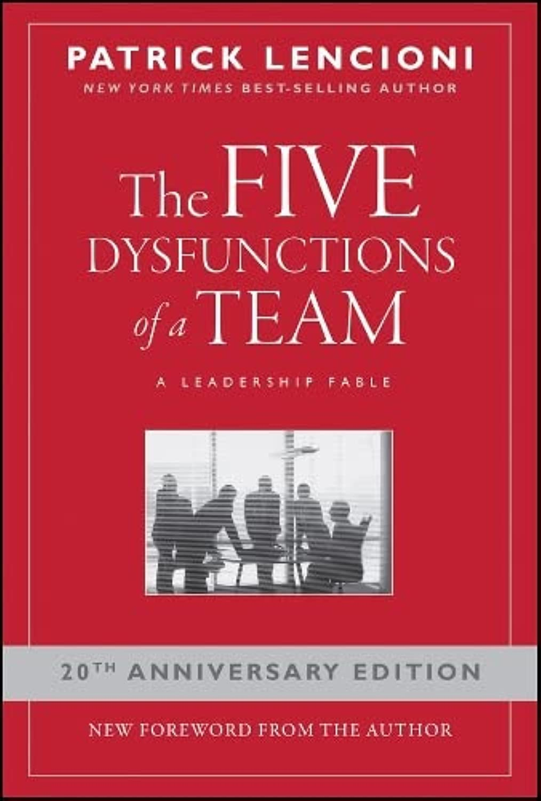

> [!note]- Bronnen
> - [Goodreads](https://www.goodreads.com/book/show/21343.The_Five_Dysfunctions_of_a_Team)
> - [Referentieblad met oefeningen en technieken per dysfunctie (xlsx)](./lencioni-the-five-dysfunctions-of-a-team/5%20Dysfunctions%20of%20a%20Team.xlsx)

## Core idea

Teams fail due to five stacked dysfunctions: absence of trust, fear of conflict, lack of commitment, avoidance of accountability, inattention to results. Each dysfunction enables the one above it.

## Key concepts

[[team-dysfunction]], [Trust](../concepts/trust.md), [[conflict]], [[commitment]], [Accountability](../concepts/accountability.md), [[results]], [[vulnerability-trust]]

## What I took from it

* The basis (Trust, meaning: Psychological safety) has to be right. Once that is good enough:
* Fear of conflict can be worked on. Once that is good enough:
* Lack of Commitment can be worked on.
* ...

and so on...

### General

Het centrale inzicht van dit boek: teamfalen is bijna nooit een kwestie van incompetentie of slechte wil — het is structureel. De vijf dysfuncties bouwen op elkaar: als je vertrouwen mist, vermijd je conflict; als je conflict vermijdt, krijg je geen echte commitment; zonder commitment houdt niemand elkaar aansprakelijk; en zonder aansprakelijkheid gaan mensen terug naar hun eigen belang. De piramide is een cascade van oorzaak en gevolg, en de oorzaak ligt altijd onderaan.

Het meest onderschatte punt: Lencioni maakt een scherp onderscheid tussen **vertrouwen op resultaten** (ik vertrouw je omdat je tot nu toe heeft geleverd) en **kwetsbaarheidsvertrouwen** (ik durf toe te geven wat ik niet weet of wat ik fout deed). Alleen het tweede soort ontgrendelt de rest van de piramide.

### Connection to our work

Safe-to-fail probes fail when teams have these dysfunctions. Trust (dysfunction 1) is prerequisite for everything. Relevant to the human side of AI-first transformation design. Related: [The Advantage: Why Organizational Health Trumps Everything Else In Business (J-B Lencioni Series)](lencioni-the-advantage-why-organizational-health-trumps-everything-el.md), [Creativity, Inc.: Overcoming the Unseen Forces That Stand in the Way of True Inspiration](catmull-creativity-inc-overcoming-the-unseen-forces-that-stand-in-th.md), [Project Aristotle: What Makes a Team Effective?](../articles/google-project-aristotle-what-makes-a-team-effective.md)

---

## Samenvatting

### Centrale stelling

Teams presteren niet slecht door gebrek aan talent of middelen — maar door vijf onderling verbonden gedragspatronen die elkaar versterken. Ze zijn gestapeld: elke dysfunctie bovenin wordt mogelijk gemaakt door de dysfunctie eronder. De oplossing begint altijd onderaan: zonder vertrouwen is alles erboven symptoombestrijding.

---

### De vijf dysfuncties — piramide

<table><tr>
<td valign="top">

| # | Dysfunctie | Gevolg | Functionele tegenhanger |
|---|---|---|---|
| 5 | **Inattention to Results** | Status en ego domineren | Collectieve resultaten boven individuele doelen |
| 4 | **Avoidance of Accountability** | Lage normen | Mensen spreken elkaar aan op gedrag en resultaat |
| 3 | **Lack of Commitment** | Onduidelijkheid over richting | Duidelijkheid en alignment na discussie |
| 2 | **Fear of Conflict** | Kunstmatige harmonie | Echte, productieve onenigheid |
| 1 | **Absence of Trust** | Kwetsbaarheid vermijden | Fouten en zwaktes durven tonen |

De dysfuncties zijn geen losstaande problemen — elk veroorzaakt het volgende.\
Gebrek aan vertrouwen maakt conflict onveilig.\
Geen conflict = geen echte commitment.\
Geen commitment = niemand houdt de ander aansprakelijk.\
Geen aansprakelijkheid = individuele belangen winnen van collectieve resultaten.

</td>
<td valign="top">

</td>
</tr></table>

---

### 1. Absence of Trust — fundament van alles

Lencioni onderscheidt twee soorten vertrouwen:

- **Predictief vertrouwen**: ik vertrouw je omdat je tot nu toe heeft geleverd — gebaseerd op trackrecord
- **Kwetsbaarheidsvertrouwen** *(vulnerability-based trust)*: ik durf toe te geven wat ik niet weet, wat ik fout deed, waar ik hulp bij nodig heb

Alleen kwetsbaarheidsvertrouwen ontgrendelt de rest. Zonder dit verbergen teamleden hun zwaktes, vragen ze geen hulp, en springen ze tot negatieve conclusies over elkaars intenties.

| Zonder vertrouwen | Met vertrouwen |
|---|---|
| Zwaktes en fouten verbergen | Fouten en zwaktes durven tonen |
| Geen hulp vragen | Hulp vragen én geven |
| Negatieve conclusies over anderen trekken | Benefit of the doubt geven |
| Vergaderingen vermijden | Uitkijken naar samenwerking |

**Hoe doorbreken:**
- **Personal Histories** — teamleden leren elkaar op persoonlijk niveau kennen via eenvoudige achtergrondvragen: waar groeide je op, hoeveel broers/zussen, vroegste uitdaging. Laagdrempelig, maar het opent de persoon achter de functie.
- **Team Effectiveness Exercise** — ieder teamlid benoemt de belangrijkste bijdrage van elke collega én het ene gedrag dat hen het meest tegenhoudt. In het openbaar, niet anoniem.
- **De leider gaat als eerste in kwetsbaarheid** — niet als techniek, maar als signaal. Pas als de leider eigen zwaktes en fouten toont, is het veilig voor de rest om hetzelfde te doen.

---

### 2. Fear of Conflict — kunstmatige harmonie

Teams zonder vertrouwen vermijden conflict — niet omdat er geen meningsverschillen zijn, maar omdat het onveilig voelt om ze te uiten. Het resultaat is *kunstmatige harmonie*: de vergadering loopt rustig, maar buiten de deur gebeurt het echte gesprek.

| Teams die conflict vermijden | Teams die conflict aangaan |
|---|---|
| Saaie vergaderingen | Levendige, inhoudelijke discussies |
| Ruimte voor achterkamerpolitiek | Ideeën van iedereen worden benut |
| Kritische onderwerpen blijven onbesproken | Echte problemen worden snel opgelost |
| Energie gaat naar individuele posities | Politiek wordt geminimaliseerd |

Lencioni maakt het onderscheid tussen **productief ideologisch conflict** (meningsverschil over ideeën en aanpak) en **destructief persoonlijk conflict** (aanvallen op mensen). Het eerste is noodzakelijk. Het tweede is wat teams willen vermijden — maar ze schieten door en vermijden ook het eerste.

**Hoe doorbreken:**
- **Mining** — een teamlid krijgt expliciet de rol om begraven meningsverschillen boven tafel te brengen, ook als dat ongemakkelijk voelt: *"Ik denk dat we het hier niet echt over eens zijn — laten we dat uitspreken."*
- **Real-time permission** — een korte, expliciete reminder van de leider dat het conflict of de inhoudelijke discussie die nu plaatsvindt precies is wat het team nodig heeft. Geen formele goedkeuring, maar een actief signaal: *dit gesprek is waardevol, ga door.*
- **Conflictstijlen bespreekbaar maken** — instrumenten als Thomas-Kilmann helpen teamleden begrijpen hoe zij persoonlijk op conflict reageren, en waarom sommigen escaleren terwijl anderen verstommen.

---

### 3. Lack of Commitment — onduidelijkheid als bescherming

Commitment vereist geen consensus — het vereist dat iedereen gehoord is en bereid is de gezamenlijke beslissing te dragen, ook als ze het er niet volledig mee eens zijn. Zonder echte discussie (fear of conflict) is er geen echte commitment — alleen schijncommitment.

| Teams zonder commitment | Teams met commitment |
|---|---|
| Onduidelijkheid over richting en prioriteiten | Duidelijkheid over richting en prioriteiten |
| Beslissingen worden steeds opnieuw heropen | Beslissingen staan en worden uitgevoerd |
| Angst voor mislukking remt actie | Vermogen om van fouten te leren |
| Ramen van kansen gaan dicht door analyse-verlamming | Profiteren van kansen voor de concurrent doet |

**Hoe doorbreken:**
- **Cascading Messaging** — aan het einde van elke vergadering: wat communiceren we naar buiten, en hoe? Dit dwingt het team tot afstemming over de beslissing vóór iedereen de deur uit gaat.
- **Expliciete deadlines** — commitment zonder vervaldatum is geen commitment. Beslismomenten met een vaste datum voorkomen eindeloze heranalyse.
- **Worst-case analyse** — angst voor commitment zit vaak in de onuitgesproken vraag: *"Wat als we het mis hebben?"* Door de slechtste uitkomst expliciet te benoemen en te bespreken, wordt de drempel lager.

---

### 4. Avoidance of Accountability — lage normen als cultuur

Accountability in teams is niet de verantwoordelijkheid van de leider alleen — het is peer-to-peer. Als teamleden elkaar niet aanspreken op gedrag en resultaten, verschuift de volledige last naar de leider. En die kan niet overal tegelijk zijn.

| Teams zonder accountability | Teams met accountability |
|---|---|
| Wrok tussen mensen met verschillende normen | Druk op slechte presteerders om te verbeteren |
| Middelmatigheid wordt getolereerd | Problemen worden vroeg gesignaleerd |
| Deadlines worden gemist | Onderlinge respect groeit door gedeelde normen |
| Leider is enige bron van discipline | Geen bureaucratie nodig rond prestatiebeheer |

**Hoe doorbreken:**
- **Publicatie van doelen en normen** — maak expliciete, gedeelde maatstaven zichtbaar voor iedereen. Zonder een gedeelde norm is aanspreken willekeurig; met een gedeelde norm is het objectief.
- **Progress Reviews** — structurele, korte check-ins over gedrag én resultaat, niet alleen over output. Maakt aanspreken normaal in plaats van uitzonderlijk.
- **Team Rewards** — beloon de groep, niet het individu. Zodra succes collectief is, hebben teamleden een gedeeld belang bij elkaars presteren.

---

### 5. Inattention to Results — status en ego winnen

Als accountability ontbreekt, gaan individuele belangen domineren: carrière, zichtbaarheid, status. Het team "bestaat" nog wel, maar het werkt niet meer als collectief. Resultaten worden de som van individuele output, niet van samenwerking.

| Teams zonder resultaatfocus | Teams met resultaatfocus |
|---|---|
| Stagneert en groeit niet | Behoudt resultaatgerichte mensen |
| Verliest getalenteerde mensen | Minimaliseert individualistisch gedrag |
| Individuen werken naar eigen doelen | Individuen ondergeschikten eigen doel aan teambelang |
| Snel afgeleid | Blijft gefocust |

**Hoe doorbreken:**
- **Publieke resultaatcommitment** — wie publiek commitment uitspreekt, werkt harder om het waar te maken. Resultaten benoemen vóór de vergadering eindigt maakt ze concreet en afrekenbaar.
- **Resultaatgerelateerde beloningen** — bonussen koppelen aan teamresultaten, niet aan individuele inzet. Zo ontstaat een gedeeld belang in het collectieve eindresultaat.
- **De leider stelt resultaten boven eigen status** — als de leider zichtbaar eigen ego ondergeschikt maakt aan teamresultaat, geeft dat het signaal dat individuele scorebordbeheer niet gewaardeerd wordt.

---

### Anti-patronen

| Anti-patroon | Onderliggende dysfunctie | Gevolg |
|---|---|---|
| Leider gaat als eerste in kwetsbaarheid — nooit | Absence of Trust | Rest van het team volgt nooit |
| "We mogen het hier niet oneens over zijn" | Fear of Conflict | Schijnharmonie, echte beslissingen elders |
| Iedereen moet het eens zijn voor we beslissen | Lack of Commitment | Besluiteloosheid, eindeloze herhalingen |
| Alleen de manager spreekt mensen aan | Avoidance of Accountability | Normen zakken, leider brandt op |
| Individuele bonussen voor teamwerk | Inattention to Results | Eigen belang wint altijd |
| 360° feedback zonder psychologische veiligheid | Absence of Trust | Feedback wordt strategisch in plaats van eerlijk |

---

### Verband met Project Aristotle

Google onderzocht onafhankelijk hetzelfde vraagstuk en kwam tot vijf factoren die teameffectiviteit voorspellen. De twee modellen zijn elkaars spiegel: Lencioni beschrijft wat er *mis gaat*, Aristotle beschrijft wat er *goed moet gaan*.

| Five Dysfunctions | Project Aristotle | Verband |
|---|---|---|
| Absence of Trust | Psychological Safety | Kwetsbaarheidsvertrouwen = psychologische veiligheid — beide modellen zien dit als fundament |
| Fear of Conflict | Psychological Safety | Veiligheid maakt productief conflict mogelijk |
| Lack of Commitment | Structure & Clarity | Commitment vereist duidelijkheid — zonder clarity geen echte buy-in |
| Avoidance of Accountability | Dependability | Betrouwbaarheid vereist dat mensen elkaar aanspreken op afspraken |
| Inattention to Results | Meaning & Impact | Wie werk zinvol vindt, richt zich op collectief resultaat in plaats van eigen status |

Zie ook: [Project Aristotle: What Makes a Team Effective?](../articles/google-project-aristotle-what-makes-a-team-effective.md)

---

### Kernspanning van het boek

> De vijf dysfuncties zijn geen karakterfouten van individuen.  
> Het zijn structurele patronen die ontstaan wanneer de basis — kwetsbaarheidsvertrouwen — ontbreekt.

De leider kan Responsibility niet eisen (Avery), kan commitment niet opleggen, en kan accountability niet vervangen. Wat de leider wél kan: als eerste kwetsbaar zijn, en daarmee het veilig maken voor de rest.
