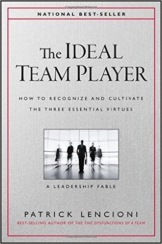

## Core idea

Three virtues of ideal team players: humble, hungry, and smart (people-smart). The absence of any one creates predictable dysfunctions. Hiring and developing for these three matters more than skills.

## Key concepts

[[humble-hungry-smart]], [[team-player-virtues]], [[hiring-for-culture]], [[people-smart]]

## What I took from it

### General

Het meest onderschatte van de drie eigenschappen is **Smart** — en Lencioni bedoelt er iets specifiek mee dat niets met intelligentie te maken heeft. Het is sociale scherpzinnigheid: aanvoelen hoe woorden en acties landen bij anderen. Dat is precies wat in AI-first omgevingen kritisch is — niet technische kennis, maar het vermogen om mensen mee te nemen.

De combinaties zijn het meest bruikbare deel van het boek: elke ontbrekende eigenschap creëert een herkenbaar patroon. Zodra je de namen kent (Bulldozer, Charmer, Lovable Slacker...) zie je ze overal.

### Connection to our work

In AI-first orgs, the remaining human roles require high people-smartness and hunger. Automation removes humble-but-not-hungry roles. Related: [The Five Dysfunctions of a Team](lencioni-the-five-dysfunctions-of-a-team.md), [The Advantage: Why Organizational Health Trumps Everything Else In Business (J-B Lencioni Series)](lencioni-the-advantage-why-organizational-health-trumps-everything-el.md)

---

## Samenvatting

### Centrale stelling

De beste teamspeler heeft drie eigenschappen die elk afzonderlijk onvoldoende zijn maar samen onverslaanbaar zijn: **Humble**, **Hungry**, en **Smart** (in de zin van people-smart). Het ontbreken van één van de drie creëert voorspelbare en herkenbare dysfuncties — ongeacht hoe competent iemand technisch is.

> *"The three virtues are simple to understand, yet difficult to achieve. But for those who are willing to put in the work, they represent the foundation of genuine teamwork."*

Het boek is geschreven als fabel, maar het model is volledig praktisch.

---

### De drie eigenschappen

#### 1. Humble — gebrek aan buitensporig ego

Niet zelfondermijnend of zonder zelfvertrouwen. Humble betekent: geen buitensporig ego, geen obsessie met status of erkenning. Wie humble is, geeft eer aan anderen, erkent fouten, en stelt het teambelang boven eigen zichtbaarheid.

**Kenmerken:**
- Deelt credit makkelijk en spontaan
- Geeft toe dat ze het fout hadden zonder dat het hen raakt
- Vraagt om hulp zonder zich er voor te schamen
- Praat vaker over "wij" dan over "ik"

**Niet verwarren met**: bescheidenheid die zelfeffacement is, of mensen die hun eigenwaarde verbergen achter neerslachtigheid. Echte bescheidenheid is krachtig, niet zwak.

#### 2. Hungry — intrinsieke gedrevenheid

Altijd op zoek naar meer: meer te doen, meer te leren, meer verantwoordelijkheid. Niet gedreven door externe druk maar door een interne motor. Hungry mensen hoeven niet te worden aangespoord — ze sporen zichzelf aan.

**Kenmerken:**
- Neemt meer op zich dan gevraagd wordt
- Zoekt actief naar nieuwe uitdagingen
- Werkt hard ook als niemand kijkt
- Raakt gefrustreerd bij stilstand of gebrek aan voortgang

**Niet verwarren met**: workaholisme of ambitie ten koste van anderen. Hunger gaat over bijdragen aan het team, niet over persoonlijk succes.

#### 3. Smart — sociale scherpzinnigheid

Dit is **niet** intellectuele intelligentie. Smart betekent hier: gezond verstand over mensen. Begrijpen hoe woorden en acties landen bij anderen. De juiste toon aanvoelen. Goede vragen stellen. Groepsdynamiek lezen.

**Kenmerken:**
- Weet wanneer te spreken en wanneer te luisteren
- Vraagt vragen die anderen niet durfden te stellen
- Merkt wanneer iemand afgehaakt is
- Past toon en boodschap aan de persoon aan

**Niet verwarren met**: manipulatie of politiek gedrag. Smart is authentiek, niet strategisch.

---

### De zeven combinaties

| Humble | Hungry | Smart | Type | Beschrijving |
|:---:|:---:|:---:|---|---|
| ✓ | ✓ | ✓ | **Ideal Team Player** | Fundament van sterk teamwerk |
| ✓ | — | — | **Pawn** | Aangenaam maar niet effectief — heeft voortdurend richting nodig |
| — | ✓ | — | **Bulldozer** | Levert resultaten maar laat schade achter — geen oog voor anderen |
| — | — | ✓ | **Charmer** | Aangenaam gezelschap maar levert weinig — gebruikt sociale vaardigheden om echt werk te vermijden |
| ✓ | ✓ | — | **Accidental Mess-maker** | Goede intenties maar zegt verkeerde dingen — onbewust schadelijk |
| ✓ | — | ✓ | **Lovable Slacker** | Fijn om mee te werken maar duwt niet vooruit — aanwezig zonder urgentie |
| — | ✓ | ✓ | **Skillful Politician** | Weet hoe de organisatie werkt, maar stelt eigen belang altijd voorop |
| — | — | — | *(geen teamspeler)* | Eenvoudig: hoort niet in een team |

---

### De meest gevaarlijke combinaties

**Skillful Politician** (Hungry + Smart, niet Humble) is de gevaarlijkste: ze zijn productief, sociaal vaardig, en weten precies hoe ze er goed uit kunnen zien — maar ze maken het team kleiner in plaats van groter. Ze zijn moeilijk te herkennen omdat ze alle juiste dingen zeggen.

**Accidental Mess-maker** (Humble + Hungry, niet Smart) is de meest tragische: goede intenties, hard werkend, maar zegt regelmatig het verkeerde op het verkeerde moment. Ze begrijpen zelf niet waarom de sfeer na hun woorden verandert.

---

### Hiring voor de drie eigenschappen

Lencioni erkent dat skills makkelijker te testen zijn dan eigenschappen. Maar de eigenschappen zijn te ontdekken via gerichte vragen:

**Humble:**
- "Vertel me over een teamproject waar je trots op bent. Wat was jouw bijdrage?" — let op hoe snel ze naar "wij" schakelen
- "Wanneer heb je voor het laatst een grote fout gemaakt? Wat heb je ervan geleerd?"
- "Wie anders heeft bijgedragen aan dat succes?"

**Hungry:**
- "Vertel over iets wat je op eigen initiatief hebt opgepakt zonder dat iemand je erom vroeg."
- "Wat frustreert je in een werkomgeving?"
- "Hoe zag je werkweek eruit in de afgelopen maand?"

**Smart:**
- Observeer gedrag in groepsgesprekken: wie stelt vragen, wie luistert, wie domineert, wie leest de kamer?
- "Hoe zou je omgaan met een collega die iets anders wil dan jij?"
- "Vertel over een moment dat je iets anders aanpakte dan gepland omdat je aanvoelde dat de situatie erom vroeg."

---

### Developing — bestaande mensen

Voor mensen die al in het team zitten maar één eigenschap missen:

- **Niet Humble**: directe feedback geven over specifiek gedrag — geen algemene kritiek. Ze zien het zelf niet. Concrete voorbeelden van wanneer ze eer opeisten of anderen niet bedankten.
- **Niet Hungry**: achterhalen of het een motivatiekwestie is (verkeerde rol) of een gedragspatroon. Soms helpen duidelijke doelen en consequenties. Soms past de rol niet.
- **Niet Smart**: het moeilijkst te ontwikkelen. Vraagt zelfbewustzijn dat sommigen nooit ontwikkelen. Coaching op specifieke situaties kan helpen, maar het fundament moet er al zijn.

---

### Verband met Five Dysfunctions

De drie eigenschappen zijn de individuele bouwstenen voor de teamdynamieken die Lencioni in Five Dysfunctions beschrijft:

| Eigenschap | Verband met Five Dysfunctions |
|---|---|
| **Humble** | Fundament voor kwetsbaarheidsvertrouwen (Dysfunction 1: Absence of Trust) |
| **Hungry** | Drijft accountability en resultaatfocus (Dysfunction 4 & 5) |
| **Smart** | Maakt productief conflict mogelijk (Dysfunction 2: Fear of Conflict) |
| **Skillful Politician** (Hungry + Smart) | Veroorzaakt achterkamerpolitiek — precies wat Fear of Conflict en Absence of Trust produceren |

Zie ook: [The Five Dysfunctions of a Team](lencioni-the-five-dysfunctions-of-a-team.md)

---

### Anti-patronen

| Anti-patroon | Gevolg |
|---|---|
| Aannemen op skills, eigenschappen niet toetsen | Team presteert onder niveau door teamdynamiek |
| Topperformer die Skillful Politician is, behouden | Cultuur verschuift richting politiek — anderen zien het en passen zich aan |
| Accidental Mess-maker niet coachen | Schade blijft — en de persoon zelf begrijpt nooit waarom |
| Humble mislabelen als gebrek aan zelfvertrouwen | Je verliest de meest waardevolle mensen aan organisaties die hun eigenwaarde wél zien |
| Hunger eisen maar niet belonen | Intrinsieke motivatie neemt af zodra externe druk de norm wordt |

---

### Kernspanning van het boek

> De meeste hiring-processen selecteren op competentie en ervaring.  
> Lencioni stelt dat je daarmee de verkeerde vraag stelt: de vraag is niet "kan deze persoon het werk doen?" maar "maakt deze persoon het team beter?"

Een team van gemiddeld competente maar alle-drie-aanwezige spelers overtreft een team van toptalenten met één ontbrekende eigenschap — elke keer.
