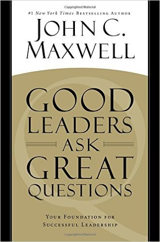

## Core idea

Leadership is fundamentally about asking better questions. Questions unlock insights, motivate action, build relationships, and solve problems. Great leaders are perpetual learners through questions.

## Key concepts

[[leadership-questions]], [[curiosity]], [[learning-leadership]], [[questions-as-tools]]

## What I took from it

### General

*(To be filled in)*

### Connection to our work

The critical questions and forcing choices in Sections 4 and 5 of the template are leadership questions. Facilitation of the assessment requires the leader to ask, not tell. Related: [From Contempt to Curiosity: Creating the Conditions for Groups to Collaborate Using Clean Language & Systemic Modelling™](walker-from-contempt-to-curiosity-creating-the-conditions-for-group.md)
