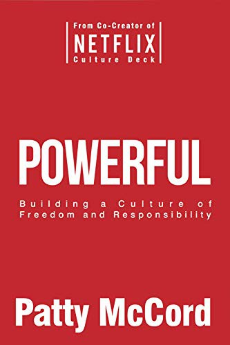

## Core idea

Netflix culture: give people real freedom, hold them to high standards, treat them as adults. Talent density matters more than process. Radical honesty prevents politics.

## Key concepts

[[culture-of-freedom]], [[talent-density]], [[radical-honesty]], [[high-performance-culture]], [[adults-in-the-room]], [[netflix-culture]]

## What I took from it

### General

Het scherpste inzicht van dit boek: **de meeste HR-processen zijn ontworpen rond de uitzondering, niet de norm**. Functioneringsgesprekken, vakantiebeleid, onkostenprocedures, competentieframeworks — ze zijn gebouwd om de kleine minderheid te controleren die misbruik zou maken. Het effect: de grote meerderheid van verantwoordelijke volwassenen wordt behandeld als potentieel probleem. Dat is niet alleen onnodig — het is actief destructief voor de cultuur die je wil bouwen.

McCords antwoord is radicaal simpel: behandel mensen als volwassenen, geef ze echte vrijheid, houd ze aan hoge standaarden, en wees eerlijk — ook als het pijn doet.

### Connection to our work

AI-first organisaties vereisen precies deze cultuur: AI vergroot de impact van mensen die al sterk zijn, en maakt het moeilijker om je te verschuilen achter bureaucratie. De menselijke rollen die overblijven vereisen oordeel, vrijheid en verantwoordelijkheid — niet procedures. Related: [Creativity, Inc.: Overcoming the Unseen Forces That Stand in the Way of True Inspiration](catmull-creativity-inc-overcoming-the-unseen-forces-that-stand-in-th.md), [The Advantage: Why Organizational Health Trumps Everything Else In Business (J-B Lencioni Series)](lencioni-the-advantage-why-organizational-health-trumps-everything-el.md), [Project Aristotle: What Makes a Team Effective?](../articles/google-project-aristotle-what-makes-a-team-effective.md)

---

## Samenvatting

### Achtergrond

Patty McCord was Chief Talent Officer bij Netflix van 1998 tot 2012. Samen met CEO Reed Hastings bouwde ze een cultuur die radicaal afweek van hoe Silicon Valley — en de rest van de bedrijfswereld — over HR dacht. De kern van die cultuur werd vastgelegd in het beroemde **Netflix Culture Deck**: een PowerPoint-presentatie die zo veel aandacht kreeg dat Sheryl Sandberg het "het belangrijkste document ooit uit Silicon Valley" noemde. Dit boek is de uitgeschreven versie van alles wat McCord in die jaren leerde.

---

### De centrale these: vrijheid en verantwoordelijkheid zijn ondeelbaar

De meeste organisaties kiezen impliciet voor controle: als je mensen vrijheid geeft, zullen ze die misbruiken. McCord stelt het omgekeerde: **controle is wat misbruik uitlokt**. Mensen die behandeld worden als verantwoordelijke volwassenen, gedragen zich als verantwoordelijke volwassenen. Mensen die behandeld worden als potentiële overtreders, gedragen zich defensief, politiek en creatief in het omzeilen van regels.

Vrijheid zonder verantwoordelijkheid is chaos. Verantwoordelijkheid zonder vrijheid is theater. De twee werken alleen samen.

---

### Talentdichtheid boven procesdikte

Het meest radicale principe van Netflix: **een team van tien uitzonderlijke mensen presteert beter dan een team van vijfentwintig gemiddelde mensen** — en de tien zijn ook nog eens gelukkiger, want ze werken samen met mensen die hen uitdagen.

De consequentie die de meeste organisaties weigeren te trekken: middelmatige prestaties rechtvaardigen afscheid. Niet als straf, maar als eerlijkheid. McCord formuleert het als de **keeper test**: "zou je hard vechten om deze persoon te houden als ze morgen zouden vertrekken?" Als het antwoord nee is, is een genereuze vertrekregeling de eerlijkste optie — voor de persoon én voor het team.

Iemand te lang houden uit loyaliteit is geen vriendelijkheid. Het is uitstelgedrag dat de persoon de kans ontneemt om ergens anders te slagen waar ze wél op hun plek zijn.

---

### Context, niet controle

Leiders bij Netflix gaven geen stap-voor-stap instructies. Ze gaven **context**: wat willen we bereiken, waarom, welke beperkingen zijn er, hoe ziet succes eruit? Daarna lieten ze mensen zelf de weg bepalen.

Dit vereist dat je mensen hebt die de context begrijpen en er iets mee kunnen. Dat is geen reden om minder context te geven — het is een reden om beter te werven. Wanneer je merkt dat je meer controle nodig hebt, is dat een signaal dat de context niet helder is, of dat je de verkeerde mensen hebt aangenomen.

---

### Radicale eerlijkheid als cultuurpraktijk

Bij Netflix was eerlijke feedback geen jaarlijks ritueel — het was een dagelijkse praktijk. McCord beschrijft hoe Netflix regelmatig **360-graden feedbacksessies hield tijdens All Hands-vergaderingen**: medewerkers gaven elkaar publiekelijk eerlijke start/stop/continue-feedback. Niet als HR-oefening, maar als serieuze informatie.

Het principe: het ontbreken van eerlijke feedback is geen vriendelijkheid — het is een dienstverlening die je weigert te leveren. Wie jarenlang nooit te horen krijgt wat er niet klopt, kan zich niet ontwikkelen. Wie pas bij een exitgesprek hoort wat er misgegaan is, heeft niet de kans gekregen om iets te veranderen.

De hardste feedbackgesprekken zijn tegelijk de meest respectvolle — ze behandelen de ander als iemand die de waarheid aankan.

---

### Het einde van het jaarlijkse functioneringsgesprek

McCord is onverbiddelijk: **het jaarlijkse functioneringsgesprek is theater**. Het komt te laat, het is te formeel, het leidt zelden tot echte verandering, en het geeft leidinggevenden een excuus om moeilijke gesprekken uit te stellen tot het verplichte moment.

Het alternatief: continue, directe gesprekken. Als iets niet goed gaat, zeg het direct. Als iemand uitstekend werk levert, benoem het direct. Een cultuur waar feedback altijd en overal veilig is, heeft geen jaarlijks ritueel nodig.

---

### Betaal marktwaarde, niet salarisschalen

Netflix betaalde mensen wat ze op de open markt waard waren — niet wat de interne salarisschaal zei. Als iemand meer waard was geworden, werd het salaris proactief verhoogd — zonder dat die persoon een aanbod van elders moest meebrengen.

Het argument: als je wacht tot iemand een tegenvoorstel heeft, heb je al verloren. Je hebt die persoon maanden of jaren onderbetaald, hij heeft het geweten, en de enige reden hij is gebleven is gemak — niet betrokkenheid.

---

### Geen beleid waar vertrouwen volstaat

Netflix had geen vakantiebeleid. De onkostenprocedure was één zin: *"Act in Netflix's best interest."* Geen formulieren, geen goedkeuringen, geen limieten.

Niet omdat Netflix naïef was, maar omdat ze ontdekten dat gedetailleerde regels mensen leren om de grens op te zoeken in plaats van het goede oordeel te gebruiken. Een beleid dat zegt "maximaal €50 per diner op zakenreis" creëert mensen die consequent €49 uitgeven. Een cultuur die zegt "gebruik je oordeel, je weet wat redelijk is" creëert mensen die nadenken of het diner überhaupt noodzakelijk was.

---

### De briljante klootzak bestaat niet

Netflix had één absolute regel: **geen briljante jerks**. Hoe uitzonderlijk iemand ook presteerde — als die persoon het team slechter maakte door zijn gedrag, vertrok hij.

Het argument: de kostprijs van een briljante jerk wordt systematisch onderschat. Je telt de output van die persoon op, maar je telt niet af wat het team verliest aan psychologische energie, aan mensen die vertrekken, aan ideeën die niet meer gedeeld worden. Een team van mensen die goed met elkaar werken, overtreft structureel een team met één briljante jerk en negen mensen die op eieren lopen.

---

### Bouw de organisatie die je wil zijn, niet de organisatie die je was

Terwijl Netflix groeide, was de constante verleiding om meer proces toe te voegen. McCord beschrijft hoe ze die verleiding bewust weerstonden: elke keer dat er een probleem was, was de instinctieve reactie "we hebben een beleid nodig." De betere vraag: "hebben we de juiste mensen aangenomen?"

Proces is het antwoord op wantrouwen of incompetentie. Als je de juiste mensen hebt en je vertrouwt hen, heb je minder proces nodig — niet meer. Organisaties die groeien en tegelijk meer regels toevoegen, maken zichzelf langzamer zonder veiliger te worden.

---

### Anti-patronen

| Patroon | Wat het signaleert |
|---|---|
| Gedetailleerd onkostenbeleid | Wantrouwen als standaard |
| Jaarlijkse functioneringsgesprekken | Moeilijke gesprekken uitstellen |
| Iemand te lang houden uit loyaliteit | Eerlijkheid vermijden |
| Interne salarisschalen | Marktwaarde negeren |
| "Culture committees" en teambuilding-activiteiten | Cultuur verwarren met fun |
| Processen toevoegen bij elk probleem | Symptoom behandelen in plaats van oorzaak |

---

### Kernspanning van het boek

> De meeste organisaties willen een cultuur van vrijheid en verantwoordelijkheid.  
> Maar ze zijn niet bereid de prijs te betalen: eerlijke gesprekken voeren, mensen laten gaan die niet meer passen, en HR-rituelen afschaffen die veilig aanvoelen maar niets opleveren.

McCords conclusie: cultuur bouw je niet met woorden op een muur of waarden in een handboek. Je bouwt het met elke beslissing die je neemt over wie je aanneemt, wie je houdt, wie je laat gaan, en hoe je met mensen praat.
