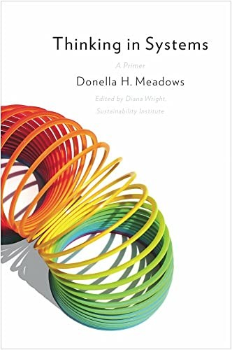
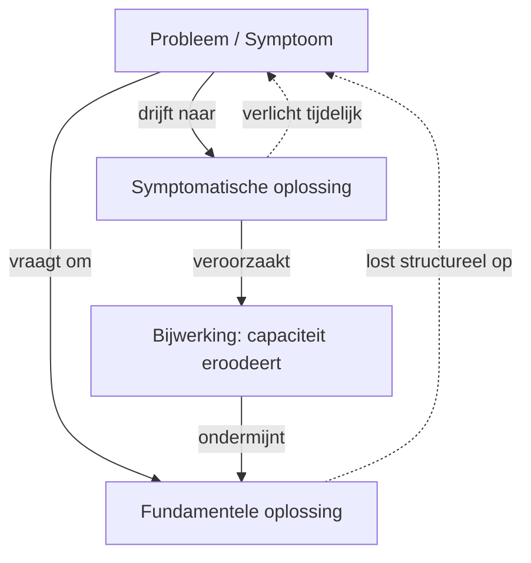
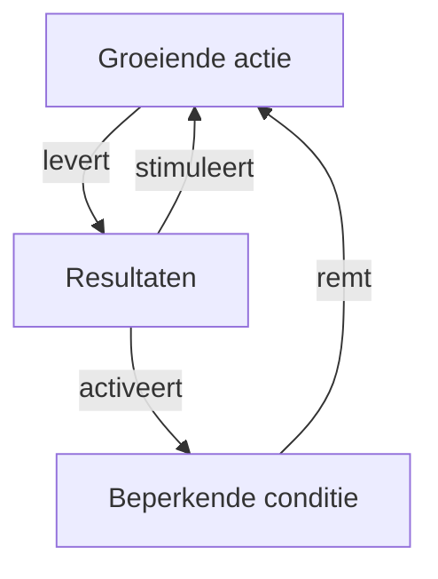
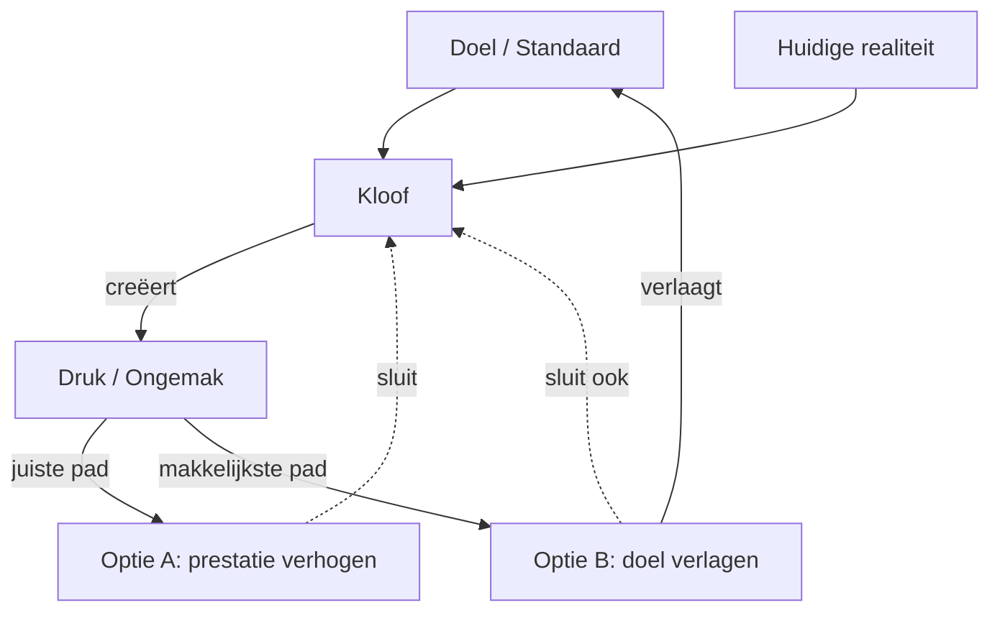
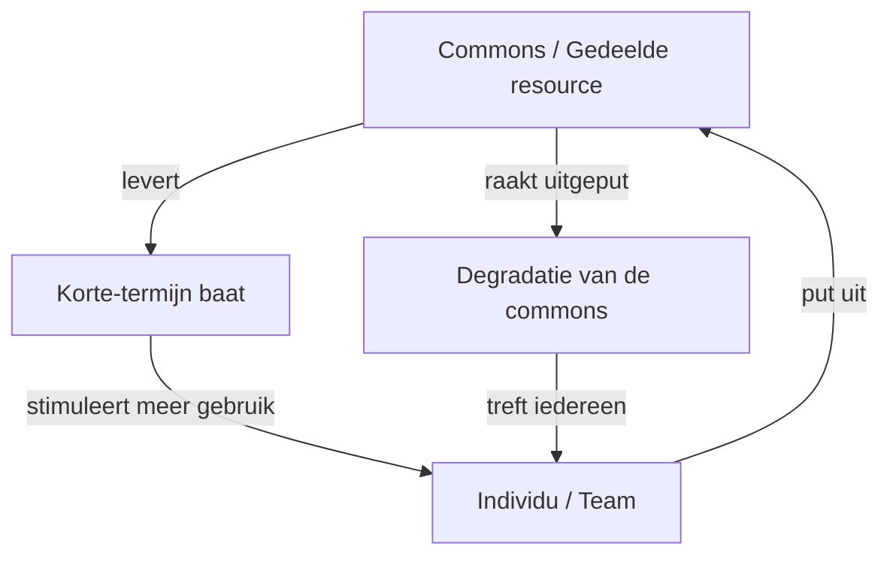

## Core idea

Most problems are caused by system structure, not individual actors. Systems have stocks, flows, feedback loops, and delays. To change behavior, change structure — not people.

## Key concepts

[Systems Thinking](../concepts/systems-thinking.md), [Feedback Loops](../concepts/feedback-loops.md), [[stocks-and-flows]], [[leverage-points]], [[unintended-consequences]], [[delays]], [[archetypes]]

## What I took from it

### General

Dit is het meest compacte systeemdenkboek dat bestaat. Meadows schrijft met uitzonderlijke helderheid over een onderwerp dat al snel abstract wordt. Het kernmechanisme — feedback loops, delays, leverage points — verklaart meer organisatiegedrag dan de meeste managementboeken samen.

### Connection to our work

Value streams are systems. AI dramatically accelerates feedback loops. Org impact analysis is systems thinking applied. The unintended consequences column in Section 14 (Expected Emergence) is a systems thinking output. Related: [[senge-the-fifth-discipline]], [An Introductory Guide to Systems Thinking](kerr-an-introductory-guide-to-systems-thinking.md), [Antifragile: Things That Gain from Disorder](taleb-antifragile-things-that-gain-from-disorder.md)

---

## Samenvatting

### Centrale stelling

De meeste problemen zijn geen fouten van individuen of slechte bedoelingen — ze zijn eigenschappen van het systeem. Als je mensen vervangt maar het systeem intact laat, produceer je dezelfde uitkomsten. Systeemgedrag volgt uit structuur, niet uit intentie.

---

### Bouwstenen van systemen

**Stocks**: de toestand van het systeem — iets dat je kunt meten op een moment. (Waterstand, voorraad, vertrouwen, technische schuld)

**Flows**: de veranderingssnelheid van een stock. (Watertoevoer, productierondes, vertrouwensopbouw, schuldenafbouw)

**Feedback loops:**
- *Balancing loops*: sturen het systeem terug naar een gewenst niveau (thermostaat, bloeddrukregulatie)
- *Reinforcing loops*: versterken afwijkingen — kunnen zowel groei als ineenstorting versnellen (compound interest, ecologische omslagpunten)

**Delays**: vertragingen in feedback maken systemen fragiel. Een lange delay betekent dat je nu acties neemt op basis van verouderde informatie — en overshoots worden onvermijdelijk.

---

### Systemische archetypes

Terugkerende structuren die overal opduiken. Zie ook de archetypen in [Senge — The Fifth Discipline](senge-the-fifth-discipline-the-art-practice-of-the-learning-organi.md) voor een bredere set.

#### Legende

| Notatie | Betekenis |
|---|---|
| `A -->|"..."| B` | A veroorzaakt B direct |
| `A -.->|"..."| B` | A beïnvloedt B via feedback of vertraging |
| Versterkende loop | Twee nodes versterken elkaar wederzijds → groei of verval |
| Balancerende loop | Een node remt een andere → systeem zoekt evenwicht |

---

#### Shifting the Burden

Een symptoom wordt opgelost met een sneloplossing die de fundamentele oplossing verdringt. Naarmate de sneloplossing werkt, neemt de druk op de fundamentele oplossing af — en wordt de structurele oplossing steeds moeilijker.

---

#### Limits to Growth

Een reinforcing loop stuit op een balancing loop. Naarmate groei doorzet, activeren grenzen die groei terugdrukken. Fout: harder pushen op de groeifactor. Juist: de constraint identificeren en wegnemen.

---

#### Eroding Goals

Wanneer resultaten tegenvallen, worden doelen verlaagd in plaats van dat de performance verbetert. Neerwaartse spiraal die eruitziet als acceptatie.

---

#### Tragedy of the Commons

Een gedeelde resource wordt door elk individu geoptimaliseerd, met collectieve uitputting als gevolg. Rationeel individueel gedrag, irrationeel systeemgedrag.

---

### De 12 leverage points (van laag naar hoog)

Meadows' meest geciteerde bijdrage: een hiërarchie van interventiepunten, geordend naar werkelijke impact.

**Laag (parameters)** — makkelijk te veranderen, weinig effect:
- 12. Getallen (subsidies, belastingen, standaarden)
- 11. Buffer sizes
- 10. Stock-and-flow structuur

**Middel (feedback)** — meer effect:
- 9. Delay lengths
- 8. Sterkte van negatieve feedback loops
- 7. Versterkende loops versterken of afzwakken
- 6. Informatiestromen (wie krijgt welke informatie, wanneer)
- 5. Regels van het systeem (incentives, constraints)
- 4. De macht om regels te veranderen

**Hoog (doelen en paradigma's)** — moeilijk, maar transformatief:
- 3. Doelen van het systeem
- 2. Paradigma's — de gedeelde aannames waaruit het systeem voortkomt
- 1. De capaciteit om paradigma's te bevragen

> **Kernles**: de meeste interventies opereren op niveau 12–9. De meest impactvolle interventies opereren op niveau 3–1. Maar die zijn ook het moeilijkst — ze zijn de onzichtbare aannames waarop alles rust.

---

### AI en systeemstructuur

AI inzetten zonder de structuur te wijzigen is parameters aanpassen — de laagst mogelijke hefboomwerking. AI versnelt wat het systeem al doet. Als het systeem silo's heeft, versnelt AI de fragmentatie. Als het systeem een HiPPO-cultuur heeft, versterkt AI die hiërarchie. Structuurverandering (leverage points 6–4) is de voorwaarde — dan pas AI.
