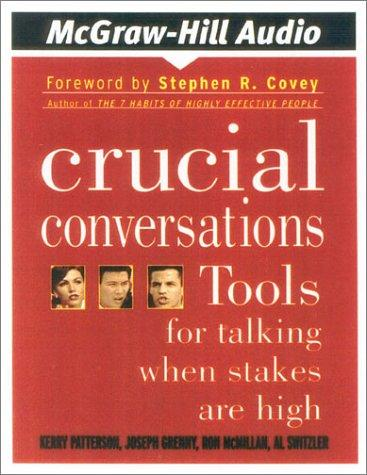

## Core idea

High-stakes conversations go wrong because people feel unsafe. Create safety first, then speak honestly. Pool the Shared Meaning. State your path: facts → story → feelings → ask → talk tentatively → encourage testing.

## Key concepts

[Crucial Conversations](../concepts/crucial-conversations.md), [[shared-meaning]], [[psychological-safety-conversations]], [[silence-vs-violence]], [[state-your-path]]

## What I took from it

### General

*(To be filled in)*

### Connection to our work

The forcing choices in Section 4 and brutal analysis in Section 5 are crucial conversations. Leaders need these skills to facilitate honest assessment. Related: [Nonviolent Communication: Create Your Life, Your Relationships, and Your World in Harmony with Your Values](rosenberg-nonviolent-communication-create-your-life-your-relationships.md)
