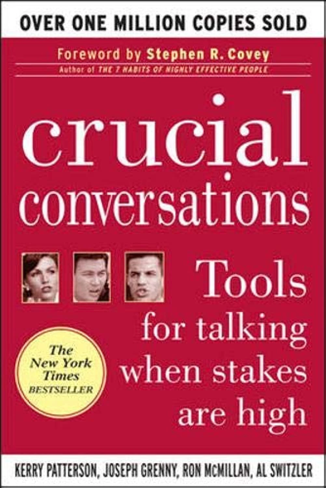
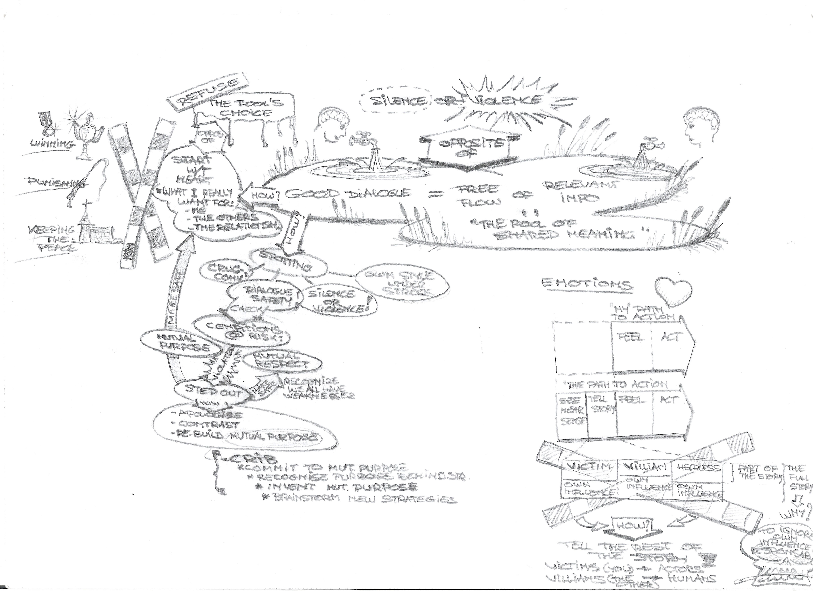
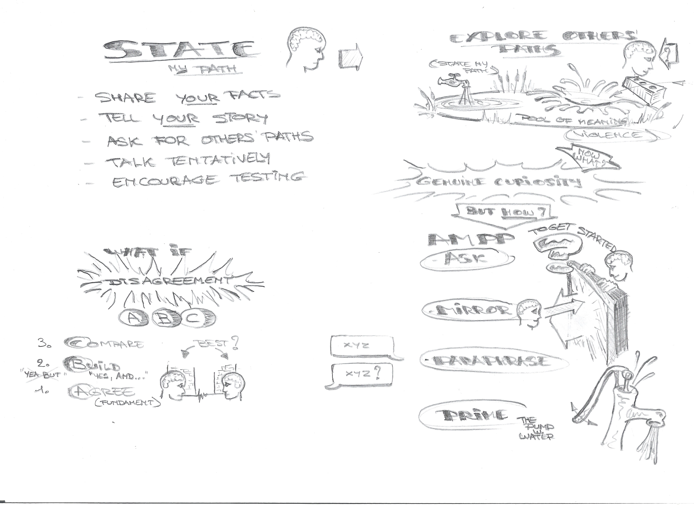

> [!note]- Bronnen
> - [Goodreads](https://www.goodreads.com/book/show/15014.Crucial_Conversations)
> - [cruciallearning.com — officiële boekpagina](https://cruciallearning.com/crucial-conversations-book/)

## Core idea

High-stakes conversations gaan mis omdat mensen zich onveilig voelen. De oplossing is niet kiezen tussen eerlijkheid en harmonie — dat is **The Fool's Choice**. Goed gesprek vult de **[Pool of Shared Meaning](../concepts/shared-meaning.md)**: hoe vrijer relevante informatie stroomt, hoe beter de beslissing en hoe sterker het commitment aan de uitkomst.

## Key concepts

[Crucial Conversations](../concepts/crucial-conversations.md), [[shared-meaning]], [silence-vs-violence](../concepts/silence-vs-violence.md), [[path-to-action]], [[villain-stories]], [[state-your-path]], [AMPP](../concepts/ampp.md), [Mutual Purpose](../concepts/mutual-purpose.md), [[psychological-safety]]

## What I took from it

### General

Het scherpste inzicht: de meeste mensen kiezen onbewust voor **The Fool's Choice** — eerlijk zijn *of* de relatie bewaren, winnen *of* meedoen. Crucial Conversations toont dat dit een valse tweedeling is. Je kunt veiligheid creëren én eerlijk zijn — maar het vereist vaardigheid, niet alleen moed.

Het tweede sleutelinzicht: we reageren niet op feiten maar op de **verhalen** die we er zelf over vertellen. Tussen waarnemen en handelen zit altijd een verhaal — en dat verhaal is waar de meeste gesprekken al fout gaan vóórdat ze begonnen zijn.

### Connection to our work

Crucial Conversations is de **operationele vaardigheid** achter wat vrijwel alle andere bronnen in onze KB als voorwaarde stellen. [Felps](../articles/felps-mitchell-byington-how-when-why-bad-apples-2006.md) beschrijft motivationele interventie als de gezonde teamrespons op een bad apple — dit boek beschrijft *hoe* je dat gesprek voert. [Lencioni](lencioni-the-five-dysfunctions-of-a-team.md) noemt avoidance of accountability als kerndisfunctie — het systematisch vermijden van crucial conversations *is* die vermijding. Met [Avery](avery-the-responsibility-process-unlocking-your-natural-ability-to.md): het gesprek aangaan is Responsibility kiezen; het niet aangaan is in Blame of Justify blijven.

[Buckingham & Goodall](../articles/performance-and-evaluation/buckingham-goodall-the-feedback-fallacy.md) tonen waarom *hoe* je spreekt ertoe doet — feiten delen en vragen stellen in plaats van oordelen vellen is precies wat STATE my path inbouwt. [Bennis](bennis-transparency-how-leaders-create-a-culture-of-candor.md) beschrijft candor als organisatienorm; Crucial Conversations is de individuele vaardigheid die die norm mogelijk maakt.

Related: [The Five Dysfunctions of a Team](lencioni-the-five-dysfunctions-of-a-team.md), [Bad Apples — Felps](../articles/felps-mitchell-byington-how-when-why-bad-apples-2006.md), [The Responsibility Process](avery-the-responsibility-process-unlocking-your-natural-ability-to.md), [Transparency: How Leaders Create a Culture of Candor](bennis-transparency-how-leaders-create-a-culture-of-candor.md), [The Feedback Fallacy](../articles/performance-and-evaluation/buckingham-goodall-the-feedback-fallacy.md), [Nonviolent Communication](rosenberg-nonviolent-communication-create-your-life-your-relationships.md), [Crucial Confrontations](patterson-crucial-confrontations.md)

---

## Samenvatting

> [!note]- Visuele samenvatting
> 
> 

---

### De kern: Pool of Shared Meaning

**Good dialogue** = vrije stroom van relevante informatie → **[Pool of Shared Meaning](../concepts/shared-meaning.md)**: het gedeelde begrip dat ontstaat wanneer iedereen zijn perspectief, feiten en gevoelens eerlijk inbrengt. Hoe groter de Pool, hoe beter de beslissing — en hoe sterker het commitment aan de uitkomst.

Het tegenovergestelde is **[silence-vs-violence](../concepts/silence-vs-violence.md)**:
- **Silence** — terugtrekken: masken, vermijden, zwijgen
- **Violence** — aanvallen: controleren, labelen, forceren

Beide zijn vluchtgedrag wanneer het gesprek onveilig aanvoelt.

---

### The Fool's Choice

De meeste mensen geloven dat ze moeten kiezen tussen eerlijk zijn en de relatie bewaren. Dat is The Fool's Choice — een valse tweedeling. De drie valse opties:
- **Winning** — gelijk krijgen ten koste van de relatie
- **Punishing** — de ander laten voelen dat ze fout zaten
- **Keeping the peace** — het echte probleem laten liggen

Crucial Conversations verwerpt alle drie. Het is mogelijk om eerlijk én respectvol te zijn — mits je veiligheid creëert.

---

### Start with Heart

Voordat je het gesprek aangaat, clarifieer je eigen intentie:
- Wat wil ik voor *mezelf*?
- Wat wil ik voor *de ander*?
- Wat wil ik voor de *relatie*?

Dit voorkomt dat winnen of gelijk krijgen ongemerkt het echte doel wordt.

---

### Dialogue Safety: Mutual Purpose + Mutual Respect

Gesprekken ontsporen wanneer één van twee condities wegvalt:

| Conditie | Definitie | Signaal dat het ontbreekt |
|---|---|---|
| **[Mutual Purpose](../concepts/mutual-purpose.md)** | De ander gelooft dat jij hun belangen in gedachten houdt | "Je bent hier alleen voor jezelf" |
| **Mutual Respect** | Beide partijen voelen zich respectvol bejegend | Iemand voelt zich aangevallen of geminacht |

Wanneer safety wegvalt, valt iedereen terug op Silence or Violence. Spot je eigen patroon onder stress — dat is je vertrekpunt.

**Safety herstellen:**
- **Apologize** — als je iets fout deed, erken het oprecht
- **Contrast** — verklaar wat je *niet* bedoelde + wat je *wel* bedoelde: *"Ik wil niet zeggen dat... Wat ik wél wil zeggen is..."*
- **Re-build Mutual Purpose** via **CRIB**:
  - **C**ommit to mutual purpose — kies bewust voor een gedeeld doel
  - **R**ecognize purpose reminder — herinner jezelf aan wat jullie echt beiden willen
  - **I**nvent mutual purpose — als het er niet is, creëer een nieuwe gemeenschappelijke basis
  - **B**rainstorm new strategies — zoek samen nieuwe wegen

---

### Master your story: The Path to Action

We reageren niet op feiten — we reageren op de **[verhalen](../concepts/path-to-action.md)** die we over feiten vertellen.

```
See / Hear / Sense  →  [Tell a Story]  →  Feel  →  Act
```

Die tussenliggende stap — het verhaal — is onzichtbaar maar bepalend. Wat we denken als "My Path to Action" is in werkelijkheid slechts het laatste stuk:

```
Feel  →  Act   (de verkorte, onbewuste versie)
```

**[Drie villain stories](../concepts/villain-stories.md)** die we onszelf vertellen — en die elk de eigen invloed en verantwoordelijkheid negeren:

| Story | Rol die je jezelf geeft | Wat het negeert |
|---|---|---|
| **Victim story** | "Ik heb geen schuld, ik ben het slachtoffer" | Eigen bijdrage aan het probleem |
| **Villain story** | "De ander is slecht / incompetent / kwaadaardig" | De menselijkheid en context van de ander |
| **Helpless story** | "Ik kan niets doen aan deze situatie" | Eigen keuzemogelijkheden |

**Tell the rest of the story** — de weg terug:

| Van | Naar |
|---|---|
| Victims (jij) | Actors — jij hebt een aandeel en keuzes |
| Villains | Others / Humans — de ander heeft context en intenties die je niet kent |
| Helpless | Humans — jij hebt meer invloed dan je denkt |

---

### STATE my path

Hoe je je eigen perspectief inbrengt zonder de ander te overvallen of te pushen:

- **S**hare your facts — start met waarneembare feiten, niet met interpretaties
- **T**ell your story — deel je conclusie, maar *tentatively*: *"Ik begin me af te vragen of..."*
- **A**sk for others' paths — nodig de ander expliciet uit hun perspectief te delen
- **T**alk tentatively — gebruik taal die ruimte laat: "misschien", "het kan zijn dat ik het mis heb"
- **E**ncourage testing — maak het expliciet veilig om je te corrigeren: *"Klopt dit? Zie ik iets over het hoofd?"*

---

### Explore others' paths — AMPP

Wanneer de ander zwijgt of escaleert: breng hen terug in gesprek. Grondhouding: **genuine curiosity** — je wil echt weten wat zij denken, niet bevestigd worden.

**[AMPP](../concepts/ampp.md):**
- **A**sk — stel een oprechte vraag: *"Wat zie jij hier?"*
- **M**irror — benoem wat je waarneemt zonder te oordelen: *"Je lijkt gefrustreerd"*
- **P**araphrase — vat hun perspectief samen om te tonen dat je het gehoord hebt
- **P**rime — als ze vastlopen, geef je beste gok als opstap: *"Vind je misschien dat ik...?"*

---

### What if disagreement? — ABC

Als na uitwisseling de meningen blijven verschillen:

1. **Compare** — zoek eerst naar overeenkomsten; benoem wat jullie wél delen
2. **Build** — verschuif van *"yes, but..."* naar *"yes, AND..."* — voeg toe in plaats van te weerleggen
3. **Agree to disagree** — op fundamentele waarden is dit soms de eerlijkste uitkomst
