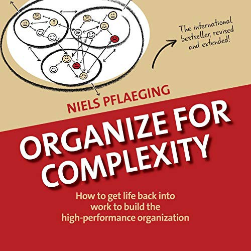

## Core idea

Complexity requires a fundamentally different organizational logic. The BetaCodex: organizations need a cell structure with periphery (value creation, customer-facing) and center (coordination), not traditional hierarchy.

## Key concepts

[BetaCodex](../concepts/betacodex.md), [[cell-structure]], [[periphery-vs-center]], [Self-Organization](../concepts/self-organization.md), [[dynamic-network]], [[complexity-in-organizations]], [[value-creation-vs-coordination]]

## What I took from it

### General

*(To be filled in)*

### Connection to our work

Most directly relevant to Part II probe design and AI-first org structure. The periphery/center model maps well to AI-native value streams: AI handles center (coordination), humans handle periphery (customer judgment). Related: [Reinventing organizations: geillustreerde versie (Dutch Edition)](laloux-reinventing-organizations-geillustreerde-versie-dutch-editio.md), [Team of Teams: New Rules of Engagement for a Complex World](mcchrystal-team-of-teams-new-rules-of-engagement-for-a-complex-world.md)
