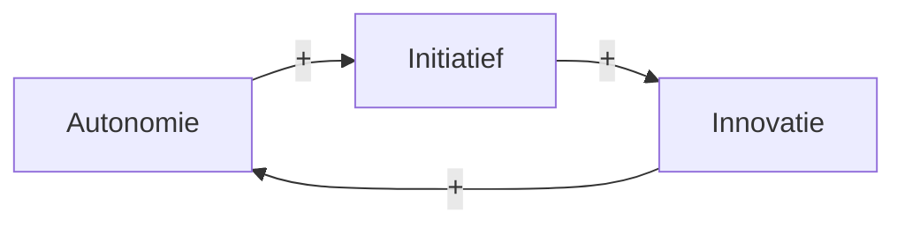
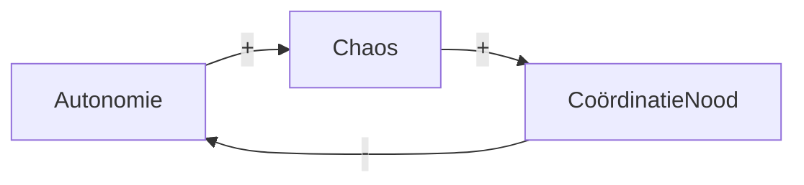

# CDAO - Designing Agile Organizations

## 1. Structuur & Organisatiedesign

### Kernidee: Product Groups

Een **Product Group** is het fundamentele bouwblok:

- **Semi-autonome eenheid** rond een familie van producten
- Bevat de **volledige value stream** (alles wat nodig is om waarde af te leveren)
- Onder leiding van een **Product Owner** (senior manager) verantwoordelijk voor strategie, visie en business outcomes

**Doel:** Teams kunnen onafhankelijk werken en snel beslissingen nemen.

### De 3 Soorten Dependencies

Dependencies bepalen hoe teams samen moeten werken. Er zijn drie fundamentele types:

#### 1. Pooled Dependencies
- Eenheden doen dezelfde taak in parallelle **of** delen een resource
- *Voorbeeld:* Twee teams gebruiken dezelfde test-omgeving
- **Coördinatie-overhead:** Laag ✓

#### 2. Sequential Dependencies
- Eenheden vertrouwen op elkaar in **voorspelbare volgorde**
- *Voorbeeld:* Team A geeft werk af aan Team B
- **Coördinatie-overhead:** Gemiddeld ⚠️

#### 3. Reciprocal Dependencies
- Eenheden **werken constant samen**, beïnvloeden elkaar
- *Voorbeeld:* Backend & Frontend team werken tegelijk aan dezelfde feature
- **Coördinatie-overhead:** **2-3x hoger** dan andere types ⚠️⚠️

**Kritiek inzicht:** Reciprocale dependencies zijn veel duurder om te coördineren!

### De Decoupling Strategie

**Kernprincipe:** Zorg dat reciprocale dependencies **in dezelfde product group** zitten.

Dit betekent:
- ✅ Groepeer teams die veel met elkaar samenwerken
- ❌ Vermijd dat teams elkaar constant moeten coördineren vanuit aparte product groups
- **Resultaat:** Minder coördinatie-overhead, snellere beslissingen, meer autonomie

#### DSM - Dependency Structure Matrix

Een visuele tool om dependencies in kaart te brengen:
- Identificeert welke teams/units afhankelijk zijn van elkaar
- Symmetrische elementen tonen **reciprocale dependencies**
- Helpt bij herstructurering van product groups

### 4 Perspectieven voor Product Group Structuring

Niet op één perspectief vertrouwen, maar combineren. Dit helpt eindeloze discussies te vermijden.

#### 1. Frequency (Start hier)
- **Hoe vaak werken teams samen?**
- Definieer product grenzen op basis van samenwerking frequentie
- Meest directe en gebruikte perspectief (meer dan 10 jaar standaard)

#### 2. Criticality & Uncertainty
- **Welke onderdelen zijn kritisch of onzeker in implementatie?**
- Zorg dat deze in dezelfde product group zitten
- Helpt risico's beter te managen
- Gebruik dit ter aanvulling op Frequency

#### 3. Operational Dependencies (Fine-tuning)
- **Kijk naar daadwerkelijke technische/operationele afhankelijkheden**
- Doel: Reciprocale dependencies in dezelfde unit houden
- Pas toe nadat Frequency en Criticality bepaald zijn

#### 4. Cost of Delay (Flow Efficiency)
- **Wat is de impact van vertraging in waarde-creatie?**
- Gebruik Value Stream Mapping
- Verschuift focus van "resource efficiency" naar "flow efficiency"

### Typische Aanpak

1. **Start:** Frequency + Criticality/Uncertainty → bepaal basisstructuur
2. **Verfijn:** + Operational Dependencies → tune fijne details
3. **Optimaliseer:** + Cost of Delay → optimaliseer flow efficiency

---

## 2. Systeemdenken (Systems Thinking)

### Waarom Systeemdenken?

Organisaties zijn **complexe systemen** waar onderdelen elkaar beïnvloeden. Lineair denken ("als ik dit veander, gebeurt dat") werkt niet. Je moet begrijpen hoe het geheel werkt.

**Systeemdenken** is een manier om organisaties als interconnected netwerken te zien, waar:
- Onderdelen elkaar beïnvloeden (feedback loops)
- Kleine veranderingen grote gevolgen kunnen hebben
- Intenties niet altijd leiden tot verwachte resultaten

### Kernconcepten van Systeemdenken

#### 1. Interconnectedness
- Alles in een organisatie is verbonden
- Verandering in één onderdeel beïnvloedt anderen
- *Voorbeeld:* Een wijziging in het financiële systeem beïnvloedt hoe teams prioriteiten stellen

#### 2. Feedback Loops
Twee soorten:

**Versterkende loops (Reinforcing):**
- Effect versterkt zichzelf
- *Voorbeeld:* Meer autonomie → meer initiatief → snellere innovatie → nog meer autonomie
- Positief, maar kan uit hand lopen

**Stabiliserende loops (Balancing):**
- Effect wordt gedempt
- *Voorbeeld:* Te veel autonomie → chaos → behoefte aan coördinatie → minder autonomie
- Zorgt voor evenwicht

#### Hoe herken je een loop type in een Causal Loop Diagram?

**Vuistregel:** Tel het aantal `-` (negatieve) pijlen in de loop.
- **Even aantal** (0, 2, 4...) → **Reinforcing loop (R)** — versterkt zichzelf
- **Oneven aantal** (1, 3, 5...) → **Balancing loop (B)** — dempt zichzelf

**Voorbeeld: Reinforcing loop (0 × min = versterking)**

*Alle pijlen zijn `+` → 0 negatieve pijlen → even → Reinforcing (R)*

**Voorbeeld: Balancing loop (1 × min = rem)**

*Één `-` pijl → oneven → Balancing (B)*

> **Geheugensteun:** Als er één iemand in de ketting "nee" zegt (min), trekt de loop zichzelf terug. Twee mensen die "nee" zeggen heffen elkaar op → versterking.

#### 3. Time Delays
- Oorzaken en gevolgen liggen niet altijd dicht bij elkaar in tijd
- Dit maakt problemen moeilijk op te sporen
- *Voorbeeld:* Slechte organisatiestructuur → burnout na 6 maanden → personeelsverlies

#### 4. Emergent Properties
- Het geheel is meer dan de som van de onderdelen
- Eigenschappen ontstaan uit de interactie tussen onderdelen
- Je kunt niet alles voorspellen door individuele onderdelen te analyseren

### Systeemdenken Toepassen op Organisaties

#### Stap 1: Identificeer het System
- Wat zijn de grenzen van het systeem je analyseert?
- Wie/wat zit erin? Wie/wat zit erbuiten?

#### Stap 2: Kaart de Elementen en Verbindingen
- Welke onderdelen zijn er? (teams, processen, rollen)
- Hoe beïnvloeden ze elkaar?
- DSM (Dependency Structure Matrix) kan hier helpen

#### Stap 3: Zoek Feedback Loops
- Waar zijn versterkende loops? (kunnen uit hand lopen)
- Waar zijn stabiliserende loops? (brengen evenwicht)
- Dit helpt problemen te begrijpen

#### Stap 4: Denk in Tijd
- Waar liggen time delays?
- Hoe lang duurt het voordat je gevolgen ziet?
- Dit verklaart waarom oplossingen niet meteen werken

#### Stap 5: Zoek Leverage Points
- Waar zou een kleine verandering grote impact hebben?
- Dit zijn de beste plekken om aan te werken

### Systeemdenken vs. Lineair Denken

| Lineair | Systeemdenken |
|---------|---|
| Oorzaak → Gevolg | Oorzaak ↔ Gevolg (feedback) |
| Problemen hebben één oorzaak | Problemen hebben meerdere oorzaken |
| Snel resultaat | Resultaten nemen tijd |
| Optimaliseer onderdelen | Optimaliseer het geheel |
| Voorspelbaar | Gaat om patronen en trends |

### Praktijkvoorbeeld: Reorganisatie

**Lineair denken:** "We herstructureren teams → snellere levering"

**Systeemdenken vraagt:**
- Wat zijn de feedback loops? (autonomie ↔ coördinatie)
- Time delay: Hoe lang tot teams ingespeeld zijn?
- Emergent properties: Welke onverwachte effecten ontstaan?
- Leverage points: Waar hebben we impact zonder alles om te gooien?

---
## 3. Capabilities & Adaptabiliteit

### Wat zijn Organizational Capabilities?

**Capabilities** zijn de mogelijkheden van een organisatie om bepaalde dingen te doen. Ze bepalen wat een organisatie kan bereiken en hoe snel.

*Voorbeelden:*
- Snelheid van innovatie
- Vermogen om klantfeedback snel in te verwerken
- Vermogen om risico's te identificeren en aan te pakken
- Vermogen om mensen aan te trekken en vast te houden

### Types of Adaptability (Verschillende soorten flexibiliteit)

Niet alle adaptabiliteit is gelijk. Er zijn verschillende types die je organisatie nodig kan hebben:

#### 1. **Tactical Adaptability** (Tactische aanpassingen)
- Snelle aanpassingen binnen bestaande structuur
- Reageren op directe marktveranderingen
- *Voorbeeld:* Een team past sprintplanning aan omdat klanten andere prioriteiten hebben
- **Tijdschaal:** Dagen tot weken
- **Impact:** Lokaal (een team/product group)

#### 2. **Strategic Adaptability** (Strategische aanpassingen)
- Grotere verschuivingen in richting en focus
- Reageren op markttrends en langetermijnkansen
- *Voorbeeld:* Organisatie verschuift focus van B2B naar B2C
- **Tijdschaal:** Weken tot maanden
- **Impact:** Organisatiebreedte

#### 3. **Structural Adaptability** (Structurele aanpassingen)
- Wijzigingen in hoe de organisatie is georganiseerd
- Hoe teams verdeeld zijn, hoe product groups samengesteld zijn
- *Voorbeeld:* Herindeling van product groups op basis van marktveranderingen
- **Tijdschaal:** Maanden
- **Impact:** Diep - organisatiestructuur verandert

#### 4. **Cultural Adaptability** (Culturele aanpassingen)
- Veranderingen in hoe mensen denken, werken, communiceren
- Mindset shifts in de organisatie
- *Voorbeeld:* Van "ik ben verantwoordelijk voor mijn functie" naar "ik ben verantwoordelijk voor customer outcome"
- **Tijdschaal:** Maanden tot jaren
- **Impact:** Het meest transformerend, maar ook het langzaamst

### Flow Efficiency vs. Resource Efficiency

Dit is een **kritieke keuze** voor organizational capability:

#### Resource Efficiency (Traditioneel)
- **Doel:** Iedereen druk houden, geen "verspilling"
- **Benadering:** Maak teams volledig bezet
- **Resultaat:** Mensen zijn altijd bezig, maar werk staat in rijen in te wachten
- **Gevolg:** Langere doorlooptijd, meer context switching, hoger burnout

#### Flow Efficiency (Agile)
- **Doel:** Werk snel doorstromen van idee naar klant
- **Benadering:** Zorg dat een stuk werk niet wacht, voorkeur voor snelle levering
- **Resultaat:** Teams hebben soms "slack", maar werk gaat snel
- **Gevolg:** Kortere doorlooptijd, minder wachten, hogere kwaliteit

### Strategic Alignment (Alignment met Strategie)

**Kernidee:** Organisatiedesign moet passen bij je strategie. Anders werk je tegen jezelf.

#### Voorbeeld: Online Retailer

**Strategie:** "Snel innoveren, veel experimeteren"

**Design Consequenties:**
- ✅ Product groups moeten onafhankelijk kunnen experimenteren
- ✅ Snelle feedback loops van klant naar product group
- ✅ Laag aantal review/approval gates
- ❌ Niet geschikt: Strikte centralisatie, veel hand-offs

**Conversely:**

**Strategie:** "Betrouwbaarheid is kritiek (bijv. bank)"

**Design Consequenties:**
- ✅ Goede coördinatie, strikte processen
- ✅ Veel review/approval gates
- ✅ Centralisatie waar nodig
- ❌ Niet geschikt: Chaos, ieder doet wat

### Defining Products & Services

Een onderdeel van het design is: **Wat is je product?**

Dit klinkt simpel, maar is cruciaal:

#### Product vs. Feature
- **Product:** Een volledige oplossing die klanten waarderen
- **Feature:** Één onderdeel van een product
- *Voorbeeld:* Slack is het product, "threaded conversations" is een feature

#### Product Boundaries Bepalen
- **Te breed:** Een product group kan niet alles beheren
- **Te smal:** Teams kunnen niet zelfstandig werken
- **Juist:** Teams kunnen het product zelfstandig leveren

**Vragen om product boundaries te bepalen:**
1. Wie is de klant?
2. Wat is de core value die je levert?
3. Welke features horen echt bij deze value?
4. Waar liggen de natuurlijke breaks?

### Designing Product Groups (Praktisch)

**Stap-voor-stap aanpak:**

#### 1. Identificeer de Producten/Services
- Welke products/services heb je?
- Wie zijn de klanten per product?

#### 2. Kies je Perspectief(ven)
- Start met **Frequency**: teams die veel samenwerken
- Voeg toe: **Criticality**, **Dependencies**, **Cost of Delay**

#### 3. Definieer Product Group Grenzen
- Inclusief: Teams, rollen, resources
- Exclusief: Wat hoort NIET in deze group?

#### 4. Definieer de Product Owner Rol
- Strategie en visie voor de group
- Business outcomes verantwoordelijkheid
- Autonomie in prioriteiten

#### 5. Definieer Coördinatieprocessen
- Hoe coördineren product groups met elkaar?
- Waar zijn dependencies die aandacht nodig hebben?

### Capabilities als Concurrentie Voordeel

**Interessant inzicht:** Je organisatiedesign bepaalt welke capabilities je kan opbouwen.

**Voorbeeld:**
- Design met autonome product groups → Snelle innovatie capability
- Design met veel coördinatie → Reliability capability
- Design met decoupled teams → Scalability capability

**Dus:** Denk erover na:
- Welke capabilities zijn kritiek voor je strategie?
- Ondersteunt je design deze capabilities?
- Zo niet, wat moet je veranderen?

---

## Sources

- [Scrum.org - Four Perspectives on Structuring Product Groups and Teams](https://www.scrum.org/resources/blog/four-perspectives-structuring-product-groups-and-teams)
- [Creating Agile Organizations - Product Group Design](https://creatingagileorganizations.com/wp-content/uploads/2025/12/Product-Group-Design.pdf)
- [Scrum.org - Critical Agile Organization Design Guidelines](https://www.scrum.org/resources/blog/critical-agile-organization-design-guidelines)
- [Creating Agile Organizations - Main Website](https://creatingagileorganizations.com/)
- [Designing & Creating Agile Organizations Whitepaper](https://creatingagileorganizations.com/wp-content/uploads/2024/05/Designing-Creating-Agile-Organizations-Whitepaper.pdf)
