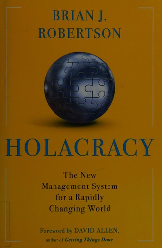

## Core idea

A complete system for self-governance. Replaces management hierarchy with defined structure of roles, circles, and governance processes. Power distributed to roles, not people. Tensions drive evolution.

## Key concepts

[Holacracy](../concepts/holacracy.md), [[roles-vs-people]], [[circles]], [[governance-process]], [[distributed-authority]], [[tensions]], [Self-Organization](../concepts/self-organization.md)

## What I took from it

### General

*(To be filled in)*

### Connection to our work

One possible structural end state for AI-first org design. When AI absorbs coordination, human governance needs to be lighter and more distributed — Holacracy is one model. Related: [Reinventing organizations: geillustreerde versie (Dutch Edition)](laloux-reinventing-organizations-geillustreerde-versie-dutch-editio.md), [Organize for Complexity: How to Get Life Back Into Work to Build the High-Performance Organization (Betacodex Publishing)](pflaeging-organize-for-complexity-how-to-get-life-back-into-work-to-bu.md)
