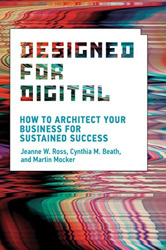

## Core idea

*(To be filled in)*

## Key concepts

Org capability architecture, operational backbone, digital platform, autonomous teams, transition design

## What I took from it

### General

*(Not directly read — used as reference framework)*

### Connection to our work

Informs the organizational impact sections and the transition architecture logic in toward-ai-native-ai-first.
