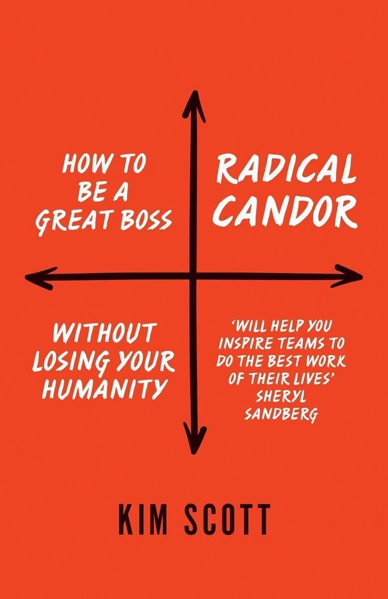
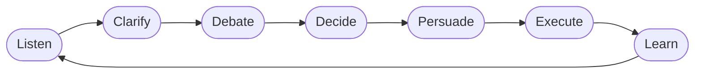

> [!note]- Bronnen
> - [Goodreads](https://www.goodreads.com/book/show/29939161-radical-candor)
> - [radicalcandor.com — officiële boekpagina](https://www.radicalcandor.com/the-book/)

## Core idea

Goede managers [Care Personally](../concepts/care-personally.md) én [Challenge Directly](../concepts/challenge-directly.md). Wie alleen het eerste doet, fàalt de mensen die hij wil beschermen — **[Ruinous Empathy](../concepts/ruinous-empathy.md)** is de meest voorkomende managementfout. Eerlijkheid zonder zorg is bruutheid. Zorg zonder eerlijkheid is verraad.

## Key concepts

[[candor]], [[care-personally]], [[challenge-directly]], [[ruinous-empathy]], [[psychological-safety]], [[accountability]], [[dissent]]

## What I took from it

### General

Het centrale paradox van dit boek: de managers die het meest geven om hun mensen zijn vaak degenen die hen het meest falen — door te zwijgen over wat echt gezegd moet worden. Ruinous Empathy voelt als vriendelijkheid maar is in werkelijkheid een vorm van zelfbescherming: het gesprek vermijden dat ongemakkelijk is voor de manager, ten koste van de groei van het teamlid.

Het tweede inzicht: Radical Candor is geen vergunning om hard te zijn. De "Care Personally"-as is niet decoratief. Zonder echte zorg voor de persoon wordt Challenge Directly gewoon Obnoxious Aggression — en dat lost niets op.

### Connection to our work

[Felps](../trust-by-design/the-kindness-trap/felps-mitchell-byington-how-when-why-bad-apples-2006.md) beschrijft de drie barrières die motivationele interventie blokkeren. Radical Candor voegt een vierde toe die Felps impliciet houdt: **Ruinous Empathy als culturele barrière**. Wanneer een organisatie Ruinous Empathy als norm heeft — managers die niet durven aanspreken, peers die zwijgen uit "vriendelijkheid" — zijn de andere barrières overbodig. De bad apple overleeft zonder dat er macht, veiligheid of regels aan te pas komen.

Met [Avery](avery-the-responsibility-process-unlocking-your-natural-ability-to.md): Ruinous Empathy is Obligation zonder Responsibility — je doet de motie van betrokkenheid, maar neemt geen eigenaarschap over de uitkomst. Radical Candor kiezen is Responsibility kiezen.

[Buckingham & Goodall](../trust-by-design/the-performance-illusion/buckingham-goodall-the-feedback-fallacy.md) stellen dat deficit-feedback niet werkt. De spanning is echter oplosbaar: RC-feedback is specifiek, gedragsmatig en verankerd in Care Personally (= de psychologische veiligheid die het lerende brein-circuit activeert in plaats van het verdedigings-circuit). Bovendien omvat RC evenveel aandacht voor gerichte lof als voor kritiek — precies wat B&G bepleiten.

[McCord (Powerful)](mccord-powerful-building-a-culture-of-freedom-and-responsibility.md) en [Netflix](../trust-by-design/beyond-the-review/cases/netflix.md) beschrijven RC op organisatieniveau — de Culture Deck is institutionele Radical Candor. [Crucial Conversations](patterson-crucial-conversations-tools-for-talking-when-stakes-are-high.md) geeft de *vaardigheid* voor het gesprek; Radical Candor geeft het *kader* waarom je het voert.

Related: [Bad Apples — Felps](../trust-by-design/the-kindness-trap/felps-mitchell-byington-how-when-why-bad-apples-2006.md), [The Responsibility Process](avery-the-responsibility-process-unlocking-your-natural-ability-to.md), [Powerful — McCord](mccord-powerful-building-a-culture-of-freedom-and-responsibility.md), [The Feedback Fallacy](../trust-by-design/the-performance-illusion/buckingham-goodall-the-feedback-fallacy.md), [Transparency: How Leaders Create a Culture of Candor](bennis-transparency-how-leaders-create-a-culture-of-candor.md), [Crucial Conversations](patterson-crucial-conversations-tools-for-talking-when-stakes-are-high.md), [The Five Dysfunctions of a Team](lencioni-the-five-dysfunctions-of-a-team.md), [Netflix — case](../trust-by-design/beyond-the-review/cases/netflix.md)

---

## Samenvatting

### Het 2×2-kader

Het hart van het boek: twee assen, vier kwadranten.

| | Challenge Directly: laag | Challenge Directly: hoog |
|---|---|---|
| **Care Personally: hoog** | ⚠️ **[Ruinous Empathy](../concepts/ruinous-empathy.md)** *"Ik wil je niet kwetsen"* De meest voorkomende fout | ✅ **Radical Candor** *Het doel* |
| **Care Personally: laag** | ❌ **Manipulative Insincerity** *Politiek, passief-agressief* | ❌ **Obnoxious Aggression** *"Being an asshole"* |

---

### [Care Personally](../concepts/care-personally.md)

Geen "aardig zijn" — echte interesse in de persoon achter de functie. Wat motiveert hen? Wat is er gaande buiten het werk? Waar willen ze over vijf jaar zijn?

Zonder Care Personally is Challenge Directly gewoon bruutheid. Care Personally is de voorwaarde, niet de vervanging van eerlijkheid.

---

### [Challenge Directly](../concepts/challenge-directly.md)

Eerlijk zijn ook als het ongemakkelijk is. Onmiddellijk, specifiek, in persoon. Zowel over wat goed gaat als wat beter kan.

Kritiek in het moment is een gunst — weggeslikte kritiek stapelt zich op en leidt tot ofwel een plotse explosie, ofwel een afschrijving zonder kans op herstel.

---

### [Ruinous Empathy](../concepts/ruinous-empathy.md) — de meest voorkomende fout

Je geeft om de persoon maar zegt niet wat gezegd moet worden. Je beschermt hen tegen kortetermijn-ongemak en fàalt hen op de lange termijn.

Voorbeelden:
- Zwijgen over een gewoonte die iemands carrière schaadt omdat je hen niet wil kwetsen
- Een performanceprobleem omheen formuleren zodat de boodschap niet aankomt
- "Geweldig werk!" zeggen zonder te specifiëren wat precies goed was

> Ruinous Empathy voelt als vriendelijkheid voor de gever. Het is verraad voor de ontvanger — die pas later, te laat, ontdekt wat nooit gezegd werd.

[McCord](mccord-powerful-building-a-culture-of-freedom-and-responsibility.md) formuleert het identiek in [Powerful](mccord-powerful-building-a-culture-of-freedom-and-responsibility.md): *"Het ontbreken van eerlijke feedback is geen vriendelijkheid — het is een dienstverlening die je weigert te leveren."* Twee onafhankelijke auteurs, dezelfde conclusie.

---

### Rockstars en superstars

Niet iedereen wil groeien op dezelfde manier. Scott maakt onderscheid tussen twee waardevolle trajecten:

| Type | Trajectorie | Wat ze nodig hebben |
|---|---|---|
| **Superstar** | Steil — wil nieuwe uitdagingen, promotie, verandering | Kansen, stretch-opdrachten, snelle feedback |
| **Rock star** | Geleidelijk — excellent in huidige rol, stabiel, niet gericht op promotie | Erkenning, autonomie, geen druk om te "groeien" |

Ruinous Empathy faalt rock stars het meest: door hen geen eerlijke feedback te geven over hoe ze nog beter kunnen worden in wat ze al goed doen, ontneem je hen de groei die ze wél willen.

---

### Guidance: lof én kritiek

RC-feedback is: **specifiek, onmiddellijk, oprecht en in persoon.**

- **Lof** zo specifiek als kritiek: niet *"Goed gedaan"* maar *"De manier waarop je in die vergadering X deed door Y te doen, had effect omdat Z"* — alleen zo leert iemand hun eigen patroon van succes kennen.
- **Kritiek** privé; lof kan publiek — maar beide moeten de persoon helpen, niet de manager ontlasten.
- Vraag eerst zelf om feedback vóór je het geeft — het verlaagt de defensiviteit en bouwt vertrouwen.

---

### Getting Stuff Done — de wheel

RC is niet alleen een feedbackmodel. Scott beschrijft een cyclisch proces voor hoe teams werk gedaan krijgen:

De manager faciliteert de cyclus — zorgt dat de juiste mensen spreken, dat beslissingen genomen worden, en dat geleerd wordt van uitkomsten.

| Stap | Wat de manager doet |
|---|---|
| **Listen** | Creëert ruimte — 1-on-1s, stille momenten in vergaderingen — zodat ideeën en zorgen bovenkomen |
| **Clarify** | Helpt ideeën scherper worden vóór het debat; vaag blijft vaag tot iemand vraagt: *"wat bedoel je precies?"* |
| **Debate** | Faciliteert productief conflict over ideeën — niet over mensen. RC maakt dit veilig |
| **Decide** | Maakt of delegeert de beslissing. Wie beslist, moet helder zijn — onduidelijkheid hier blokkeert alles erna |
| **Persuade** | Mensen die niet in de kamer waren, moeten begrijpen waarom. Zonder dit: sabotage bij Execute |
| **Execute** | De manager doet het werk niet — hij ruimt obstakels uit de weg |
| **Learn** | Werkte het? Wat niet? De uitkomst voedt de volgende ronde van Listen |

De cyclus is zichzelf versterkend: **Learn** maakt **Listen** rijker. Een team dat niet leert, herhaalt — en een manager die niet luistert, mist het signaal.

---

#### Waar is het toepasbaar?

Het GSD-wheel werkt overal waar een team beslissingen moet nemen én uitvoeren — strategische planning, complexe probleemoplossing, projectopstart, productontwikkeling. 
Kernvoorwaarde: er moet iets op het spel staan dat de moeite waard is om samen te denken. 
Voor triviale of eenpersoonsbesluiten is de overhead niet gerechtvaardigd.

Het wheel werkt het best wanneer:
- het team mentale en emotionele capaciteit heeft (niet uitgeput of in crisis)
- de cultuur dissent tolereert en verwacht
- leiderschap bereid is de uitkomst van het debat te accepteren — ook als die afwijkt van hun beginpositie

Wanneer een team burned-out is of emotioneel geladen, adviseert Scott expliciet een **timeout** in te lassen. Doorduwen in die staat levert zelden goede uitkomsten. ([RC Podcast S4E2](https://www.radicalcandor.com/podcast/s4-e2-the-gsd-wheel/))

---

#### Listen: stil of luid?

De Listen-stap heeft twee uitvoeringsvormen, afhankelijk van de leiderschapsstijl ([RC Blog — Culture of Listening](https://www.radicalcandor.com/blog/culture-of-listening/)):

| Stijl | Aanpak | Risico |
|---|---|---|
| **Quiet listening** (Tim Cook) | Zwijgen + neutrale lichaamstaal — mensen vullen de stilte met echte gedachten | Mensen raden wat de baas wil horen; stilte voelt als een val |
| **Loud listening** (Steve Jobs) | Stevige mening uitspreken, anderen uitdagen die te weerleggen | Intimideert mensen die nog geen vertrouwen hebben om terug te duwen |

Geen van beide is superieur. 
Kernprincipe: ken je eigen stijl, en compenseer actief voor het bijbehorende risico. 
Paul Saffo's formulering sluit hierop aan: *"strong opinions, weakly held"* — een duidelijk standpunt innemen terwijl je oprecht open blijft voor tegenargumenten.

---

#### Debate: de verplichting om te dissenten

Universele instemming in een debat is een waarschuwingssignaal, geen succes — het betekent dat er onvoldoende kritisch is nagedacht. 
Scott noemt dit een *"[obligation to dissent](../concepts/dissent.md)"*: iedereen in de kamer heeft de plicht actief tegenwicht te bieden, niet enkel te knikken. ([RC Podcast S4E2](https://www.radicalcandor.com/podcast/s4-e2-the-gsd-wheel/))

Dit maakt het wheel fundamenteel anders dan een managementvergadering waar consensus het doel is. 
Consensus is het resultaat van een goed Decide-moment — niet van een goed Debate-moment.

---

#### De valkuil: collaboration tax

Het wheel wordt een **collaboration tax** als stappen overgeslagen of eindeloos uitgerekt worden. 
Overslaan van Clarify → debat over misverstanden in plaats van ideeën. 
Overslaan van Persuade → sabotage bij Execute door mensen die de beslissing niet begrijpen. 
Uitrekken van Debate → vermoeidheid, valse consensus, afgehaken teamleden.

De cyclus is een investering die rendeert wanneer hij snel doorlopen wordt — niet een procedure die gevolgd moet worden om de procedure.
