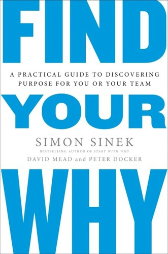

## Core idea

Practical process for discovering individual and team WHY. The WHY comes from the past, is expressed in the present, and guides the future. Team WHY emerges from stories.

## Key concepts

[[why-discovery]], [Purpose](../concepts/purpose.md), [[team-why]], [[story-based-discovery]]

## What I took from it

### General

*(To be filled in)*

### Connection to our work

Before designing AI-first transitions, the team needs a shared WHY. Without it, the target attractor (Section 10) has no emotional anchor. Related: [Start with Why: How Great Leaders Inspire Everyone to Take Action](sinek-start-with-why-how-great-leaders-inspire-everyone-to-take-ac.md)
