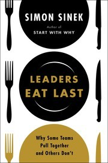

## Core idea

Great leaders sacrifice their own comfort for those they lead. The Circle of Safety: inside feels safe, outside feels dangerous. Neurochemistry of leadership: oxytocin, serotonin, cortisol.

## Key concepts

[[circle-of-safety]], [[servant-leadership]], [Trust](../concepts/trust.md), [[oxytocin]], [[cortisol]], [[empathy]], [[neurochemistry-of-leadership]]

## What I took from it

### General

*(To be filled in)*

### Connection to our work

AI-first transformation requires creating safety for experimentation. Without the Circle of Safety, probes feel like threats. Safe-to-fail needs psychological safety first. Related: [Creativity, Inc.: Overcoming the Unseen Forces That Stand in the Way of True Inspiration](catmull-creativity-inc-overcoming-the-unseen-forces-that-stand-in-th.md), [Your Brain at Work: Strategies for Overcoming Distraction, Regaining Focus, and Working Smarter All Day Long](rock-your-brain-at-work-strategies-for-overcoming-distraction-reg.md)
