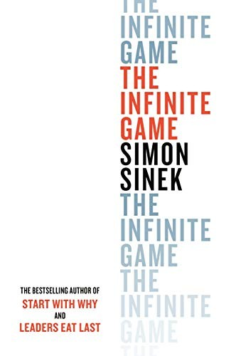

## Core idea

Business is an infinite game with no final winners. Finite mindset (win/lose) destroys organizations over time. Infinite mindset requires: just cause, trusting teams, worthy rivals, existential flexibility, courage to lead.

## Key concepts

[The Infinite Game](../concepts/infinite-game.md), [[finite-vs-infinite]], [[just-cause]], [[worthy-rivals]], [[existential-flexibility]], [[will-and-resources]]

## What I took from it

### General

*(To be filled in)*

### Connection to our work

AI-first transformation is an infinite game — there is no "done." The sensing cadence and probe design are infinite game moves. Organizations with finite mindset will stop after first wins. Related: [Start with Why: How Great Leaders Inspire Everyone to Take Action](sinek-start-with-why-how-great-leaders-inspire-everyone-to-take-ac.md)
