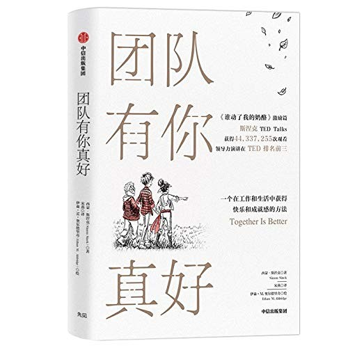

## Core idea

Short illustrated book on the power of human connection and courage in leadership. Core message: we accomplish more together, and leadership is about giving, not taking.

## Key concepts

[[connection]], [[courage]], [[giving]], [[leadership-values]]

## What I took from it

### General

*(To be filled in)*

### Connection to our work

Accessible entry point to Sinek's broader leadership thinking.
