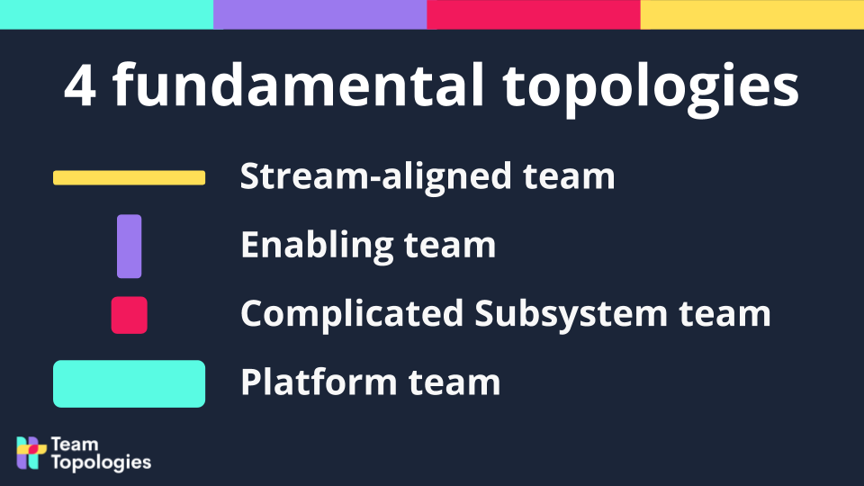
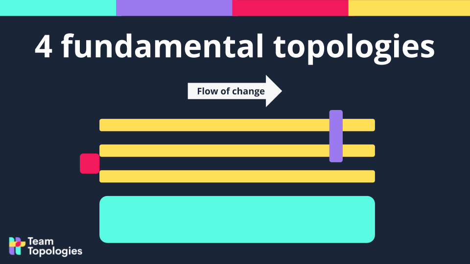
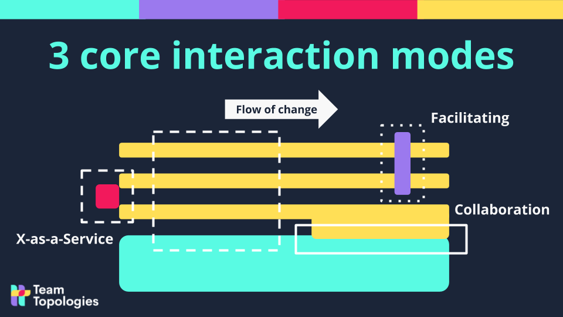

## Core idea

Team Topologies geeft een praktisch model voor hoe softwareorganisaties hun teams kunnen inrichten voor snelle, duurzame flow. De centrale claim: team-ontwerp is niet een HR-vraagstuk maar een architectuurvraagstuk. Wie teams ontwerpt, ontwerpt de software — en andersom (Conway's Law).

Het boek maakt organisatieontwerp benaderbaar via twee assen:
- **Vier teamtypen** — wat doet een team?
- **Drie interactiemodi** — hoe werken teams samen?

Het overkoepelende criterium: **cognitieve belasting** (cognitive load). Een team kan maar een bepaalde hoeveelheid complexiteit dragen. Overschrijd je die grens, dan vertraagt alles — niet door luiheid, maar door structurele overbelasting.

---

## Vier teamtypen

### 1. Stream-aligned team
Het **primaire teamtype**. Aligned op een continue stroom van waarde richting de klant — een product, een feature-set, een gebruikersreis, een business-domein.

- Levert end-to-end (van idee tot productie)
- Heeft alle skills in-house die nodig zijn om de stroom te onderhouden
- Minimale afhankelijkheid van andere teams voor dagelijks werk
- Eigenaar van de productiviteitsstroom; andere teams *dienen* dit team

> Analogie: het stream-aligned team is het chirurgisch team — alle andere teamtypen zijn ondersteunend.

### 2. Enabling team
Helpt stream-aligned teams over drempels heen. Tijdelijk, gericht op competentieopbouw — niet op het overnemen van het werk.

- Brengt expertise in die het stream-aligned team tijdelijk nodig heeft maar niet intern heeft
- Doel: het stream-aligned team zelfstandiger maken, niet afhankelijker
- Verdwijnt idealiter wanneer de competentie is overgedragen

> Valkuil: enabling teams die permanent worden en zo een nieuwe afhankelijkheid creëren.

### 3. Complicated-subsystem team
Beheert een technisch complex subsysteem dat specialistische kennis vereist — wiskundige modellen, grafische engines, cryptografische protocollen.

- Nodig wanneer de complexiteit structureel te hoog is voor een stream-aligned team
- Interface: levert output als service aan stream-aligned teams
- Klein gehouden; te groot → empire-building risico

### 4. Platform team
Biedt een intern platform waarop stream-aligned teams kunnen bouwen zonder de onderliggende complexiteit te hoeven kennen.

- Verbergt infrastructuurcomplexiteit achter een intuïtieve API
- Behandelt stream-aligned teams als **klanten** — met onboarding, documentatie, support
- Succes gemeten aan adoptie en autonomie van stream-aligned teams, niet aan platformfeatures
- Maatstaf: "Kan een stream-aligned team ons platform gebruiken zonder ons te hoeven vragen?"

---

## Drie interactiemodi

### 1. Collaboration
Twee teams werken nauw samen voor een bepaalde periode — ontdekkingswerk, innovatie, het oplossen van complexe problemen samen.

- Hoge coördinatiekost (hoog cognitief gewicht)
- Juist wanneer je niet weet wat je zoekt
- Tijdelijk — overgaat naar X-as-a-Service zodra de interface duidelijk is

### 2. X-as-a-Service
Eén team levert iets; een ander team consumenteert het via een duidelijke, stabiele interface.

- Lage coördinatiekost
- Juist wanneer de verwachtingen helder zijn en de interface stabiel
- Vereist uitstekende documentatie en betrouwbaarheid aan de service-kant

### 3. Facilitating
Eén team helpt een ander team beter te worden — het enabling team in interactie met een stream-aligned team.

- Tijdelijk
- Gericht op competentieoverdracht, niet op dienstverlening
- Succes = het andere team heeft de facilitering niet meer nodig

---

## Cognitieve belasting als ontwerpprincipe

Het centrale concept dat Team Topologies onderscheidt van andere modellen: **cognitieve belasting als primaire ontwerpconstraint**.

Drie typen cognitieve belasting:
- **Intrinsic** — inherente complexiteit van het domein (de wiskundige kern van het probleem)
- **Extraneous** — onnodige complexiteit door slechte tooling, onduidelijke processen, gebrek aan context
- **Germane** — leerwerk dat waarde toevoegt (nieuwe patronen aanleren, expertise opbouwen)

Goed teamontwerp:
- Vermindert extraneous load (platform teams, goede tooling, duidelijke interfaces)
- Beschermt ruimte voor germane load (leren, meesterschap)
- Laat intrinsic load bewust bij het team dat het domein bezit

> Praktische vraag: "Kan dit team dit domein nog overzien? Of verdelen we het beter?"

---

## Inverse Conway Maneuver

Conway's Law zegt: organisaties produceren systemen die hun communicatiestructuur weerspiegelen. De **Inverse Conway Maneuver** keert dit om als ontwerptool:

> Ontwerp eerst de gewenste softwarearchitectuur. Organiseer teams daarna zo dat ze die architectuur *natuurlijk* produceren.

Dit is een architectuurbeslissing voor HR, en een HR-beslissing voor architectuur. Beide tegelijk.

Team Topologies past Conway's Law als actief ontwerpinstrument toe — niet als diagnose-achteraf.

---

## Team API

Elk team heeft een "Team API": de interface waarmee andere teams interageren:

- Code en documentatie (de technische interface)
- Communicatiekanalen (Slack, wiki, meetingritme)
- Werkafspraken (hoe vraag je om hulp? Hoe lang duurt feedback?)
- Teamprincipes en beslissingscriteria (wat beslist het team autonoom?)

Hoe explicieter de Team API, hoe minder coördinatiekost voor teams die ermee werken.

---

## Topologieën veranderen mee

Belangrijk principe: de topologie is geen statisch org-chart. Ze evolueert met het systeem.

- Een nieuw domein begint met **collaboration** (ontdekking)
- Zodra de interface duidelijk is → **X-as-a-Service**
- Wanneer een stream-aligned team vastloopt → enabling team faciliteert, verdwijnt daarna
- Wanneer complexiteit te hoog wordt → complicated-subsystem team neemt een stuk over

Teamtypen en interactiemodi zijn **tijdelijk van aard** — het gaat om de beweging, niet de foto.

---

## Relatie tot Org Topologies

| Dimensie | Team Topologies | Org Topologies |
|---|---|---|
| Scope | Softwaredevelopment | Universeel (elke sector) |
| Centrale constraint | Cognitieve belasting | Transaction- en switching costs |
| Teammodel | 4 typen + 3 modi | 16 archetypes op 2D-map |
| Verandertool | Interactiemodi evolueren | MADE-methode + Elevating Katas |
| Conway | Centraal (Inverse Conway) | Impliciet aanwezig |
| AI | Niet expliciet | Expliciet (AI-friendly ontwerp) |

**Complementariteit**: Team Topologies werkt het beste voor softwareteams; Org Topologies is breder inzetbaar en biedt meer strategische diagnoseruimte. De 2D-kaart van OT is sterker als communicatietool voor non-technical stakeholders. Team Topologies is concreter voor dag-tot-dag teamontwerp in technologiebedrijven.

---

## Wat ik ervan meenam

### Sterkte

- Cognitieve belasting als ontwerpcriterium is onmiddellijk bruikbaar — het maakt overvol teamwork tastbaar en bespreekbaar
- De vier teamtypen zijn eenvoudig genoeg om te onthouden, rijk genoeg om te onderscheiden
- De Inverse Conway Maneuver geeft een concreet handvat dat architectuur en organisatieontwerp verbindt

### Blinde vlek

- Sterk gefocust op softwareproductontwikkeling — minder toepasbaar in niet-tech organisaties
- Cognitieve belasting is moeilijk te meten in de praktijk
- Enabling teams verdwijnen idealiter — maar de politieke realiteit maakt dat zelden zo eenvoudig

### Verbinding met ons werk

- Stream-aligned teams zijn het equivalent van OT's Driving-archetypes (C3/C4): end-to-end, outcome-gericht
- Platform teams zijn een institutionalisering van gedeelde capaciteiten — relevant voor [Org Topologies™: Strategic Org Design — The Primer](krivitsky-larman-flemm-org-topologies.md) (Delivery vs. Adaptive Topology)
- Cognitieve overbelasting is een verklaring voor waarom fragmentatie (dysfunction #5) zo destructief is in AI-context: elk team draagt AI-tools als extra cognitieve last bovenop het domeinwerk
- Inverse Conway + AI: als AI de softwarearchitectuur fundamenteel verandert (event-driven, microservices, AI-agents als services), moeten teams meeveranderen — anders herhaalt Conway's Law zich als anti-patroon

Related: [Org Topologies™: Strategic Org Design — The Primer](krivitsky-larman-flemm-org-topologies.md), [Accelerate: Building and Scaling High Performing Technology Organizations](forsgren-accelerate-building-and-scaling-high-performing-technology-o.md), [Management 3.0: Leading Agile Developers, Developing Agile Leaders](appelo-management-30-leading-agile-developers-developing-agile-lead.md), [Team of Teams: New Rules of Engagement for a Complex World](mcchrystal-team-of-teams-new-rules-of-engagement-for-a-complex-world.md)
