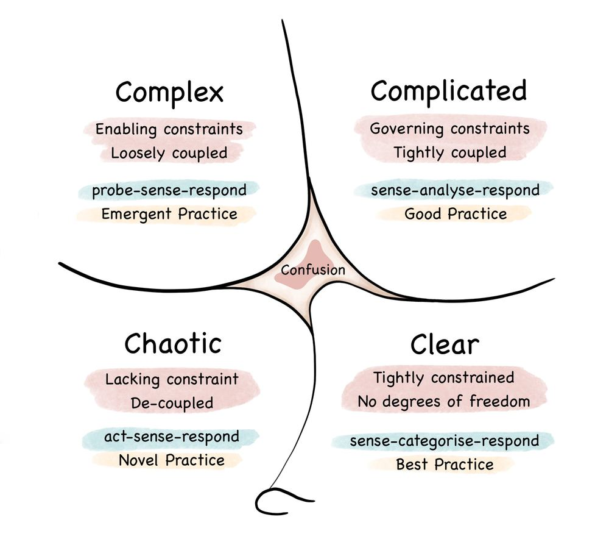
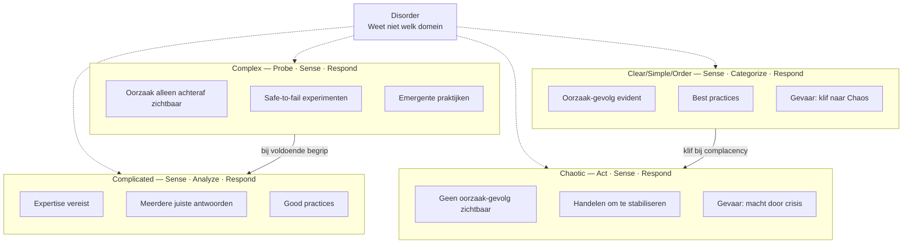

## Core idea

Cynefin (Welsh: "habitat" — de omgeving die je vormt zonder dat je het beseft) is een **sense-making framework** dat helpt bepalen welk type situatie je voor je hebt — en dus welke aanpak gepast is. De kernfout die Cynefin corrigeert: mensen behandelen complexe problemen als gecompliceerde problemen en zoeken naar analyses en plannen waar probes en experimenten nodig zijn.

## Key concepts

Domain awareness (Clear/Simple/Order / Complicated / Complex / Chaotic / Disorder), probe-sense-respond, safe-to-fail experiments, attractors, enabling constraints, emergent practice

## What I took from it

### General

*(Not directly read — used as reference framework)*

### Connection to our work

Foundational to the entire Part II of the template (Probe Design). Explains why a linear plan fails in organizational transformation and what to do instead. The split between Part I (Complicated) and Part II (Complex) is directly derived from Cynefin.

---

## Samenvatting

### De vijf domeinen

Cynefin onderscheidt vijf domeinen op basis van de relatie tussen oorzaak en gevolg:

| Domein | Oorzaak-gevolg | Aanpak | Respons |
|---|---|---|---|
| **Clear/Simple/Order** | Bekend en voorspelbaar | Best practices toepassen | Sense → Categorize → Respond |
| **Complicated** | Kenbaar met expertise | Good practices via analyse | Sense → Analyze → Respond |
| **Complex** | Alleen achteraf zichtbaar | Emergente praktijken via probes | Probe → Sense → Respond |
| **Chaotic** | Geen verband zichtbaar | Handelen om stabiliteit te herstellen | Act → Sense → Respond |
| **Disorder** | Onbekend in welk domein | Gevaarlijkst: mensen vallen terug op comfort | — |

### De response types toegelicht

De volgorde van de stappen is niet willekeurig — ze verschilt per domein en dat is precies het punt:

**Sense → Categorize → Respond** *(Clear/Simple/Order)*
Je observeert de situatie, herkent het patroon, past de bijhorende best practice toe. De categorie is al bekend — je hoeft niet na te denken, alleen te herkennen. Snel en efficiënt, maar gevaarlijk als je te snel categoriseert.

**Sense → Analyze → Respond** *(Complicated)*
Je observeert, brengt expertise in om oorzaak en gevolg te achterhalen, dan reageer je. Analyse komt vóór actie. Meerdere correcte antwoorden zijn mogelijk — experts kunnen van mening verschillen. Trager dan Clear/Simple/Order, maar noodzakelijk.

**Probe → Sense → Respond** *(Complex)*
Je kan niet zinvol observeren zonder eerst iets in beweging te zetten. De probe genereert informatie die er nog niet was. Pas daarna observeer je wat er gebeurt, en reageer je door te versterken of te dempen. **De probe komt eerst** — dat is het fundamentele verschil met de andere domeinen.

**Act → Sense → Respond** *(Chaotic)*
Er is geen tijd om te observeren of te analyseren — het systeem is onstabiel en elke vertraging vergroot de schade. Eerst handelen om enige stabiliteit te herstellen, dan observeren wat het effect is, dan bijsturen. Zodra stabiliteit terug is: verschuif naar Complex of Complicated.

> De meest gemaakte fout: **Probe** vervangen door **Analyze** in het Complex domein. Je kan een emergent systeem niet analyseren voor je het verstoord hebt — want het gedrag ontstaat pas door de interactie.

---

### De domeinen in detail

#### Clear/Simple/Order
Oorzaak en gevolg zijn evident voor iedereen. Regels en procedures werken goed. Gevaar: **over-confidence** — systemen die als Clear/Simple/Order worden behandeld kunnen plotseling in Chaos kantelen (de "klif" tussen Clear/Simple/Order en Chaotic). Complacency in dit domein is de meest voorkomende oorzaak van crises.

#### Complicated
Oorzaak en gevolg bestaan, maar vereisen expertise om te achterhalen. Het domein van ingenieurs, consultants, specialisten. Meerdere juiste antwoorden zijn mogelijk. Goede analyse levert goede oplossingen. Gevaar: **experts die het domein beschermen** en complexe vragen terugduwen naar het Complicated domein waar hun expertise geldt.

#### Complex
Oorzaak en gevolg zijn **alleen achteraf** zichtbaar — niet vooraf. Patronen ontstaan uit de interactie van vele actoren. Geen enkel expert-advies of plan kan het systeem volledig voorspellen. De juiste aanpak: meerdere **safe-to-fail experimenten** tegelijk uitvoeren, observeren wat werkt, versterken wat positief is, dempen wat negatief is.

> Dit is het domein van organisatieverandering, strategie, cultuurshift en AI-adoptie.

#### Chaotic
Geen herkenbare oorzaak-gevolg relatie. Onmiddellijk handelen is noodzakelijk om enige stabiliteit te herstellen — daarna terug naar Complex of Complicated. Gevaar: **leiders die in Chaotic blijven hangen** omdat decisief handelen hen macht geeft.

#### Disorder (centrum)
Het gevaarlijkste domein: je weet niet in welk domein je zit. Mensen vallen terug op hun standaard-comfortzone:
- Managers → Complicated (meer analyse)
- Operators → Clear/Simple/Order (regels en procedures)
- Ondernemers → Chaotic (snel handelen)

Herkennen dat je in Disorder zit is de eerste stap.

---

### Safe-to-fail experimenten

In het Complex domein zijn experimenten niet bedoeld om te slagen — ze zijn bedoeld om te **leren**. Kernprincipes:

- Voer **meerdere probes tegelijk** uit in verschillende richtingen
- Elke probe heeft een hypothese, een signaal dat succes aantoont, en een signaal dat falen aantoont
- **Amplify** wat werkt: versterk succesvolle probes
- **Dampen** wat niet werkt: stop snel wat mislukt
- Geen grote inzetten op één aanpak — spreiding is de strategie

Het verschil met pilot-projecten: een pilot wil bewijzen dat iets werkt. Een safe-to-fail experiment wil leren of iets werkt — en is ontworpen om te kunnen mislukken zonder schade.

---

### Enabling constraints

Elk domein heeft een ander type constraint nodig:

| Domein | Type constraint | Functie |
|---|---|---|
| Clear/Simple/Order | Vaste regels | Gedrag standaardiseren |
| Complicated | Governing constraints | Ruimte voor expertise binnen kaders |
| Complex | Enabling constraints | Grenzen die emergentie mogelijk maken zonder te sturen |
| Chaotic | Geen / minimaal | Ruimte om te handelen en te stabiliseren |

In het Complex domein zijn **enabling constraints** cruciaal: ze creëren de condities waaronder gewenste patronen kunnen ontstaan, zonder het resultaat voor te schrijven.

---

### De klif tussen Clear/Simple/Order en Chaotic

Een van de meest onderschatte inzichten: de grens tussen Clear/Simple/Order en Chaotic is **geen geleidelijke overgang maar een klif**. Systemen die als volledig begrijpelijk worden behandeld kunnen plotseling in chaos kantelen — juist omdat de complacency van het Clear/Simple/Order-domein geen vroege signalen laat opvangen.

Voorbeelden: financiële crises, pandemieën, supply chain collapses — allemaal systemen die als "gecontroleerd" golden.

---

### Cynefin en leiderschap

| Fout | Wat er gebeurt |
|---|---|
| Complex behandelen als Complicated | Grote analyseprojecten en masterplannen voor wat emergentie vraagt |
| Complicated behandelen als Clear/Simple/Order | Best practices toepassen op problemen die expertise vereisen |
| Complex behandelen als Chaotic | Paniekacties zonder observatie of leren |
| In Disorder blijven | Ieder handelt vanuit eigen comfort, niemand stemt af op het werkelijke domein |

De meest voorkomende leiderschapsfout in organisaties: **organisatieverandering behandelen als een Complicated probleem** — een project met een plan, mijlpalen en deliverables — terwijl het inherent Complex is.

---

---

### Cynefin vs. Stacey Matrix

Twee frameworks die in hetzelfde decennium ontstonden en vaak door elkaar worden gehaald — maar fundamenteel anders zijn.

| | **Stacey Matrix** | **Cynefin** |
|---|---|---|
| **Auteur** | Ralph Stacey | Dave Snowden |
| **Jaar** | ~1996 (*Managing Complexity*) | ~1999 (IBM; formeel gepubliceerd 2002–2003) |
| **Oorsprong** | Strategisch management, organisatiedynamica | Kennismanagement, complexiteitswetenschap |
| **Structuur** | 2D-matrix | Sense-making framework (5 domeinen, geen matrix) |
| **Assen** | X: *Certainty* (kennis over oorzaak-gevolg) / Y: *Agreement* (consensus over doelen) | Geen assen — domeinen op basis van oorzaak-gevolg relatie |
| **Aantal zones** | 5 zones (Simple, Complicated, Complex, Anarchy + transitiezone) | 5 domeinen (Clear, Complicated, Complex, Chaotic, Disorder) |
| **Unieke dimensie** | *Agreement*-as: politieke/sociale complexiteit als aparte variabele | Geen agreement-dimensie — sociale complexiteit zit impliciet in Complex |
| **"Verloren" zone** | *Anarchy*: hoek (ver van certainty én van agreement) | *Disorder*: het centrum — je weet niet in welk domein je zit |
| **De klif** | Niet aanwezig | Uniek aan Cynefin: Clear/Simple kan plotseling in Chaos kantelen |
| **Primair gebruik** | Strategische positionering; uitleggen waarom Agile werkt voor complexe projecten | Real-time sense-making; beslissingsarchitectuur voor leiders |
| **Prescriptie** | Welke aanpak past bij welke zone? | Welke aanpak past bij welk domein? + hoe verschuif je bewust? |

#### Kernverschil in één zin

**Stacey** vraagt: *"Hoe zeker zijn we, en hoe eens zijn we?"* — twee dimensies die allebei kunnen variëren.

**Cynefin** vraagt: *"In welk type systeem zitten we — en weten we dat eigenlijk wel?"* — één dimensie (oorzaak-gevolg) met als gevaarlijkste antwoord: *we weten het niet* (Disorder).

#### Wanneer gebruik je welk?

**Stacey** is sterker wanneer je wil aantonen dat een project complex is *ondanks* dat iedereen zegt "we weten wat we willen" — de Agreement-as maakt zichtbaar dat disagreement over doelen een aparte uitdaging is naast technische onzekerheid. Sterk als gesprekstool met stakeholders en in Agile introductiecontexten.

**Cynefin** is sterker wanneer je leiders wil helpen beslissen *hoe* te handelen, niet alleen *waarom* hun aanpak niet klopt. De Probe → Sense → Respond cyclus, safe-to-fail experimenten, enabling constraints en het cliff-concept geven concretere handelingsinstructies. Sterk als framework voor veranderstrategie en organisatietransformatie.

#### In ons werk

Beide zijn bruikbaar in de AI-adoptiecontext:
- **Stacey**: uitleggen waarom AI-trajecten complex zijn (onzekerheid over impact + gebrek aan gedeeld beeld van succes)
- **Cynefin**: ontwerpen hoe je AI-trajecten aanpakt (parallelle probes, sensing cadences, geen masterplan)

Ze zijn complementair: Stacey als *diagnose* waarom de klassieke aanpak faalt, Cynefin als *handelingskader* voor wat je er voor in de plaats zet.

---

### Mermaid — het Cynefin-model

