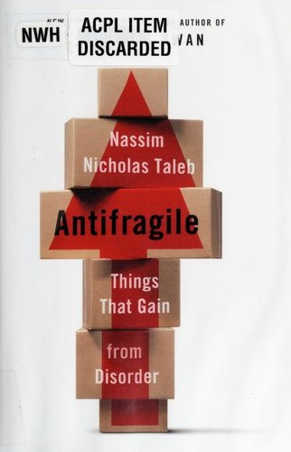

## Core idea

Some systems not only withstand shocks but get stronger from them. Three categories: fragile (breaks under stress), robust (survives stress), antifragile (gains from stress). Modern organizations over-optimize for efficiency, making them brittle.

## Key concepts

[Antifragility](../concepts/antifragility.md), [[fragility]], [[optionality]], [[barbell-strategy]], [[via-negativa]], [[black-swan]], [[randomness]], [Complexity (Cynefin)](../concepts/complexity.md)

## What I took from it

### General

Taleb bouwt een nieuw concept dat voor hem in de taal ontbrak: het tegenovergestelde van fragiel is niet robuust maar *antifragiel* — niet een systeem dat overleeft maar een systeem dat wint van stress. Dit onderscheid herformuleert de vraag van "hoe beschermen we ons?" naar "hoe ontwerpen we systemen die sterker worden van tegenslag?"

### Connection to our work

AI-first orgs risk fragility through over-optimization. Safe-to-fail probes ARE a barbell strategy. The probe-sense-respond cycle is inherently antifragile — it gains information from failure. Related: [Cynefin Framework](snowden-cynefin.md), [[meadows-thinking-in-systems]]

---

## Samenvatting

### Centrale stelling

De wereld is fundamenteel onvoorspelbaar op de schaal die ertoe doet. De meeste risicomodellen berekenen bekende risico's — maar de echte schade komt van onbekende onbekenden (*Black Swans*). De juiste reactie is niet betere voorspelling — het is systemen bouwen die profijt trekken van onzekerheid.

| Fragiel | Robuust | Antifragiel |
|---|---|---|
| Breekt bij stress | Overleeft stress | Wordt sterker van stress |
| Heeft stabiliteit nodig | Tolereert volatiliteit | Heeft volatiliteit nodig |
| Kat in een bubbel | Steen | Spier |

---

### De Barbell-strategie

De naam is letterlijk: een halter in de sportschool heeft twee zware uiteinden en niets in het midden. Taleb past deze vorm toe op hoe je risico moet verdelen.

**Het linker uiteinde**: ultra-veilig. Capaciteiten en middelen die je zeker niet kapotmaken — dingen die je bezit, die je begrijpt, die niet afhangen van externe partijen. Hier zit het overgrote deel (ruwweg 90%) van je inzet.

**Het rechter uiteinde**: agressief experimenteel. Kleine, bewuste experimenten waarbij je vooraf weet wat je maximaal kunt verliezen — en dat verlies is beperkt. De mogelijke opbrengst is echter asymmetrisch groot. Hier zit een klein deel (ruwweg 10%).

**Het midden**: dit is wat je vermijdt. "Matig risico" voelt veilig maar is het niet. Één onverwachte schok kan je volledig raken — geen experimentele opbrengsten, maar ook geen veilig uiteinde dat je opvangt.

**Hoe leidt dit tot antifragiliteit?**

Met de barbell kan je nooit volledig ten onder gaan: het veilige linker uiteinde overleeft elke schok. Tegelijk ben je, via het rechter uiteinde, blootgesteld aan positieve verrassingen. Als een experiment mislukt, verlies je weinig. Als een experiment slaagt — of als een grote verstoring precies dat experiment waardevol maakt — profiteer je. Het systeem wint dus structureel van variatie en onzekerheid, in plaats van er kapot aan te gaan.

**Toepassing op AI-afhankelijkheid:**

| Uiteinde | Wat het betekent |
|---|---|
| **Linker uiteinde** (veilig) | Eigen testsuite, interne expertise, tools die je bezit en begrijpt ongeacht vendor |
| **Rechter uiteinde** (experimenteel) | Kleine proeven met nieuwe AI-vendors, open-source modellen, alternatieve aanpakken — elk begrensd in omvang |
| **Gevaarlijk midden** | Één vendor voor alle kritieke functies, zonder intern begrip of alternatief — voelt stabiel, is kwetsbaar |

---

### Keuzevrijheid en asymmetrie

Een sleutelbegrip bij Taleb: *keuzevrijheid* (in het Engels *optionality* — een term uit de financiële wereld die hij breder toepast). Het betekent: het recht hebben om iets te doen, zonder de verplichting het te doen.

Een experiment op het rechter uiteinde van de barbell is zo'n keuzevrijheid: je investeert weinig om de *mogelijkheid* te kopen dat iets waardevol blijkt. Als het niets oplevert, laat je het vallen. Als het wél oplevert, gebruik je het. De neerwaartse kant is begrensd; de opwaartse kant niet.

> Elke beslissing die deze keuzevrijheid verkleint — lock-in bij één vendor, één toolset, één aanpak — maakt je fragieler. Niet omdat die keuze fout is, maar omdat je de mogelijkheid verliest om bij te sturen als de wereld verandert.

---

### Via Negativa

Een van Taleb's contraïntuitievere inzichten: de meest effectieve verbeteringen bestaan uit *weghalen*, niet toevoegen. Systemen worden robuuster door simpliciteit.

> "Artsen zijn de enigen die rijk worden door mislukkingen te repareren die ze zelf veroorzaakten door teveel te behandelen."

Organisatorisch: lagen, frameworks, processen en tools toevoegen als reactie op complexiteit vergroot de kwetsbaarheid, verkleint ze niet. Minder afhankelijkheden = minder breekpunten.

---

### Black Swans

Gebeurtenissen die (1) buiten het normale verwachtingsbereik liggen, (2) extreme impact hebben, en (3) achteraf als "voorspelbaar" worden beschreven. De fout: mensen bouwen systemen die bestand zijn tegen bekende risico's, terwijl de echte schade buiten die verdeling ligt.

Antifragiel ontwerpen = minder afhankelijk worden van het *uitblijven* van grote schokken, en via het rechter uiteinde van de barbell blootgesteld blijven aan de *positieve* kant ervan.

---

### Verband met Appelo — Barbell Economy

Appelo gebruikt dezelfde barbellmetafoor in [Forget Downsizing. Try Widesizing.](../articles/appelo-widesizing.md) om een macro-economische verschuiving te beschrijven: grote bedrijven consolideren verder aan het ene uiteinde, micro-ondernemers en kleine teams groeien explosief aan het andere. Het kwetsbare midden — middelgrote bedrijven zonder schaalvoordelen én zonder wendbaarheid — staat het meest onder druk.

Dezelfde structuur, een groter schaalniveau: de barbell als beschrijving van hoe markten zich reorganiseren onder AI-druk.

---

### Safe-to-fail als antifragiele strategie

Cynefin's probeontwerp is een barbell in de praktijk: meerdere kleine, begrensd-risicovolle experimenten die ieder onafhankelijk kunnen mislukken zonder het systeem te breken. Elke mislukking is informatie. Elke geslaagde probe vergroot de capaciteit. Het systeem als geheel wint van de variatie — en dat is precies wat antifragiel betekent.
