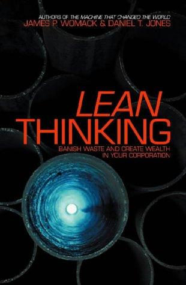

## Core idea

*(To be filled in)*

## Key concepts

Value stream mapping, 5 Lean principles, outside-in thinking, waste elimination

## What I took from it

### General

*(Not directly read — used as reference framework)*

### Connection to our work

Direct source of value stream mapping methodology used throughout the assessment template. The 5 principles (value, value stream, flow, pull, perfection) are embedded in the outside-in principle.
