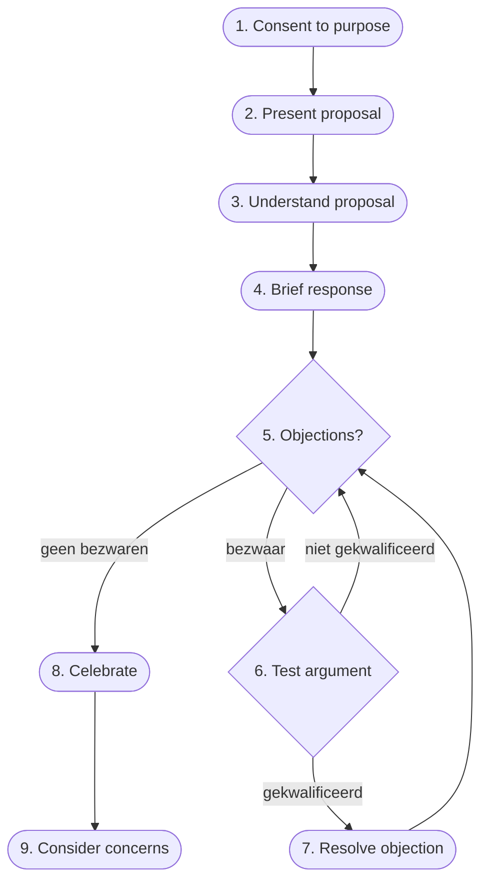

# Consent

Uit [Sociocracy 3.0](https://sociocracy30.org/) (aka 'S3.0'): een besluit passeert wanneer niemand een **bezwaar** heeft — niet wanneer iedereen het ermee eens is. Consent is geen consensus.

Een S3.0-bezwaar heeft een specifieke definitie: een reden waarom dit voorstel *de organisatie of een persoon schaadt*. \
Persoonlijke voorkeur ("ik zou het anders doen") kwalificeert niet. De vraag is: *"Is dit goed genoeg voor nu — veilig genoeg om te proberen?"*

Dit maakt consent fundamenteel anders dan consensus: de lat ligt niet bij instemming, maar bij de afwezigheid van aantoonbare schade. \
Een besluit kan passeren terwijl mensen het suboptimaal vinden — zolang niemand een bezwaar heeft dat schade aantoont.

> **Bezwaar vs. zorg** — Een *bezwaar* blokkeert het besluit en moet opgelost worden. Een *zorg* is een aanname zonder bewijs dat het de drempel van aantoonbare schade haalt — het blokkeert niet, maar wordt genoteerd voor de reviewronde.

---

## Het 9-stappen proces

Bron: [S3.0 Consent Decision-Making](https://patterns.sociocracy30.org/consent-decision-making.html)

### Stap 1 — Consent to purpose

Verifieer dat de aanleiding en het vereiste duidelijk en relevant zijn — vóór het voorstel op tafel komt. \
**Voordeel:** Voorkomt dat de groep energie steekt in een besluit dat niet relevant is, al elders belegd is, of een verkeerd probleem oplost.

### Stap 2 — Present proposal

De opsteller presenteert het voorstel volledig: verantwoordelijkheden, reviewdatum, evaluatiecriteria. \
**Voordeel:** Iedereen werkt met dezelfde basistekst. Discussie over wat het voorstel *zegt* verdwijnt — de focus gaat naar wat het *betekent*.

### Stap 3 — Understand proposal

Verduidelijkingsvragen enkel over betekenis — geen "waarom"-vragen, geen evaluatie. \
**Voordeel:** Loopt ambiguïteiten eruit vóór de reactiefase. Scheidt begrip van beoordeling; wie nog niet begrijpt wat er staat, kan nog niet eerlijk reageren.

### Stap 4 — Brief response

Eerste reacties en gevoelens, zonder interactie. Iedereen spreekt, niemand reageert. \
**Voordeel:** Legt de diversiteit van eerste indrukken bloot zonder dat één stem de toon zet. "Stille informatie" — wat mensen voelen maar normaal niet zeggen — wordt zichtbaar.

### Stap 5 — Check for objections

Gelijktijdige handsignalen: wie heeft een bezwaar? \
**Voordeel:** De simultaneïteit is cruciaal — het voorkomt groepsdruk. Niemand ziet eerst wat de anderen doen. Dit is de gestructureerde uitnodiging voor [[dissent]]. Geen bezwaren? Direct naar stap 8.

### Stap 6 — Test one argument

Toets het bezwaar: toont het aantoonbare schade of een risico aan dat vermeden kan worden? \
**Voordeel:** Filtert echte bezwaren van zorgen. Wie zegt "ik zou het anders doen" heeft een zorg, geen bezwaar. Wie zegt "dit schaadt X omdat Y" heeft een bezwaar. Zonder deze filter ontaardt consent in blokkade-cultuur.

### Stap 7 — Resolve the objection

Verbeter het voorstel op basis van de informatie die het bezwaar bevatte. Terug naar stap 5. \
**Voordeel:** Het bezwaar wordt een bron, geen obstructie. De informatie die iemand ertoe bracht bezwaar te maken, verbetert het voorstel — iteratief, tot er geen bezwaren meer zijn.

### Stap 8 — Celebrate

Markeer het besluit expliciet. \
**Voordeel:** Bouwt ritueel commitment. De beslissing is genomen — dit is het moment van overgang van debat naar executie.

### Stap 9 — Consider concerns

Bespreek zorgen die geen bezwaar waren maar toch relevant zijn. Noteer ze bij de evaluatiecriteria. \
**Voordeel:** Vangt informatie op die door de bezwaardrempel viel maar toch waarde heeft. Soms onthult een zorg bij nader inzien toch een bezwaar — dan terug naar het patroon.

---

## Consent en dissent

Consent kanaliseert [[dissent]]: de bezwaarronde is een geformaliseerde uitnodiging om te dissenten — maar met een hogere drempel dan dissent zelf vereist. Dissent mag op voorkeur; een bezwaar moet schade aantonen.

De culturele voorwaarde voor werkende consent: mensen moeten veilig genoeg zijn om bezwaar te maken. \
Zonder [[psychological-safety]] wordt de consent-ronde een stempel-ritueel.

De volledige complementariteit en de volgorde in de besluitvormingscyclus: zie [[consent-en-dissent]]. \
Hier zie je dat Consent uit S3.0 een structurele ondersteuning biedt om een Dissent cultuur te implementeren.

## Verwant

- [[dissent]]
- [[consent-en-dissent]]
- [[psychological-safety]]
- [[sociocracy]]
- [[productive-conflict]]
- [S3.0 Peer Review](../trust-by-design/the-performance-illusion/sociocracy30-peer-review.md)
