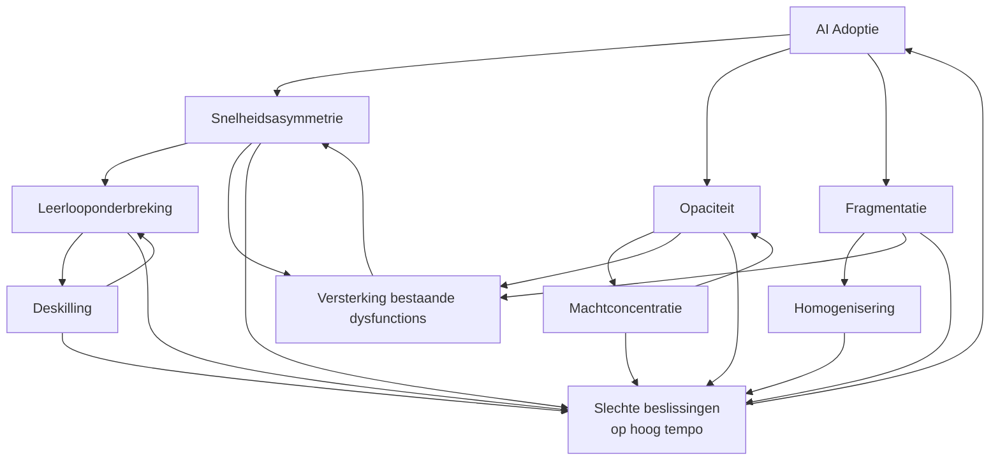

# AI & Organisatie — Dysfunction Map

> Levend document. Nieuwe mechanismen worden toegevoegd als sectie + rij in de matrix.

---

## Centrale these

AI introduceert geen dysfunctions uit het niets.
Het **versnelt, vergroot en verhult** — zowel wat goed werkt als wat al gebroken was.

> AI verhoogt de snelheid van output sneller dan de snelheid van gedeeld begrip.

De combinatie met bestaande organisatorische dysfunctions is waar de grootste risico's zitten.

---

## Overzichtsmatrix

| Mechanisme | Individu | Team | Organisatie | Strategisch |
|---|---|---|---|---|
| [1. Snelheidsasymmetrie](#1-snelheidsasymmetrie) | minder vragen, snellere beslissing | misalignment verborgen | strategische fouten snel gemaakt | verkeerde richting, hoog tempo |
| [2. Opaciteit](#2-opaciteit) | blind vertrouwen in output | conflicterende waarheden | accountability vacuum | compliance & auditrisico |
| [3. Deskilling](#3-deskilling) | expertise erosie | team afhankelijk van AI | organisationele amnesia | kwetsbaarheid bij AI-uitval |
| [4. Machtconcentratie](#4-machtconcentratie) | statusspel rond AI-vaardigheid | prompt master als bottleneck | AI-washing, HiPPO versterkt | tech-macht disproportioneel |
| [5. Fragmentatie](#5-fragmentatie) | persoonlijke workflows | parallel realities | shadow AI, coherentie verloren | bestaande silos verdiept |
| [6. Homogenisering](#6-homogenisering) | minder origineel denken | groepsdenken versneld | conformisme versterkt | strategie-convergentie sector-breed |
| [7. Leerlooponderbreking](#7-leerlooponderbreking) | grote specs, laat falen | missed insights | organisatie leert trager dan ze beweegt | strategische aannames niet bijgesteld |
| [8. Versterking bestaande dysfunctions](#8-versterking-van-bestaande-dysfunctions) | — | — | sneller, groter, minder zichtbaar | — |

---

## Mechanismen

### 1. Snelheidsasymmetrie

> AI verhoogt de snelheid van output sneller dan de snelheid van begrip, alignment en probleemdefiniëring.

**Manifestatie per niveau**

| Niveau | Hoe het zich toont |
|---|---|
| Individu | Minder clarifying questions gesteld; beslissingen sneller genomen zonder dieper begrip van het probleem |
| Team | Misalignment wordt minder zichtbaar omdat output er coherent uitziet; fouten propageren sneller door de organisatie |
| Organisatie | Strategische beslissingen op basis van AI-analyses die niet gevalideerd zijn op context of aannames |
| Strategisch | Snelle beweging in de verkeerde richting; het competitief voordeel van snelheid keert om als de richting fout is |

**Interactie met bestaande dysfunctions**
- Versterkt **HiPPO**: de hoogste betaalde persoon beslist nu nóg sneller, met AI als schijnbare onderbouwing
- Versterkt **silos**: elk silo werkt sneller in zijn eigen richting, divergentie neemt toe
- Versterkt **oplossingsgedreven cultuur**: "laten we zien wat AI genereert" vervangt "laten we het probleem begrijpen"

**Signalen om het te herkennen**
- Beslissingen worden sneller genomen maar vaker herzien
- Requirements worden vager naarmate AI-gebruik toeneemt
- Minder debat voorafgaand aan beslissingen, meer rework achteraf

---

### 2. Opaciteit

> AI-redenering is impliciet en onzichtbaar. Aannames zijn verborgen in de output, niet in de redenering.

**Manifestatie per niveau**

| Niveau | Hoe het zich toont |
|---|---|
| Individu | Men vertrouwt output zonder de aannames te kennen; kritisch denken neemt af; *illusion of quality* — output oogt coherent, gestructureerd en overtuigend maar is contextueel fout |
| Team | Conflicterende "waarheden" op basis van verschillende AI-outputs; niemand kan verifiëren welke aannames correcter zijn |
| Organisatie | Beslissingen zijn niet traceerbaar; accountability wordt diffuus; niemand is verantwoordelijk voor een beslissing die "AI aanraadde" |
| Strategisch | Audittrails ontbreken; compliance-risico's; strategische keuzes zonder expliciete redenering |

**Interactie met bestaande dysfunctions**
- Versterkt **politiek**: wie de prompt controleert, controleert de "waarheid" die de meeting binnenkomt
- Versterkt **bureaucratie**: AI-output wordt gebruikt als legitimering voor reeds genomen beslissingen
- Versterkt **gebrek aan psychologische veiligheid**: AI-output uitdagen voelt riskanter dan menselijke output uitdagen

**Signalen om het te herkennen**
- "De AI zei het" als argument-stopper in discussies
- Niemand kan uitleggen welke aannames een analyse draagt
- Audittrails voor beslissingen ontbreken of zijn onvolledig

---

### 3. Deskilling

> Menselijke capaciteiten eroderen omdat AI het werk overneemt dat vroeger vaardigheden opbouwde.

**Manifestatie per niveau**

| Niveau | Hoe het zich toont |
|---|---|
| Individu | Juniors leren niet meer door te doen; seniors oefenen bepaalde vaardigheden niet meer; expertise slijt ongemerkt |
| Team | Het team kan basistaken niet meer uitvoeren zonder AI-ondersteuning; kwetsbaarheid bij verandering van tools |
| Organisatie | Organisationele amnesia: kennis over waarom systemen werken zoals ze werken verdwijnt; kennisoverdracht stopt |
| Strategisch | Structurele kwetsbaarheid bij AI-uitval of vendor lock-in; verlies van innovatiecapaciteit op langere termijn |

**Interactie met bestaande dysfunctions**
- Versterkt **kennisverlies door verloop**: als mensen vertrekken, is er minder overdracht geweest
- Versterkt **afhankelijkheid van individuen**: de enkeling die AI én het domein begrijpt wordt onvervangbaar
- Versterkt **gebrek aan onboarding-structuur**: juniors worden niet meer ingewerkt via graduele taakopbouw

**Signalen om het te herkennen**
- Juniors kunnen taken niet uitvoeren zonder AI, ook niet als de taak dat vereist
- Niemand weet meer waarom bepaalde processen of systemen bestaan zoals ze bestaan
- Bij AI-uitval of toolswitch staat productiviteit tijdelijk stil

---

### 4. Machtconcentratie

> AI versterkt disproportioneel de invloed van degenen die het beheersen of de outputs controleren.

**Manifestatie per niveau**

| Niveau | Hoe het zich toont |
|---|---|
| Individu | Statusspel rond AI-vaardigheid; wie AI beter gebruikt wint disproportioneel invloed |
| Team | De "prompt master" wordt bottleneck én informele machtsfiguur; anderen worden afhankelijk |
| Organisatie | AI-washing door management: performatief AI-gebruik zonder echte adoptie; HiPPO + AI = nog sterker HiPPO; AI gebruikt om vooraf genomen beslissingen te legitimeren |
| Strategisch | Tech-teams krijgen disproportioneel strategische invloed; democratisering van kennis keert om naar concentratie |

**Interactie met bestaande dysfunctions**
- Versterkt **HiPPO** sterk: AI geeft de machtige persoon nog sneller een "onderbouwde" positie
- Versterkt **politiek**: controle over AI-tools wordt een machtsmiddel
- Versterkt **gebrek aan transparantie**: AI-output als black box in handen van enkelen

**Signalen om het te herkennen**
- AI-gebruik geconcentreerd bij een kleine groep; anderen vragen hen om output
- "De AI bevestigt mijn aanpak" als conversatie-ender
- Beslissingen zijn moeilijk uitdaagbaar omdat de redenering in de prompt zit, niet in het gesprek

---

### 5. Fragmentatie

> Individueel AI-gebruik breekt gedeelde werkwijzen en gedeelde realiteit af.

**Manifestatie per niveau**

| Niveau | Hoe het zich toont |
|---|---|
| Individu | Persoonlijke workflows, custom prompts, geïsoleerde automations die niet deelbaar zijn |
| Team | Geen gedeelde interpretatie van problemen of outputs; parallel realities; vertrouwensshift: "vertrouw ik jouw interpretatie van AI-output?" |
| Organisatie | Shadow AI systemen (zoals shadow IT); geen convergentiemechanisme; coherentie van werkwijzen verdwijnt |
| Strategisch | Conway's Law versterkt: AI versterkt bestaande communicatiestructuren en dus bestaande silos; architectuur volgt de fragmentatie |

**Interactie met bestaande dysfunctions**
- Versterkt **silos**: elke silo bouwt eigen AI-praktijk, divergentie versnelt
- Versterkt **gebrek aan standaardisatie**: "iedereen mag AI vrij gebruiken" zonder kaders
- Versterkt **shadow IT problematiek**: risico-profielen worden onbeheersbaar

**Signalen om het te herkennen**
- Iedereen heeft eigen AI-workflow; geen twee mensen werken hetzelfde
- Dezelfde vraag aan AI door verschillende teams leidt tot conflicterende beslissingen
- Geen gedeelde definitie van wat "goed AI-gebruik" betekent in de organisatie

---

### 6. Homogenisering

> AI convergeert denken en output, wat cognitieve diversiteit en innovatiecapaciteit reduceert.

**Manifestatie per niveau**

| Niveau | Hoe het zich toont |
|---|---|
| Individu | Minder origineel denken; output lijkt op die van collega's die dezelfde tools gebruiken |
| Team | Groepsdenken versneld; minder productieve conflicten; blinde vlekken worden gedeeld in plaats van uitgedaagd |
| Organisatie | Conformisme versterkt in hiërarchische culturen; ongebruikelijke ideeën worden nog sneller weggefilterd |
| Strategisch | Alle bedrijven in een sector gebruiken dezelfde AI → strategieën convergeren; competitive intelligence erosie |

**Interactie met bestaande dysfunctions**
- Versterkt **groupthink**: AI geeft sneller een "consensus" antwoord dat niemand uitdaagt
- Versterkt **conformisme in hiërarchische culturen**: AI output bevestigt wat de hiërarchie verwacht
- Versterkt **gebrek aan psychologische veiligheid**: afwijken van AI-output voelt riskanter

**Signalen om het te herkennen**
- Analyses van verschillende teams lijken sterk op elkaar ondanks verschillende contexten
- Minder verrassende ideeën in brainstorms; AI-output domineert de agenda
- Concurrenten lanceren gelijkaardige initiatieven tegelijk

---

### 7. Leerlooponderbreking

> AI maakt uitvoering mogelijk zonder continue menselijke betrokkenheid, waardoor leren tijdens het doen verdwijnt.

**Manifestatie per niveau**

| Niveau | Hoe het zich toont |
|---|---|
| Individu | Grote upfront specificaties → AI voert uit → fouten ontdekt laat; mentaal model van het systeem blijft zwak |
| Team | Insights die normaal tijdens implementatie opduiken worden gemist; rework wanneer aannames laat fout blijken |
| Organisatie | Feedback cycles worden te groot; de organisatie beweegt sneller dan ze leert; aannames worden niet bijgesteld |
| Strategisch | Strategische hypothesen worden niet getoetst via uitvoering; grote bets zonder correctiemechanisme |

**Interactie met bestaande dysfunctions**
- Versterkt **waterfall-denken**: grote spec → big batch uitvoering → late feedback
- Versterkt **gebrek aan iteratieve cultuur**: AI geeft het gevoel dat je alles vooraf kan specificeren
- Versterkt **afstand tussen beslissers en uitvoering**: beslissers delegeren aan AI, verliezen contact met realiteit

**Signalen om het te herkennen**
- Fouten worden laat in het proces ontdekt, niet vroeg
- Gevoel van "dit hadden we eerder moeten weten"
- Teams specificeren steeds groter voordat ze starten; kleine iteraties nemen af

> Begrip ontstaat door interactie, niet door specificatie.

---

### 8. Versterking van bestaande dysfunctions

> AI maakt bestaande organisatorische problemen sneller, groter en minder zichtbaar.

Dit is het meta-mechanisme. Elke organisatorische dysfunction die al aanwezig is, wordt door AI versneld en vergroot — terwijl de zichtbaarheid ervan afneemt omdat de output er beter uitziet.

**Kernpatroon**

| Bestaande dysfunction | Effect van AI |
|---|---|
| Bureaucratie | Meer bureaucratie, sneller geproduceerd |
| Silos | Diepere silos, hogere muren |
| HiPPO | Sterker HiPPO, beter bewapend met schijn-onderbouwing |
| Slechte processen | Snellere slechte processen |
| Politiek | Geraffineerder politiek spel |
| Gebrek aan psychologische veiligheid | Minder uitdaging, meer conformisme |
| Waterfall-denken | Grotere batches, tragere feedback |

**Kernprincipe**
> AI vergroot het signaal van wat al aanwezig is.  
> Sterke systemen worden sterker. Zwakke systemen worden sneller zwakker — maar zien er beter uit.

**Signalen om het te herkennen**
- Bestaande problemen worden erger na AI-adoptie, niet beter
- Snelheid neemt toe maar kwaliteit of richting niet
- Problemen die vroeger zichtbaar waren, zijn nu verborgen achter coherent ogende output

---

## Synthesekaart — hoe de mechanismen elkaar versterken

---

## AI en jobverlies — een genuanceerde kijk

De meest gangbare conclusie luidt: meer AI = meer jobverlies. Die conclusie is niet fout, maar ze is **incompleet** — en de manier waarop ze gesteld wordt verraadt welke bril er op zit.

### Wat de economische bril ziet

- AI automatiseert taken → minder arbeid nodig → jobverlies
- Historisch precedent: industrialisatie, mechanisering, digitalisering
- Rapporten die x% van taken als automatiseerbaar classificeren

### Wat die bril mist

**De Lump of Labour Fallacy**
De aanname dat er een vaste hoeveelheid werk bestaat die verdeeld wordt. Elke vorige technologiegolf creëerde categorieën werk die niemand kon anticiperen. De vraag naar arbeid is niet vast — ze hervormt zich.

**Taken ≠ jobs**
AI automatiseert taken, niet jobs. Een job is een bundel taken. Die bundel hervormt zich. Dat is ontwrichtend — maar het is iets anders dan eliminatie.

**Vraagerosie werkt ook omgekeerd**
Goedkopere productie leidt tot meer vraag. Meer analisten → meer analyses worden gevraagd. Meer code → meer software wordt gebouwd. Productiviteitswinst vult zich historisch consequent op met nieuwe vraag.

**De organisatiebril**
Organisaties zijn geen optimaliseringsmachines — ze zijn politieke systemen. Headcount is een machtssignaal. In de praktijk leidt AI in veel organisaties tot AI + zelfde headcount = meer output of meer waste, niet tot minder mensen. De dysfunctions in dit document vertragen en vervormen de economische logica enorm.

**De distributiebril**
Zelfs als netto-werkgelegenheid stabiel blijft: 10 nieuwe high-skill jobs tegenover 100 verdwenen middle-skill jobs is een sociale crisis, ook al is het "economisch neutraal". De economische bril kijkt naar aggregaten en mist concentratie.

**De snelheidsbril**
De lange-termijn equilibrium kan prima zijn. Maar als de transitiesnelheid de adaptieve capaciteit van mensen en instituties overtreft, heb je een crisis in de tussentijd — ook al "klopt" de eindtoestand economisch.

### Waar de zorg wél legitiem is

Dit is de eerste automatiseringsgolf die **cognitief werk breed aanpakt** — niet alleen routinetaken of fysieke arbeid, maar redeneren, schrijven, analyseren en beslissen op alle niveaus. Dat is kwalitatief anders dan vorige golven. Historische precedenten gelden mogelijk minder dan economen veronderstellen.

### De reëlere vraag

> Niet *of* er jobs verdwijnen — dat doen ze —  
> maar **wie de transitiekosten draagt, hoe snel, en wie de nieuwe waarde oppikt**.

Dat is een politieke en institutionele vraag, geen economische.

| Bril | Wat ze ziet | Wat ze mist |
|---|---|---|
| Economisch | netto-werkgelegenheid, productiviteit | distributie, transitiesnelheid |
| Organisatorisch | gedrag van teams en structuren | politieke realiteit van headcount |
| Sociologisch | betekenis van werk, identiteit | wordt zelden meegenomen |
| Politiek | macht, verdeling van winst | zelden expliciet in mainstream debat |
| Temporeel | lange-termijn equilibrium | adaptieve capaciteit in de tussentijd |

---

## Diagnostische vragen

Gebruik deze om het risicoprofiel van een organisatie snel te beoordelen:

- Worden beslissingen sneller genomen maar vaker herzien? → *Snelheidsasymmetrie*
- Kan niemand uitleggen welke aannames een analyse draagt? → *Opaciteit*
- Kunnen juniors basistaken niet uitvoeren zonder AI? → *Deskilling*
- Wordt AI-output gebruikt als argument-stopper? → *Machtconcentratie*
- Heeft iedereen een eigen AI-workflow zonder gedeelde praktijk? → *Fragmentatie*
- Lijken analyses van verschillende teams te sterk op elkaar? → *Homogenisering*
- Worden fouten consistent laat ontdekt in het proces? → *Leerlooponderbreking*
- Worden bestaande problemen erger na AI-adoptie? → *Versterking bestaande dysfunctions*

---

## Wanneer AI weinig structurele problemen veroorzaakt

Ter volledigheid: AI integreert goed wanneer:

- Problemen laag-ambigu zijn met verifieerbare output (codegeneratie, datatransformatie)
- Werk individueel is met minimale cross-team afhankelijkheid
- Teams mature zijn met sterke gedeelde taal en strakke feedbackloops
- Omgevingen hoge controle hebben met expliciete validatieprocessen (healthcare, aviation)

De matrix hierboven is primair relevant in **hoog-ambigue, multi-stakeholder, context-afhankelijke omgevingen**.

---

*Zie ook: [[issues-w-ai-in-org]] (origineel werkdocument)*
