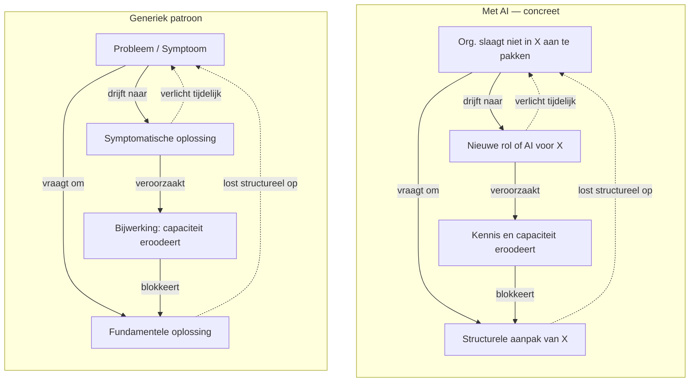
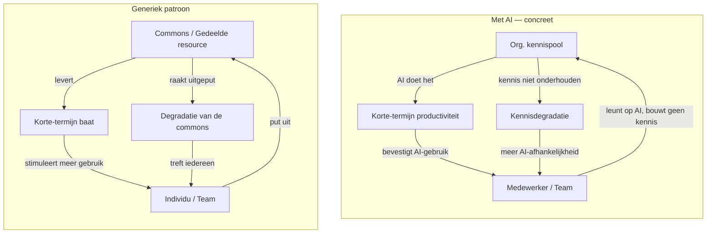
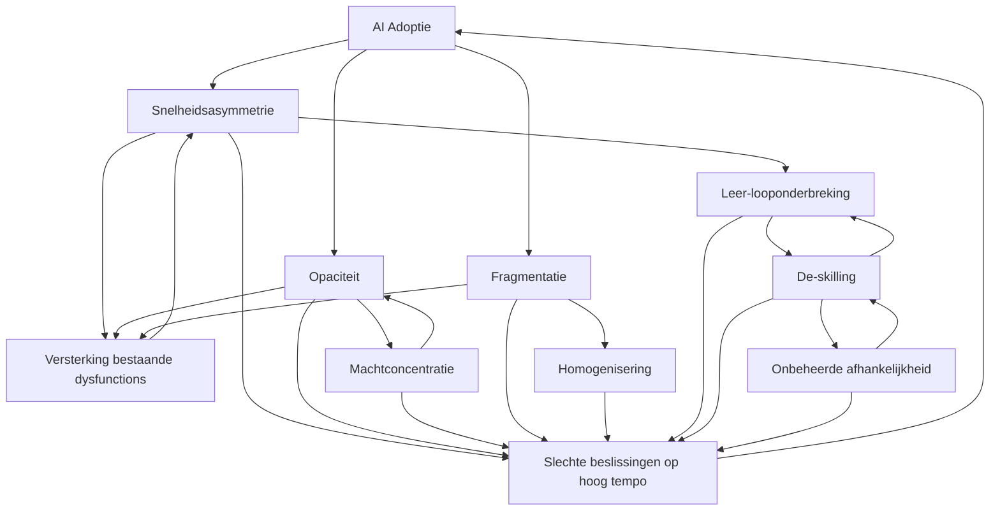

# AI & Organisatie — Dysfunction Map

> Levend document. Nieuwe mechanismen worden toegevoegd als sectie + rij in de matrix.

---

## Centrale these

AI introduceert geen dysfunctions uit het niets.
Het **versnelt, vergroot en verhult** — zowel wat goed werkt als wat al gebroken was.

> AI verhoogt de snelheid van output sneller dan de snelheid van gedeeld begrip.

De combinatie met bestaande organisatorische dysfunctions is waar de grootste risico's zitten.

---

## Twee lagen

Dit document werkt met twee onderscheiden lagen:

**Laag 1 — Bestaande dysfunctions** (pre-AI)
Organisatorische patronen die al aanwezig waren vóór AI: silos, HiPPO, blame culture, waterfall-denken, gebrek aan psychologische veiligheid, en tientallen andere. Dit is de **bodem**.
→ *Zie [Org Dysfunction Catalog](org-dysfunction-catalog.md) voor de volledige catalogus, geordend in zes categorieën.*

**Laag 2 — AI-mechanismen** (dit document)
De acht specifieke manieren waarop AI inwerkt op die bodem — sommige nieuwe patronen, de meeste amplificaties van wat al gebroken was. Dit is de **accelerant**.

Het kernprincipe: AI vergroot het signaal van wat al aanwezig is. Sterke systemen worden sterker. Gebroken systemen breken sneller — maar zien er beter uit.

---

## Overzichtsmatrix

| Mechanisme | Individu | Team | Organisatie | Strategisch |
|---|---|---|---|---|
| [1. Snelheidsasymmetrie](#1-snelheidsasymmetrie) | minder vragen, snellere beslissing | misalignment verborgen | strategische fouten snel gemaakt | verkeerde richting, hoog tempo |
| [2. Opaciteit](#2-opaciteit) | blind vertrouwen in output | conflicterende waarheden | accountability vacuum | compliance & auditrisico |
| [3. De-skilling](#3-de-skilling) | expertise erosie | team afhankelijk van AI | organisationele amnesia | kwetsbaarheid bij AI-uitval |
| [4. Machtconcentratie](#4-machtconcentratie) | statusspel rond AI-vaardigheid | prompt master als bottleneck | AI-washing, HiPPO versterkt | tech-macht disproportioneel |
| [5. Fragmentatie](#5-fragmentatie) | persoonlijke workflows | parallel realities | shadow AI, coherentie verloren | bestaande silos verdiept |
| [6. Homogenisering](#6-homogenisering) | minder origineel denken | groepsdenken versneld | conformisme versterkt | strategie-convergentie sector-breed |
| [7. Leer-looponderbreking](#7-leer-looponderbreking) | grote specs, laat falen | missed insights | organisatie leert trager dan ze beweegt | strategische aannames niet bijgesteld |
| [8. Onbeheerde afhankelijkheid](#8-onbeheerde-afhankelijkheid) | workflow stilvalt bij uitval | geen fallback als dienst wegvalt | vendor lock-in zonder bewuste afweging | continuïteit extern bepaald |

---

## Het Grondpatroon

Onder veel van de mechanismen in dit document schuilt één en dezelfde systemische dynamiek. Begrijp je dit patroon, dan begrijp je waarom AI-adoptie zo vaak verergert wat het zou moeten oplossen.

### Shifting the Burden — Senge

*The Fifth Discipline* (Senge) beschrijft het **"Shifting the Burden"** archetype als een van de meest voorkomende en gevaarlijkste systeempatronen in organisaties:

De kern: de symptomatische oplossing *werkt* — maar ondermijnt tegelijk de capaciteit om het probleem structureel aan te pakken. Over tijd: meer afhankelijkheid van de oplossing, minder capaciteit erbuiten, het probleem wordt geconseveerd in plaats van opgelost.

### Het organisatiepatroon

In organisaties ziet het er zo uit: een probleem wordt niet structureel aangepakt, maar krijgt een **rol** toegewezen om het te "managen" of te "coördineren". De persoon in die rol is daar oprecht fier op — dat is volkomen menselijk. Maar hoe sterker de identiteit aan de rol kleeft, hoe lager de kans dat het onderliggende probleem ooit opgelost raakt. De rol *onderhoudt* het probleem.

Voorbeelden:
- **Customer Happiness Manager**: de organisatie slaagt er niet in de klant structureel mee te nemen in haar werkwijze → nieuwe rol. Die rol heeft geen mandaat om de hele organisatie om te keren → klantgerichtheid blijft een eiland, het probleem blijft bestaan, de rol legitimeert de status quo.
- **XYZ Manager**: doet de "vertaalslag" tussen XYZ en team op door er tussenin te gaan staan → teams nemen nog altijd geen verantwoordelijkheid → er is nu ook een coördinatielaag bijgekomen → minder transparantie, meer overhead, zelfde grondprobleem.

### De Tragedy of the Commons-laag

De Tragedy of the Commons beschrijft hoe een gedeelde resource uitgeput raakt wanneer individuen er elk op leunen zonder bij te dragen aan het onderhoud ervan.

In organisaties is de **gedeelde kennispool** de commons. Wanneer een dependency (rol, tool, AI) het werk overneemt, heeft niemand meer een individuele incentive om die kennis actief te onderhouden. Iedereen leunt op de dependency — de commons verarmt. Hoe dieper de afhankelijkheid, hoe armer de context eromheen wordt.

> De dependency doet het toch — dus niemand hoeft het nog te weten.

### AI als nieuwe instantie van hetzelfde patroon

AI is de meest recente en krachtigste verschijningsvorm van dit patroon:

- AI neemt cognitief werk over → de mensen rondom verliezen capaciteit (de-skilling)
- AI "managet" problemen → de structurele oorzaken worden niet aangepakt
- De omliggende kennispool (de commons) verarmt → afhankelijkheid van AI groeit
- Meer afhankelijkheid → minder capaciteit om zonder AI te werken → nog meer afhankelijkheid

Het verschil met de Customer Happiness Manager: AI schaalt. De snelheid waarmee de commons verarmt is ongezien.

*→ Zie ook: [De oplossing onderhoudt het probleem](#7-de-oplossing-onderhoudt-het-probleem) in de Gallery of Irony*

### Het meta-principe: AI als versterker van bestaande dysfunctions

Naast de twee systemische patronen hierboven geldt een breder meta-principe:

> **AI vergroot het signaal van wat al aanwezig is.**  
> Sterke systemen worden sterker. Gebroken systemen breken sneller — maar zien er beter uit.

Dit is geen apart mechanisme — het is de overkoepelende werking die álle acht mechanismen gemeen hebben. Elke pre-existente organisationele dysfunction (bureaucratie, silos, HiPPO, blame culture, waterfall-denken) wordt door AI versneld, vergroot en verhuild.

**Signalen om het te herkennen**
- Bestaande problemen worden erger na AI-adoptie, niet beter
- Snelheid neemt toe maar kwaliteit of richting niet
- Problemen die vroeger zichtbaar waren, zijn nu verborgen achter coherent ogende output

*→ Zie [Org Dysfunction Catalog](org-dysfunction-catalog.md) voor de volledige catalogus van pre-AI dysfunctions die AI kan amplificeren.*

---

## Mechanismen

### 1. Snelheidsasymmetrie

> AI verhoogt de snelheid van output sneller dan de snelheid van begrip, alignment en probleemdefiniëring.

**Manifestatie per niveau**

| Niveau | Hoe het zich toont |
|---|---|
| Individu | Minder clarifying questions gesteld; beslissingen sneller genomen zonder dieper begrip van het probleem |
| Team | Misalignment wordt minder zichtbaar omdat output er coherent uitziet; fouten propageren sneller door de organisatie |
| Organisatie | Strategische beslissingen op basis van AI-analyses die niet gevalideerd zijn op context of aannames |
| Strategisch | Snelle beweging in de verkeerde richting; het competitief voordeel van snelheid keert om als de richting fout is |

**Interactie met bestaande dysfunctions**
- Versterkt **HiPPO**: de hoogste betaalde persoon beslist nu nóg sneller, met AI als schijnbare onderbouwing
- Versterkt **silos**: elk silo werkt sneller in zijn eigen richting, divergentie neemt toe
- Versterkt **oplossingsgedreven cultuur**: "laten we zien wat AI genereert" vervangt "laten we het probleem begrijpen"
- Versterkt **Output boven outcome — de Build Trap** (zie [Escaping the Build Trap](../knowledge-base/articles/perri-escaping-the-build-trap.md)): vóór AI zette de *kost* van bouwen vanzelf een rem op het bouwen van dingen die niemand nodig had — iets bouwen kostte weken, dus je dacht na vóór je begon. AI haalt die rem weg: bouwen wordt zo goedkoop dat de vraag "is dit de moeite waard?" voor het eerst geen natuurlijke kostendrempel meer heeft om op te botsen. Niet *hoe snel* of *hoe accuraat* er gebouwd wordt is dan het probleem, maar of er ooit nog gevraagd wordt of het de moeite waard was

*→ Zie [Org Dysfunction Catalog](org-dysfunction-catalog.md) voor beschrijvingen van de genoemde dysfunctions.*

**Signalen om het te herkennen**
- Beslissingen worden sneller genomen maar vaker herzien
- Requirements worden vager naarmate AI-gebruik toeneemt
- Minder debat voorafgaand aan beslissingen, meer rework achteraf

*→ Zie ook: [De snelheidsval](#2-de-snelheidsval) in de Gallery of Irony*

---

### 2. Opaciteit

> AI-redenering is impliciet en onzichtbaar. Aannames zijn verborgen in de output, niet in de redenering.

**Manifestatie per niveau**

| Niveau | Hoe het zich toont |
|---|---|
| Individu | Men vertrouwt output zonder de aannames te kennen; kritisch denken neemt af; *illusion of quality* — output oogt coherent, gestructureerd en overtuigend maar is contextueel fout |
| Team | Conflicterende "waarheden" op basis van verschillende AI-outputs; niemand kan verifiëren welke aannames correcter zijn |
| Organisatie | Beslissingen zijn niet traceerbaar; accountability wordt diffuus; niemand is verantwoordelijk voor een beslissing die "AI aanraadde" |
| Strategisch | Audittrails ontbreken; compliance-risico's; strategische keuzes zonder expliciete redenering |

**Interactie met bestaande dysfunctions**
- Creëert **informatieasymmetrie**: de prompt-schrijver kent de framing, de aannames en de context die de output gevormd hebben — anderen zien alleen het resultaat. De gevolgen lopen uiteen: van onbewuste blinde vlekken tot bewuste sturing van een discussie. Maar ook zonder kwade intentie verschuift de machtsverdeling naar wie de context bezit.
- Versterkt **bureaucratie**: AI-output wordt gebruikt als legitimering voor reeds genomen beslissingen
- Versterkt **gebrek aan psychologische veiligheid**: AI-output uitdagen voelt riskanter dan menselijke output uitdagen

*→ Zie [Org Dysfunction Catalog](org-dysfunction-catalog.md) voor beschrijvingen van de genoemde dysfunctions.*

**Signalen om het te herkennen**
- "De AI zei het" als argument-stopper in discussies
- Niemand kan uitleggen welke aannames een analyse draagt
- Audittrails voor beslissingen ontbreken of zijn onvolledig

*→ Zie ook: [De helderheid die begrip verbergt](#4-de-helderheid-die-begrip-verbergt) in de Gallery of Irony*

---

### 3. De-skilling

> Menselijke capaciteiten eroderen omdat AI het werk overneemt dat vroeger vaardigheden opbouwde.

**Manifestatie per niveau**

| Niveau | Hoe het zich toont |
|---|---|
| Individu | Juniors leren niet meer door te doen; seniors oefenen bepaalde vaardigheden niet meer; expertise slijt ongemerkt |
| Team | Het team kan basistaken niet meer uitvoeren zonder AI-ondersteuning; kwetsbaarheid bij verandering van tools |
| Organisatie | Organisationele amnesia: kennis over waarom systemen werken zoals ze werken verdwijnt; kennisoverdracht stopt |
| Strategisch | Structurele kwetsbaarheid bij AI-uitval of vendor lock-in; verlies van innovatiecapaciteit op langere termijn |

**Interactie met bestaande dysfunctions**
- Versterkt **kennisverlies door verloop**: als mensen vertrekken, is er minder overdracht geweest
- Versterkt **afhankelijkheid van individuen**: de enkeling die AI én het domein begrijpt wordt onvervangbaar
- Versterkt **gebrek aan onboarding-structuur**: juniors worden niet meer ingewerkt via graduele taakopbouw

*→ Zie [Org Dysfunction Catalog](org-dysfunction-catalog.md) voor beschrijvingen van de genoemde dysfunctions.*

**Signalen om het te herkennen**
- Juniors kunnen taken niet uitvoeren zonder AI, ook niet als de taak dat vereist
- Niemand weet meer waarom bepaalde processen of systemen bestaan zoals ze bestaan
- Bij AI-uitval of toolswitch staat productiviteit tijdelijk stil

*→ Zie ook: [De oplossing onderhoudt het probleem](#7-de-oplossing-onderhoudt-het-probleem) in de Gallery of Irony · Het Grondpatroon*

---

### 4. Machtconcentratie

> AI versterkt disproportioneel de invloed van degenen die het beheersen of de outputs controleren.

**Manifestatie per niveau**

| Niveau | Hoe het zich toont |
|---|---|
| Individu | Statusspel rond AI-vaardigheid; wie AI beter gebruikt wint disproportioneel invloed |
| Team | De "prompt master" wordt bottleneck én informele machtsfiguur; anderen worden afhankelijk |
| Organisatie | AI-washing door management: performatief AI-gebruik zonder echte adoptie; HiPPO + AI = nog sterker HiPPO; AI gebruikt om vooraf genomen beslissingen te legitimeren |
| Strategisch | Tech-teams krijgen disproportioneel strategische invloed; democratisering van kennis keert om naar autocratisering — niet per definitie door slechte intentie, maar structureel: wie de context niet heeft, kan niet effectief challengen |

**Interactie met bestaande dysfunctions**
- Versterkt **HiPPO** sterk: AI geeft de machtige persoon nog sneller een "onderbouwde" positie
- Versterkt **politiek**: controle over AI-tools wordt een machtsmiddel
- Versterkt **gebrek aan transparantie**: AI-output als black box in handen van enkelen

*→ Zie [Org Dysfunction Catalog](org-dysfunction-catalog.md) voor beschrijvingen van de genoemde dysfunctions.*

**Signalen om het te herkennen**
- AI-gebruik geconcentreerd bij een kleine groep; anderen vragen hen om output
- "De AI bevestigt mijn aanpak" als conversatie-ender
- Beslissingen zijn moeilijk uitdaagbaar omdat de redenering in de prompt zit, niet in het gesprek

*→ Zie ook: [Het democratiseringsparadox](#1-het-democratiseringsparadox) in de Gallery of Irony*

---

### 5. Fragmentatie

> Individueel AI-gebruik breekt gedeelde werkwijzen en gedeelde realiteit af.

**Manifestatie per niveau**

| Niveau | Hoe het zich toont |
|---|---|
| Individu | Persoonlijke workflows, custom prompts, geïsoleerde automations die niet deelbaar zijn |
| Team | Geen gedeelde interpretatie van problemen of outputs; parallel realities; vertrouwensshift: "vertrouw ik jouw interpretatie van AI-output?" |
| Organisatie | Shadow AI systemen (zoals shadow IT); geen convergentiemechanisme; coherentie van werkwijzen verdwijnt |
| Strategisch | Conway's Law versterkt: AI versterkt bestaande communicatiestructuren en dus bestaande silos; architectuur volgt de fragmentatie |

**Interactie met bestaande dysfunctions**
- Versterkt **silos**: elke silo bouwt eigen AI-praktijk, divergentie versnelt
- Versterkt **gebrek aan standaardisatie**: "iedereen mag AI vrij gebruiken" zonder kaders
- Versterkt **shadow IT problematiek**: risico-profielen worden onbeheersbaar

*→ Zie [Org Dysfunction Catalog](org-dysfunction-catalog.md) voor beschrijvingen van de genoemde dysfunctions.*

**Signalen om het te herkennen**
- Iedereen heeft eigen AI-workflow; geen twee mensen werken hetzelfde
- Dezelfde vraag aan AI door verschillende teams leidt tot conflicterende beslissingen
- Geen gedeelde definitie van wat "goed AI-gebruik" betekent in de organisatie

---

### 6. Homogenisering

> AI convergeert denken en output, wat cognitieve diversiteit en innovatiecapaciteit reduceert.

**Manifestatie per niveau**

| Niveau | Hoe het zich toont |
|---|---|
| Individu | Minder origineel denken; output lijkt op die van collega's die dezelfde tools gebruiken |
| Team | Groepsdenken versneld; minder productieve conflicten; blinde vlekken worden gedeeld in plaats van uitgedaagd |
| Organisatie | Conformisme versterkt in hiërarchische culturen; ongebruikelijke ideeën worden nog sneller weggefilterd |
| Strategisch | Alle bedrijven in een sector gebruiken dezelfde AI → strategieën convergeren; competitive intelligence erosie |

**Interactie met bestaande dysfunctions**
- Versterkt **groupthink**: AI geeft sneller een "consensus" antwoord dat niemand uitdaagt
- Versterkt **conformisme in hiërarchische culturen**: AI output bevestigt wat de hiërarchie verwacht
- Versterkt **gebrek aan psychologische veiligheid**: afwijken van AI-output voelt riskanter

*→ Zie [Org Dysfunction Catalog](org-dysfunction-catalog.md) voor beschrijvingen van de genoemde dysfunctions.*

**Signalen om het te herkennen**
- Analyses van verschillende teams lijken sterk op elkaar ondanks verschillende contexten
- Minder verrassende ideeën in brainstorms; AI-output domineert de agenda
- Concurrenten lanceren gelijkaardige initiatieven tegelijk

*→ Zie ook: [Het innovatie-instrument dat innovatie homogeniseert](#5-het-innovatie-instrument-dat-innovatie-homogeniseert) in de Gallery of Irony*

---

### 7. Leer-looponderbreking

> AI maakt uitvoering mogelijk zonder continue menselijke betrokkenheid, waardoor leren tijdens het doen verdwijnt.

**Manifestatie per niveau**

| Niveau | Hoe het zich toont |
|---|---|
| Individu | Grote upfront specificaties → AI voert uit → fouten ontdekt laat; mentaal model van het systeem blijft zwak |
| Team | Insights die normaal tijdens implementatie opduiken worden gemist; rework wanneer aannames laat fout blijken |
| Organisatie | Feedback cycles worden te groot; de organisatie beweegt sneller dan ze leert; aannames worden niet bijgesteld |
| Strategisch | Strategische hypothesen worden niet getoetst via uitvoering; grote beslissingen zonder bijsturingsmechanisme |

**Interactie met bestaande dysfunctions**
- Versterkt **waterfall-denken**: grote spec → big batch uitvoering → late feedback
- Versterkt **gebrek aan iteratieve cultuur**: AI geeft het gevoel dat je alles vooraf kan specificeren
- Versterkt **afstand tussen beslissers en uitvoering**: beslissers delegeren aan AI, verliezen contact met realiteit

*→ Zie [Org Dysfunction Catalog](org-dysfunction-catalog.md) voor beschrijvingen van de genoemde dysfunctions.*

**Signalen om het te herkennen**
- Fouten worden laat in het proces ontdekt, niet vroeg
- Gevoel van "dit hadden we eerder moeten weten"
- Teams specificeren steeds groter voordat ze starten; kleine iteraties nemen af

> Begrip ontstaat door interactie, niet door specificatie.

*→ Zie ook: [Het leergemak dat leren wegneemt](#3-het-leergemak-dat-leren-wegneemt) in de Gallery of Irony · Het Grondpatroon*

---

### 8. Onbeheerde afhankelijkheid

> AI introduceert een nieuwe operationele afhankelijkheid die zelden expliciet gemaakt, gewogen of beheerd wordt.

**Manifestatie per niveau**

| Niveau | Hoe het zich toont |
|---|---|
| Individu | Werksnelheid collapst bij token-limieten of uitval; persoonlijke workflow staat stil zonder AI |
| Team | Team-output afhankelijk van een externe dienst buiten eigen controle; geen fallback bij uitval |
| Organisatie | Vendor lock-in zonder bewuste afweging; kosten en beschikbaarheid extern bepaald |
| Strategisch | Strategische continuïteit afhankelijk van derde partij; prijswijzigingen of API-wijzigingen hebben directe impact |

**De DAO-lens**

In organisatiedesign maken we afhankelijkheden expliciet vóór we ze aangaan — en wegen we bewust of de kost acceptabel is. *Designing Agile Organizations* (Ramos & Larman) onderscheidt drie types:

| Type | Omschrijving | Coördinatiekost |
|---|---|---|
| Pooled | gedeelde resource, parallelle uitvoering | laag |
| Sequential | voorspelbare volgorde: A levert aan B | gemiddeld |
| Reciprocal | constante wederzijdse afstemming | **2-3x hoger** |

De AI-afhankelijkheid is een **sequential dependency**: jij vraagt, AI antwoordt. Niet reciprocaal — maar dat maakt haar niet kosteloos. De kost zit in uitvalrisico, vendor-afhankelijkheid en de afwezigheid van een decoupling-strategie.

Het kernprobleem: in org-design **maken we afhankelijkheden expliciet** voor we ze aangaan. Met AI **creëren we ze stilzwijgend** — zonder dependency mapping, zonder kostenbeoordeling, zonder bewuste afweging.

**Interactie met bestaande dysfunctions**
- Versterkt **de-skilling**: naarmate de afhankelijkheid dieper wordt, eroderen de vaardigheden die een fallback mogelijk zouden maken
- Versterkt **vendor lock-in patronen**: zoals eerder met cloud en SaaS — de overstapkost stijgt ongemerkt
- Versterkt **gebrek aan risicobewustzijn**: de afhankelijkheid is onzichtbaar zolang AI werkt

**Signalen om het te herkennen**
- De AI-afhankelijkheid is nooit als risico in kaart gebracht
- Er is geen fallback-plan bij uitval van de AI-dienst
- Token-limieten of downtime leiden tot disproportionele productiviteitsval
- Kosten van AI-gebruik worden niet bewust afgewogen tegen de waarde

*→ Zie ook: [De autonomietool die afhankelijkheid creëert](#6-de-autonomietool-die-afhankelijkheid-creeert) in de Gallery of Irony*

---

## Synthesekaart — hoe de mechanismen elkaar versterken

---

## AI en jobverlies — een genuanceerde kijk

De meest gangbare conclusie luidt: meer AI = meer jobverlies. Die conclusie is niet fout, maar ze is **incompleet** — en de manier waarop ze gesteld wordt verraadt welke bril er op zit.

### Wat de economische bril ziet

- AI automatiseert taken → minder arbeid nodig → jobverlies
- Historisch precedent: industrialisatie, mechanisering, digitalisering
- Rapporten die x% van taken als automatiseerbaar classificeren

### Wat die bril mist

**De Lump of Labour Fallacy**
De aanname dat er een vaste hoeveelheid werk bestaat die verdeeld wordt. Elke vorige technologiegolf creëerde categorieën werk die niemand kon anticiperen. De vraag naar arbeid is niet vast — ze hervormt zich.

**Taken ≠ jobs**
AI automatiseert taken, niet jobs. Een job is een bundel taken. Die bundel hervormt zich. Dat is ontwrichtend — maar het is iets anders dan eliminatie.

**Vraagerosie werkt ook omgekeerd**
Goedkopere productie leidt tot meer vraag. Meer analisten → meer analyses worden gevraagd. Meer code → meer software wordt gebouwd. Productiviteitswinst vult zich historisch consequent op met nieuwe vraag.

**De organisatiebril**
Organisaties zijn geen optimaliseringsmachines — ze zijn politieke systemen. Headcount is een machtssignaal. In de praktijk leidt AI in veel organisaties tot AI + zelfde headcount = meer output of meer waste, niet tot minder mensen. De dysfunctions in dit document vertragen en vervormen de economische logica enorm.

**De distributiebril**
Zelfs als netto-werkgelegenheid stabiel blijft: 10 nieuwe high-skill jobs tegenover 100 verdwenen middle-skill jobs is een sociale crisis, ook al is het "economisch neutraal". De economische bril kijkt naar aggregaten en mist concentratie.

**De snelheidsbril**
De lange-termijn equilibrium kan prima zijn. Maar als de transitiesnelheid de adaptieve capaciteit van mensen en instituties overtreft, heb je een crisis in de tussentijd — ook al "klopt" de eindtoestand economisch.

### Waar de zorg wél legitiem is

Dit is de eerste automatiseringsgolf die **cognitief werk breed aanpakt** — niet alleen routinetaken of fysieke arbeid, maar redeneren, schrijven, analyseren en beslissen op alle niveaus. Dat is kwalitatief anders dan vorige golven. Historische precedenten gelden mogelijk minder dan economen veronderstellen.

### De reëlere vraag

> Niet *of* er jobs verdwijnen — dat doen ze —  
> maar **wie de transitiekosten draagt, hoe snel, en wie de nieuwe waarde oppikt**.

Dat is een politieke en institutionele vraag, geen economische.

| Bril | Wat ze ziet | Wat ze mist |
|---|---|---|
| Economisch | netto-werkgelegenheid, productiviteit | distributie, transitiesnelheid |
| Organisatorisch | gedrag van teams en structuren | politieke realiteit van headcount |
| Sociologisch | betekenis van werk, identiteit | wordt zelden meegenomen |
| Politiek | macht, verdeling van winst | zelden expliciet in mainstream debat |
| Temporeel | lange-termijn equilibrium | adaptieve capaciteit in de tussentijd |

---

## Gallery of Irony

> De meest veelzeggende inzichten over AI in organisaties zijn ironisch van aard.  
> Ze tonen hoe de beloofde voordelen precies de tegengestelde effecten produceren wanneer de randvoorwaarden niet kloppen.

#### 1. Het democratiseringsparadox
AI werd beloofd als democratisering van kennis — iedereen toegang tot expertise. Het keert structureel om naar autocratisering: wie de toegang beheert, krijgt macht die anderen niet kunnen challengen. Niet door slechte intentie, maar door informatieasymmetrie.
*→ Machtconcentratie*

#### 2. De snelheidsval
AI maakt je sneller — maar snelheid zonder richting brengt je verder van de oplossing, niet dichter. Het competitief voordeel van snelheid keert om in een risico wanneer de richting fout is.
*→ Snelheidsasymmetrie*

#### 3. Het leergemak dat leren wegneemt
AI neemt het moeizame werk over. Maar het moeizame werk was precies waar het leren zat. Door het te vergemakkelijken, verwijder je de leerroute.
*→ Leer-looponderbreking*

#### 4. De helderheid die begrip verbergt
AI-output is gestructureerd, coherent en overtuigend. Die schijnbare helderheid maakt het moeilijker om te zien dat de redenering erachter onzichtbaar en oncontroleerbaar is.
*→ Opaciteit*

#### 5. Het innovatie-instrument dat innovatie homogeniseert
AI wordt ingezet om sneller en beter te innoveren. Maar iedereen gebruikt dezelfde AI → convergente antwoorden → minder cognitieve diversiteit → minder echte innovatie.
*→ Homogenisering*

#### 6. De autonomietool die afhankelijkheid creëert
AI belooft meer autonomie en capability. Maar elke nieuwe capability draagt een nieuwe afhankelijkheid mee — die zelden bewust gemaakt, gewogen of beheerd wordt.
*→ Onbeheerde afhankelijkheid*

#### 7. De oplossing onderhoudt het probleem
AI wordt ingezet om problemen te "managen" of te "coördineren". Maar het beheren van een probleem lost het niet op — het conserveert het. Ondertussen degradeert de omliggende kennis (de commons) die het probleem structureel had kunnen aanpakken. Hoe beter AI het managet, hoe minder de organisatie leert het zelf op te lossen.
*→ Het Grondpatroon · De-skilling · Onbeheerde afhankelijkheid*

---

## Diagnostische vragen

Gebruik deze om het risicoprofiel van een organisatie snel te beoordelen:

- Worden beslissingen sneller genomen maar vaker herzien? → *Snelheidsasymmetrie*
- Kan niemand uitleggen welke aannames een analyse draagt? → *Opaciteit*
- Kunnen juniors basistaken niet uitvoeren zonder AI? → *De-skilling*
- Wordt AI-output gebruikt als argument-stopper? → *Machtconcentratie*
- Heeft iedereen een eigen AI-workflow zonder gedeelde praktijk? → *Fragmentatie*
- Lijken analyses van verschillende teams te sterk op elkaar? → *Homogenisering*
- Worden fouten consistent laat ontdekt in het proces? → *Leer-looponderbreking*
- Is de AI-afhankelijkheid ooit expliciet in kaart gebracht als risico? → *Onbeheerde afhankelijkheid*
- Worden bestaande problemen erger na AI-adoptie? → *Het meta-principe: zie [Org Dysfunction Catalog](org-dysfunction-catalog.md)*

---

## Wanneer AI weinig structurele problemen veroorzaakt

Ter volledigheid: AI integreert goed wanneer:

- Problemen laag-ambigu zijn met verifieerbare output (codegeneratie, datatransformatie)
- Werk individueel is met minimale cross-team afhankelijkheid
- Teams mature zijn met sterke gedeelde taal en strakke feedbackloops
- Omgevingen hoge controle hebben met expliciete validatieprocessen (healthcare, aviation)

De matrix hierboven is primair relevant in **hoog-ambigue, multi-stakeholder, context-afhankelijke omgevingen**.

---

*Zie ook: [Org Dysfunction Catalog](org-dysfunction-catalog.md) (pre-AI dysfunctions) · [AI Org Solutions Map](ai-org-solutions-map.md) (oplossingen) · [issues-w-ai-in-org](issues-w-ai-in-org.md) (origineel werkdocument)*
