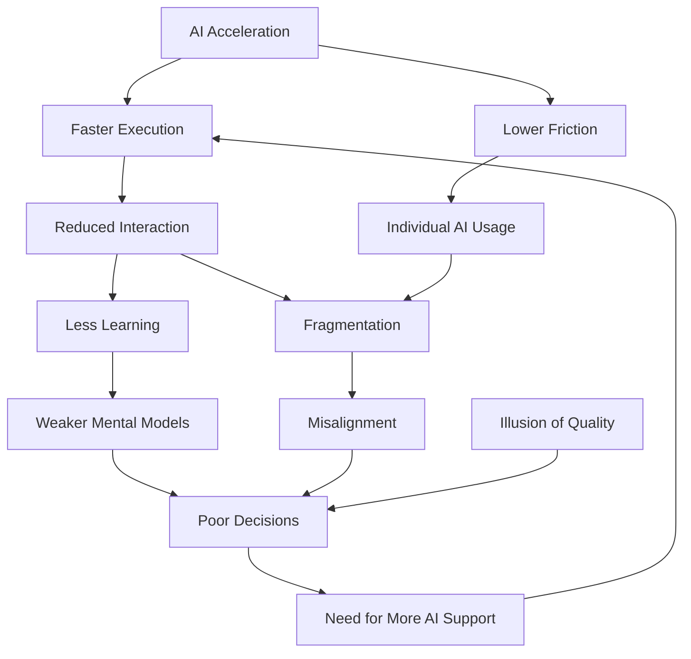

# AI in Organizations — Potential Issues & Failure Modes

## Overview

AI does not inherently create problems — it **amplifies existing organizational dynamics**.

- Strong systems → AI increases leverage
- Weak systems → AI increases chaos

The key distinction:
> AI increases **speed of output** faster than it increases **shared understanding**

---

# 1. Situations Where AI Causes FEW Structural Problems

## 1.1 Low-Ambiguity Tasks
**Examples:**
- Code generation with clear specifications
- Data transformation
- Standardized content creation

**Characteristics:**
- Clear problem definition
- Output is easily verifiable
- Minimal interpretation required

**Effect of AI:**
- Increased efficiency
- Limited coordination overhead

---

## 1.2 Individual Work (Low Dependency)
**Examples:**
- Solo contributors
- Independent analysis tasks

**Characteristics:**
- Minimal cross-team interaction
- Limited need for shared context

**Effect of AI:**
- Productivity gains
- No major alignment risks

---

## 1.3 Mature Teams & Systems
**Characteristics:**
- Strong shared language
- Clear processes and definitions
- Tight feedback loops

**Effect of AI:**
- AI integrates smoothly
- Existing alignment absorbs variability

---

## 1.4 High-Control Environments
**Examples:**
- Healthcare systems
- Aviation
- Critical infrastructure

**Characteristics:**
- Strict validation processes
- Clear accountability structures

**Effect of AI:**
- Controlled augmentation
- Low risk of misinterpretation

---

# 2. Core Failure Modes Introduced or Amplified by AI

## 2.1 Illusion of Quality
AI output appears:
- coherent
- structured
- convincing

But may be:
- incomplete
- contextually wrong
- based on incorrect assumptions

**Impact:**
- Reduced critical thinking
- Lower verification effort
- Faster but weaker decisions

---

## 2.2 Faster Output, Slower Understanding
AI reduces the need to:
- ask clarifying questions
- deeply understand problems

**Impact:**
- Teams operate on different assumptions
- Misalignment becomes less visible
- Errors propagate faster

---

## 2.3 Tool & Workflow Fragmentation
Individuals create:
- personal AI workflows
- custom tools
- isolated automations

**Impact:**
- No shared way of working
- Reduced transparency
- Loss of organizational coherence

---

## 2.4 Degradation of Problem Definition
Shift from:
- "define problem clearly"
to:
- "let’s see what AI generates"

**Impact:**
- Vague requirements
- Solution-first thinking
- Increased iteration without direction

---

## 2.5 Hidden Decision-Making
AI influences:
- recommendations
- summaries
- analyses

But:
- assumptions are implicit
- reasoning is opaque

**Impact:**
- Blurred accountability
- Reduced ownership
- Decisions detached from understanding

---

## 2.6 Trust Shift (Human-to-Human)
Not:
- "Do we trust AI?"

But:
- "Do I trust your interpretation of AI output?"

**Impact:**
- Increased friction between teams
- Conflicting “truths”
- Local optimization over shared reality

---
## 2.7 Loss of Learning-in-the-Loop

AI enables execution without continuous human engagement.

Shift from:
- learning while doing
to:
- delegating execution to AI

**Characteristics:**
- Large upfront specifications
- Long AI execution cycles without interruption
- Reduced human interaction with intermediate results

**Impact:**
- Weaker mental models of the system
- Missed insights that emerge during implementation
- Delayed detection of flawed assumptions
- Increased rework when errors surface late

**Key Mechanism:**
Learning is not just planning → it happens during execution.

AI breaks this loop when:
- humans disengage too early
- feedback cycles become too large

**Example Pattern:**
- Big spec → AI builds → issues discovered late
vs
- Small increments → continuous correction → evolving understanding

**Core Insight:**
> Understanding emerges through interaction, not specification

---

# 3. When Alignment Becomes a Critical Problem

Alignment issues become severe when the following conditions are present:

---

## 3.1 High Ambiguity + Multiple Stakeholders
**Examples:**
- Product development
- Strategy
- Customer experience design

**Why it breaks:**
- AI introduces multiple interpretations of an already unclear problem

---

## 3.2 Cross-Functional Collaboration
**Examples:**
- Business ↔ Tech
- Product ↔ Engineering
- Operations ↔ Innovation

**Failure mode:**
- Each group uses AI differently
- No shared interpretation layer

---

## 3.3 High Context Dependency (Implicit Knowledge)
**Characteristics:**
- Informal practices
- Tribal knowledge
- Unwritten assumptions

**Failure mode:**
- AI lacks access to context
- Outputs diverge from reality

---

## 3.4 Unstructured AI Adoption
**Examples:**
- “Everyone can use AI freely”
- No guidelines or shared practices

**Failure mode:**
- Parallel realities emerge
- No convergence mechanism

---

## 3.5 AI-Influenced Decision Making Without Explicit Framing
**Scenario:**
- AI output → meeting → decision

Without:
- assumption validation
- context alignment

**Failure mode:**
- False consensus
- Misaligned execution

---

# 4. Key Structural Insight

| Dimension | Without AI | With AI |
|----------|-----------|--------|
| Speed | Moderate | High |
| Output volume | Limited | Massive |
| Need for alignment | High | Higher |
| Visibility of misalignment | Visible | Hidden |

---

# 5. Core Pattern

> AI reduces friction in **producing answers**  
> but increases risk in **agreeing on what the question actually is**

Additionally:

> AI can **decouple execution from learning**, reducing the **feedback loops through which understanding normally emerges**

## 5.1 System Dynamics (Visual Map)

---

# 6. Strategic Implication

The main risk is not:
- bad AI output

But:
- **diverging interpretations of reality across people and teams**

---

# 7. Practical Diagnostic Questions

Use these to detect risk:

- Do different teams interpret AI outputs differently?
- Are decisions made faster, but revisited more often?
- Are requirements becoming less explicit?
- Do people trust their own AI outputs more than others'?
- Are workflows becoming more individualized?

If yes → alignment risk is increasing.

---

# 8. Summary

AI is safe when:
- problems are clear
- work is isolated
- systems are mature

AI becomes risky when:
- problems are ambiguous
- multiple stakeholders are involved
- shared understanding is required

---

# Final Insight

> AI scales execution  
> but does not scale shared understanding  
> and can degrade learning if feedback loops are removed

Any organization that ignores this will experience:
- faster movement
- but less coherence