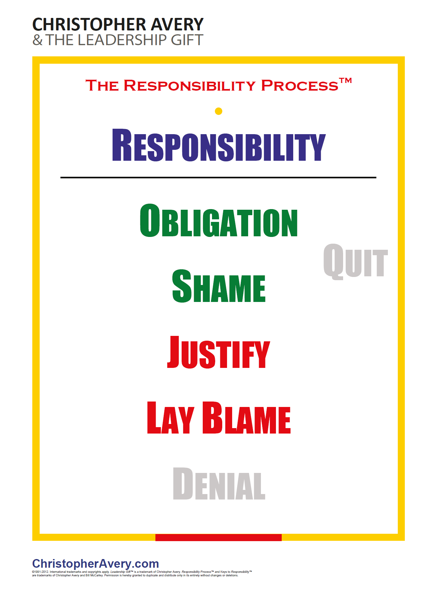

## Core idea

The Responsibility Process: people respond to problems by cycling through Denial → Blame → Justify → Shame → Obligation → Quit → Responsibility. Only Responsibility creates freedom and power.

## Key concepts

[[responsibility-process]], [[blame]], [[justify]], [[obligation-vs-responsibility]], [[mental-moves]], [[freedom-and-power]]

## What I took from it

Telling the story from Denial to Responsibility is one of the greatest assets to have. 

### General

Het ongemakkelijke inzicht van dit boek: verantwoordelijkheid nemen is niet het natuurlijke gedrag van mensen — het is een bewuste keuze die ingaat tegen een hardwired mentaal patroon. De meeste dingen die eruitzien als verantwoordelijkheid (iets doen omdat je het moet, regels volgen, je schuldig voelen) zijn het niet. Ze zijn vormen van vermijding die comfortabeler aanvoelen dan ze zijn.

### Connection to our work

AI-first transformation requires people to move to Responsibility. The resistance cycle (deny AI matters → blame leadership → justify inaction → feel shame about skills → do minimum required) is the Responsibility Process. The narrative must interrupt this cycle. Related: [[willink-extreme-ownership-how-us-navy-seals-lead-and-win]]

---

## Samenvatting

### Centrale stelling

Wanneer iets misgaat of een probleem opdoemt, doorloopt het menselijk brein automatisch een reeks mentale staten — geen van hen productief, totdat je bewust de keuze maakt voor **Responsibility**. Die keuze is niet vanzelfsprekend, niet automatisch, en niet wat de meeste mensen bedoelen als ze het woord "verantwoordelijkheid" gebruiken.

> Responsibility is niet schuld, niet credit, niet straf, en niet verplichting.  
> Het is het vermogen om te reageren — vanuit keuze, niet vanuit dwang.

---

### Het Responsibility Process

<table><tr>
<td valign="top">

De zeven staten, van onderin naar boven:

| # | Staat | Kleur | Oorzaak | Intern verhaal |
|---|---|---|---|---|
| 6 | **Responsibility** | blauw | binnen jezelf | "Ik ben de bron — ik kan dit veranderen" |
| 5 | **Obligation** | 🟢 groen | binnen jezelf | "Ik moet, ik zou moeten, het is mijn plicht" |
| 4 | **Shame** | 🟢 groen | binnen jezelf | "Ik deug niet, ik ben het probleem" |
| — | **Quit** | grijs | — | "Ik geef het op" — zijwaartse uitgang vanuit Shame of Obligation |
| 3 | **Justify** | 🔴 rood | buiten jezelf | "Gegeven de omstandigheden, wat kon ik anders?" |
| 2 | **Lay Blame** | 🔴 rood | buiten jezelf | "Het is de schuld van X" |
| 1 | **Deny** | grijs | — | "Er is geen probleem" |

**Kleurduiding:**
- 🔴 **Rood**: oorzaak wordt buiten jezelf gelegd — jij bent niet het probleem, de omstandigheid of de ander wel
- 🟢 **Groen**: erkenning dat de oorzaak binnen jezelf ligt — maar nog geen volledige ownership
- **Blauw**: Responsibility — volledige eigenaarschap, volledige vrijheid om te handelen

De overgang van rood naar groen is de eerste cruciale stap: van "het ligt aan iets buiten mij" naar "ik heb hier een aandeel in". De tweede stap — van groen naar blauw — is van erkenning naar keuze.

De staten onder Responsibility noemt Avery **"catcher states"** of **"state eilanden"** — ze vangen je en houden je vast. Elke staat heeft zijn eigen interne logica die geldig *voelt*, maar je buiten het probleemoplossend vermogen houdt.

</td>
<td valign="top">

</td>
</tr></table>

---

### Het cruciale onderscheid: Obligation vs. Responsibility

Dit is het meest onderschatte verschil in het boek — en het meest herkenbaar in organisaties.

**Obligation:**
- Je doet het omdat je het moet
- Externe druk, regels, verwachtingen zijn de bron
- Je bent een slachtoffer van de verplichting
- Het voelt als verantwoordelijkheid — maar het is dat niet

**Responsibility:**
- Je doet het omdat je het kiest
- Jij bent de bron
- Je hebt macht over de uitkomst
- Dezelfde actie, fundamenteel andere mentale oorsprong

> Dezelfde vergadering bijwonen kan vanuit Obligation ("ik moet") of vanuit Responsibility ("ik kies dit"). Het gedrag is identiek. De uitkomst op lange termijn niet.

In organisaties zijn **compliance-culturen** grotendeels Obligation-culturen — mensen doen wat gevraagd wordt, maar niemand *bezit* de uitkomst.

---

### De drie sleutels tot Responsibility

Avery beschrijft drie mentale capaciteiten die samen Responsibility mogelijk maken:

**1. Intention** — de wil om verantwoordelijk te zijn
Je moet het willen. Zonder de intentie om eigenaarschap te nemen, werken de andere twee sleutels niet. Dit klinkt triviaal maar is het niet: veel mensen willen eigenlijk niet verantwoordelijk zijn voor moeilijke situaties.

**2. Awareness** — merken in welke staat je zit
De vaardigheid om te herkennen: "ik zit nu in Blame" of "ik reageer vanuit Shame". Zonder awareness blijf je in de catcher state zonder het te weten. Dit is een te ontwikkelen vaardigheid — niet een eenmalig inzicht.

**3. Confront** — de waarheid onder ogen zien
Eerlijk zijn over de situatie zoals ze werkelijk is, niet zoals je wil dat ze is. Confront is wat de beweging van catcher state naar Responsibility mogelijk maakt — het is het moment van "wat is hier werkelijk aan de hand, en wat is mijn aandeel daarin?"

---

### Mental Moves

De praktijk van het Responsibility Process: **mentale verschuivingen** bewust maken.

- Merk op in welke staat je zit
- Benoem het (intern of hardop): "ik zit nu in Justify"
- Kies bewust om te verschuiven richting Responsibility
- Stel jezelf de vraag: "Wat wil ik hier? En wat kan ik doen?"

Dit is geen eenmalige oefening — het is een doorlopende praktijk. De catcher states zijn hardwired; ze verdwijnen niet. De vaardigheid zit in hoe snel je ze doorloopt.

---

### Responsibility in teams en organisaties

Individuen werken in systemen — en systemen versterken bepaalde staten:

| Organisatiecultuur | Dominante staat | Symptomen |
|---|---|---|
| Blame-cultuur | Lay Blame | Fouten worden verborgen, succes wordt geclaimd |
| Compliance-cultuur | Obligation | Mensen doen wat gevraagd wordt, niets meer |
| Angstcultuur | Shame | Risico vermijden, initiatieven blokkeren |
| Cynische cultuur | Justify | Redenen waarom iets niet kan domineren |
| Verantwoordelijkheidscultuur | Responsibility | Mensen nemen eigenaarschap zonder dat het gevraagd wordt |

**Leiders kunnen Responsibility niet eisen.** Ze kunnen het alleen modelleren — en condities creëren waarin het veilig is om eigenaarschap te nemen.

---

### Anti-patronen

| Anti-patroon | Onderliggende staat | Gevolg |
|---|---|---|
| "Wie heeft dit gedaan?" als eerste vraag bij fouten | Blame | Cultuur van verbergen |
| Regels als vervanging voor eigenaarschap | Obligation | Compliance zonder betrokkenheid |
| Perfectie als voorwaarde voor actie | Shame | Verlamming, risicomijding |
| Uitleg waarom iets niet kon | Justify | Geen leren, geen verandering |
| Leider neemt alle verantwoordelijkheid over | Blame (van het team) | Team groeit niet, leider brandt op |

---

### Kernspanning van het boek

> De meeste mensen denken dat ze verantwoordelijk zijn omdat ze hard werken, regels volgen en hun plicht doen.  
> Avery laat zien dat dit precies Obligation is — en dat het fundamenteel verschilt van Responsibility.

De uitdaging is niet groter werken. Het is eerlijker kijken naar vanwaar je handelt.
