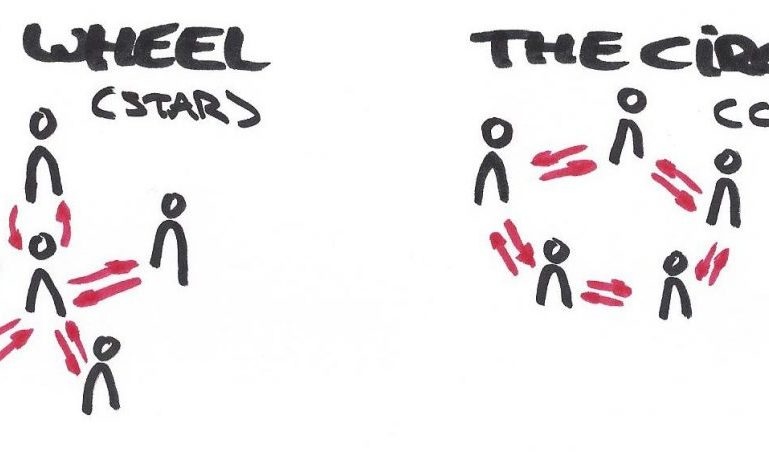
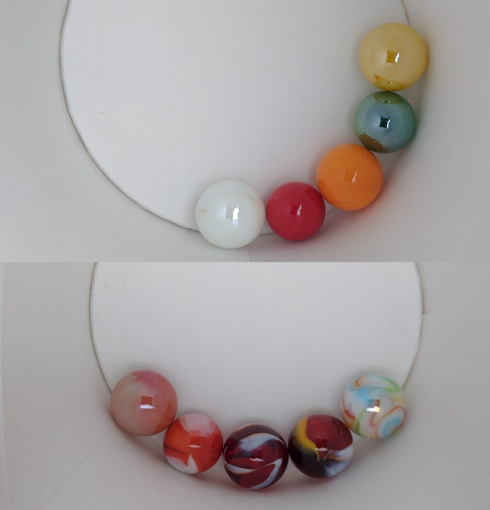
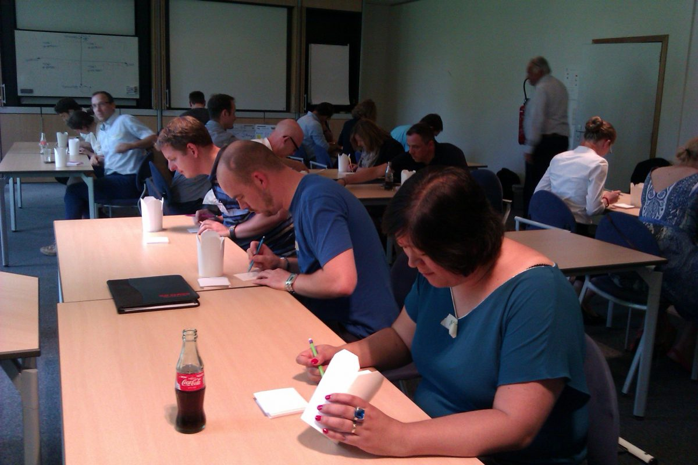

# The Winning Circle: The Game

####  Written by [Johan](https://www.linkedin.com/in/johantre/)

24 August 2016

# Interesting Experiment

Lately I discovered an interesting [experiment described in a book](https://www.amazon.com/Transparency-Leaders-Culture-TRANSPARENCY-Paperback/dp/B00QOJ27WK/ref=sr_1_6) about transparency by Warren Bennis.  It was not that much in detail, but the references -as in all good reads- were well mentioned.  
The experiment we’re talking about was done in 1962 at the Massachusetts Institute of Technology. 

So I tried to find out as much as I could about this experiment.  Because of its age, [the original article from 1962](../HBR-July-August-1962-highlight.pdf) wasn’t available anymore at [the HBR](https://hbr.org/2009/06/a-culture-of-candor).  
But guess what, after a long search, I was able to dig it up in the library of Ghent!

Why? What motivated me to do this? What kept me going?  
If this experiment **really** provided insights **through experience** , than people could **_feel_** the difference in the way we communicate while solving problems.  
This could serve as a **strong eye opener** that **helps people see** the need for changing their communication structures, and embrace the advantages of transparency as a policy.

The experiment shows that complex problem solving is best tackled in a collective manner, while for solving simple problems, a centralized way is a better fit.  
However, very little problems are of the latter kind. Virtually all real problems are of a complex kind.

This has vast implications on the information available needed for solving, whether it is a simple or a complex problem.    
For individual decision making & problem solving all info needs to be available for that individual.  We call this communication structure **centralized**.  
For collective decision making & problem solving, all info needs to be transparently available to all. We call this communication structure **decentralized**.

# The setup

How to force this communication structure and information flow?    
By using **written communication** on small cards, and **the constraint not to talk**.  
This forces information to flow according to the preset topology.    
 

# Centralized vs decentralized

Communication that follows centralized topology has got the structure of a star.    
It is the basic topology of a hierarchy: Someone at the top (or in the middle of the star) makes the decisions. The people in the star tips report only to the centre, the place where the problems also are being solved.  
We call this setup **“the Wheel”** as the spokes of a wheel.

Communication that follows decentralized topology has got the structure of a bus.    
Everyone has access to all information that flows through the bus.  
Info coming from your neighbour you can pass on to your other neighbour. Decisions are made collectively. All people are allowed to all info available, and also all people are involved in problem solving.  
To facilitate this communication, we connect the 2 ends of the bus by creating a circle.  
We call this setup **“the Circle”**.

#   
The problem itself  

Everyone receives a pasta pot with 6 marbles.    
Only 1 marble is exactly the same in all pots.  Find out which one.   In a written way.

Simple problem:  Simple colored marbles.  
Complex problem:  Complex colored marbles.  (Sample below)

In order to deliver proof we need to solve a complex problem in both topologies, and feel the difference ourselves.  
Same applies for simple problems.  
In other words, we have an experiment that consists out of 4 tests as in the image below.   

# In reality

At the moment of writing this article, we’ve completed 2 dry runs:  One with a small group of students, and one bigger group of agile coaches, managers and scrum masters.  
Their reflections showed the same findings as in 1962.    
And the participants _felt_ it indeed.    
Clearly, problem solving in **the Wheel,** **_felt boring_** to the people at the star points. It also _**felt stressful**_ for the one in the centre.  
When their problem was solved **only the person, in the centre, was cheering** , as he solved it himself.  
In **the Circle** however, the **whole group cheered their victory**.  
But that wasn’t the most important message:  **Collective problem solving was also the most efficient for complex problems**! With this elegant experiment, people can _**feel**_ and _**see**_ the need for transparency in our present corporate landscape by experience.    
It advocates that our present collaborations need the ability to rally _**together**_ _**around problems  **_in order to solve them in the most efficient way. 

#  Conclusion

With this attempt to bring this experiment back to life, I hope more people start understanding the true need for transparency.

> As a human species we came to the boundaries of our individual intelligence.    
>  Taking the next leap will need to be collective.    
>  Hence, transparency will be our gate to collective intelligence.

As a follow up article I’ll post about how we succeeded in reconstructing this game.

References:    
“[Transparency (How Leaders Create a Culture of Candor)](https://www.amazon.com/Transparency-Leaders-Culture-TRANSPARENCY-Paperback/dp/B00QOJ27WK/ref=sr_1_6)“  
“[Collective Genius: The Art and Practice of Leading Innovation](https://hbr.org/product/collective-genius-the-art-and-practice-of-leading-innovation/13296E-KND-ENG)“  
[HBR July-August 1962 – highlight: Unhuman Organisations](../HBR-July-August-1962-highlight.pdf)
