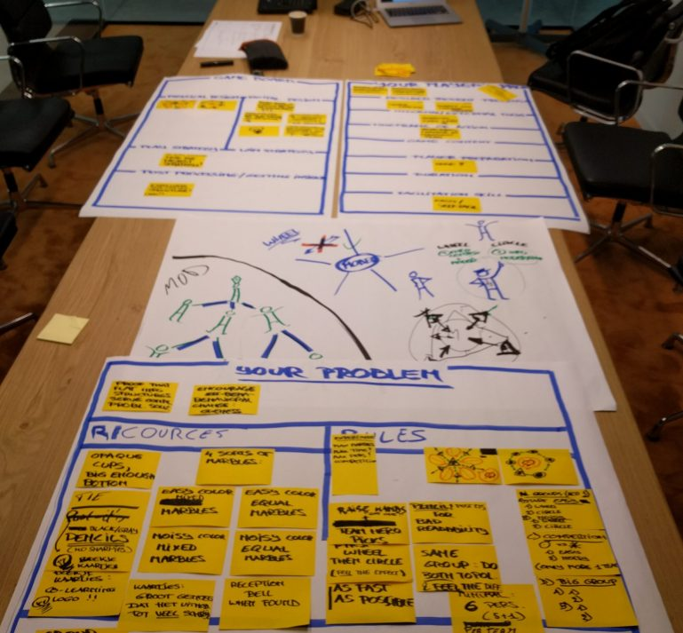
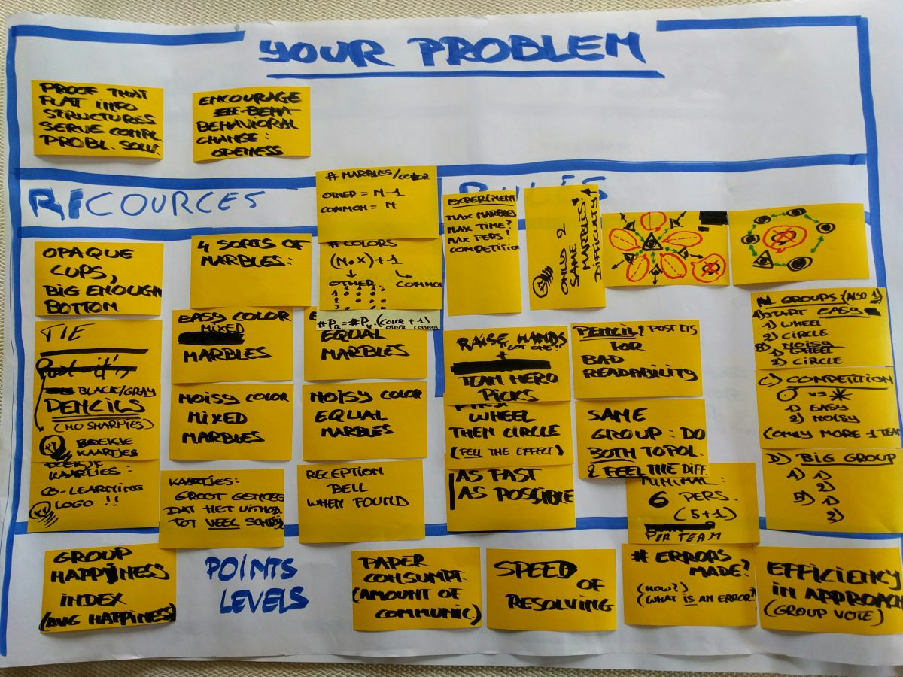
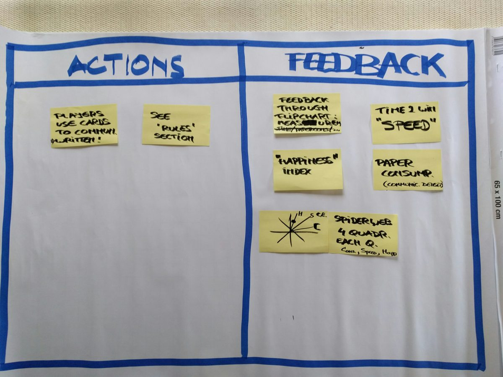
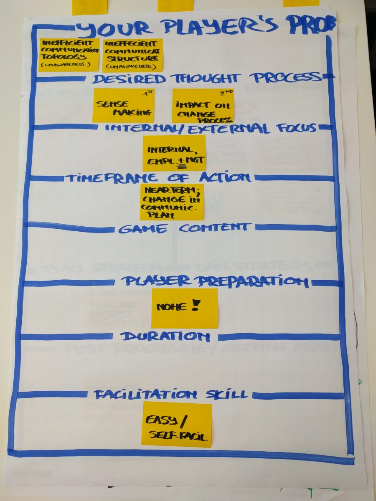
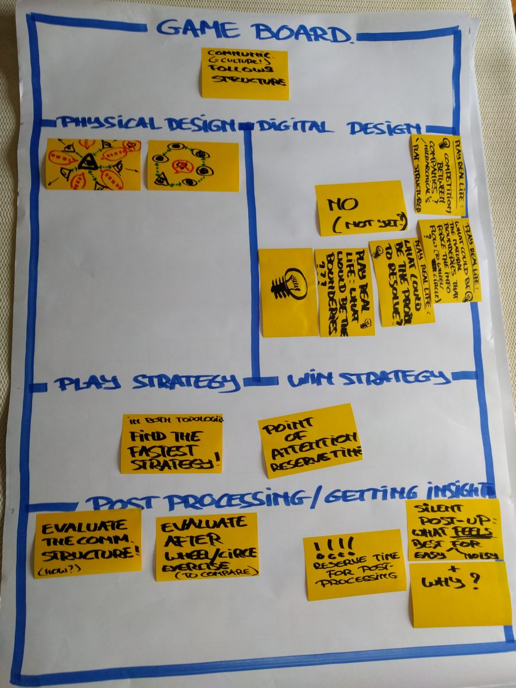

# The Winning Circle: The Making of

####  Written by [Johan](https://www.linkedin.com/in/johantre/)

31 August 2016

# Elegant experiment

In a previous article, I’ve talked about an elegant experiment from 1962 we’ve re-done.

At the moment of writing this article, we’ve completed 2 dry runs:  One with a small group of students, and one bigger group of agile coaches, managers and scrum masters.  
We got plenty of feedback, and improvement is on its way.

This article is about how we used [Luke Hohmann’s](http://conteneo.co/our-team/) [Game Canvas](./the-making-of-files/Game-Canvas-Centralization-vs.-Decentralization-in-Complex-problem-solving.docx) in order to re-run this experiment with as many considerations as possible.

# The Game Canvas

The canvas is built in several sections that are divided into 3 main aspects:  
**Your problem** : Your intentions of creating the game. What do we want to achieve with it?  
**Your player’s problem** : All aspects regarding the player. What’s in it for the players?  
**Game board** : All aspects of what your game looks like, whether there is a board, whether it needs space etc.  
The purpose of using this canvas is to fill in all sections to trigger some divergent thinking.   

As you move through the Canvas one section after another, cell by cell, you can see the various angles you’d be thinking about when creating a game.

## Starting with “WHY”: “Your problem” & “Your player’s problem”

In this case it was the problem of providing an insight, or through the player’s eyes: getting an insight.

## Resources

As you can see, this section is limited. Only marbles, cups, pens and paper is needed.    
By thinking this over, we also came to the a strategy to fill the cups upfront to assure there is only one common marble in the cups.  
We also realized that the number of marbles was a degree of complexity that needed to be tried out. Hence the dry runs.

## Rules

Again thanks to the Canvas we did take our time to look at each section.  It triggered also a lot of other ideas, even though they were not yet possible to implement. (e.g. having a similar game online, with companies competing against each other, showing their ability of fast complex problem solving through fast communication and level of transparency.

## Points Levels

Here we took our time to look at ways to gain points, even if points should be used at all. Again many ideas came up even things we didn’t implement.  Still it is not a bad idea to collect the ideas, in case you want to modify the game and finetune it in the future.

Similarly, the Player’s problem was tackled.  
Check out the results:

## 

## The Game Board

In our case it’s the setup of how people should be sitting:  in a circle or a star formation.  
Back in 1962 they used panels to separate people and prevent talking to each other.  
Now, we solved this by asking 1 person to keep an eye on the no-speaking rule.  
Despite the fact it’s not a digital game, it did trigger some ideas though.

Here is the rest of the Canvas.

# Conclusion

As you can see: the value of this Game Canvas is undeniable!

References:  
[Game Canvas](./the-making-of-files/Game-Canvas-Centralization-vs.-Decentralization-in-Complex-problem-solving.docx)  
Learning to create your own Games?  Check out the related content!